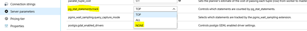

# Optimize query statistics collection in Azure Database for PostgreSQL server 
This article describes to optimize query statistics collection in an Azure Database for PostgreSQL server.

## Using pg_stats_statements
**Pg_stat_statements** is a PostgreSQL extension that is enabled by default in Azure Database for PostgreSQL. The extension provides a means to track execution statistics of all SQL statements executed by a server. However, this module hooks into every query execution and comes with a non-trivial performance cost. Enabling **pg_stat_statements** forces query text writes to files on disk.

For customers that have unique queries with long query text or are not actively monitoring **pg_stat_statements**, we recommend disabling **pg_stat_statements** for best performance by setting `pg_stat_statements.track = NONE`.

On some customer workloads we have seen up to a 50 percent performance improvement by disabling **pg_stat_statements**. However, the tradeoff one makes by disabling pg_stat_statements is the inability to troubleshoot performance issues.

To set `pg_stat_statements.track = NONE`:

- In the Azure portal, navigate to the [PostgreSQL resource management page and select the server parameters blade](howto-configure-server-parameters-using-portal.md).

- Using [Azure CLI](howto-configure-server-parameters-using-cli.md), az postgres server configuration set `--name pg_stat_statements.track --resource-group myresourcegroup --server mydemoserver --value NONE`.

## Using Query Store 
The [Query Store](concepts-query-store.md) feature in Azure Database for PostgreSQL provides a more performant method to track query statistics and is recommended as an alternative to using *pg_stats_statements*. 

## Next steps
Consider setting `pg_stat_statements.track = NONE` in the [Azure Portal](howto-configure-server-parameters-using-portal.md) or using [Azure CLI](howto-configure-server-parameters-using-cli.md).

See the [Query Store usage scenarios](concepts-query-store-scenarios.md) and [Query Store best practices](concepts-query-store-best-practices.md) for more information. 
