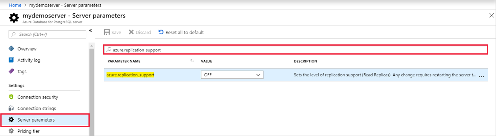
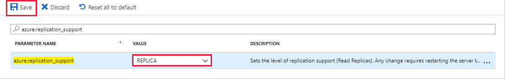
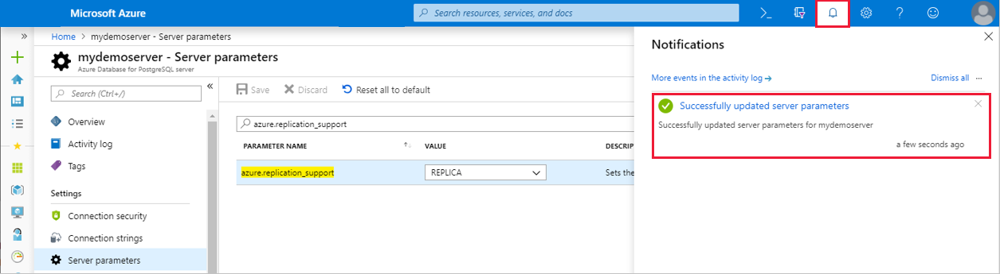

# Create and manage read replicas in the Azure portal

In this article, you learn how to create and manage read replicas in Azure Database for PostgreSQL from the Azure portal. To learn more about read replicas, see the [overview](concepts-read-replicas.md).

> [!IMPORTANT]
> The read replica feature is in public preview.

## Prerequisites
An [Azure Database for PostgreSQL server](quickstart-create-server-database-portal.md) to be the master server.

## Prepare the master server
These steps can be used to prepare a master server in the General Purpose or Memory Optimized tiers only.

The `azure.replication_support` parameter must be set to **REPLICA** on the master server. When this parameter is changed, a server restart is required for the change to take effect.

To prepare a server as a master server, follow these steps:

1. In the Azure portal, select the existing Azure Database for PostgreSQL server to use as a master.

2. On the left menu, select **Server Parameters**.

3. Search for the `azure.replication_support` parameter.

   

4. Set the `azure.replication_support` parameter value to **REPLICA**. Select **Save** to keep your changes.

   

5. After you save your changes, you receive a notification:

   

6. Restart the server to apply your changes. To learn how to restart a server, see [Restart an Azure Database for PostgreSQL server](howto-restart-server-portal.md).

## Create a read replica
To create a read replica, follow these steps:

1.	Select the existing Azure Database for PostgreSQL server to use as the master server. 

2.	On the server menu, select **SETTINGS** > **Replication**.

   If you haven't set the `azure.replication_support` parameter to **REPLICA** on a General Purpose or Memory Optimized master server and restarted the server, you receive a notification. Complete those steps before you create the replica.

3.	Select **Add Replica**.

   

4.	Enter a name for the read replica. Select **OK** to confirm the creation of the replica.

    

A replica is created by using the same server configuration as the master. After a replica is created, several settings can be changed independently from the master server: compute generation, vCores, storage, and back-up retention period. The pricing tier can also be changed independently, except to or from the Basic tier.

> [!IMPORTANT]
> Before a master server configuration is updated to new values, update the replica configuration to equal or greater values. This action ensures the replica can keep up with any changes made to the master.

After the read replica is created, it can be viewed from the **Replication** window:

 

## Stop replication
You can stop replication between a master server and a read replica.

> [!IMPORTANT]
> After you stop replication to a master server and a read replica, it can't be undone. The read replica becomes a standalone server that supports both read and writes. The standalone server can't be made into a replica again.

To stop replication between a master server and a read replica from the Azure portal, follow these steps:

1.	In the Azure portal, select your master Azure Database for PostgreSQL server.

2.	On the server menu, select **SETTINGS** > **Replication**.

3.	Select the replica server for which to stop replication.

   
 
4.	Select **Stop replication**.

   
 
5.	Select **OK** to stop replication.

   
 

## Delete a master server
The steps to delete a master server are similar to how you delete a standalone Azure Database for PostgreSQL server. 

> [!IMPORTANT]
> When you delete a master server, replication to all read replicas is stopped. The read replicas become standalone servers that now support both read and writes.

To delete a server from the Azure portal, follow these steps:

1.	In the Azure portal, select your master Azure Database for PostgreSQL server.

2.	Open the **Overview** page for the server. Select **Delete**.

   
 
3.	Enter the name of the master server to delete. Select **Delete** to confirm deletion of the master server.

   
 

## Delete a replica
You can delete a read replica similar to how you delete a master server.

- In the Azure portal, open the **Overview** page for the read replica. Select **Delete**.

   
 
You can also delete the read replica from the **Replication** window by following these steps:

1.	In the Azure portal, select your master Azure Database for PostgreSQL server.

2.	On the server menu, select **SETTINGS** > **Replication**.

3.	Select the read replica to delete.

   
 
4.	Select **Delete replica**.

   
 
5.	Enter the name of the replica to delete. Select **Delete** to confirm deletion of the replica.

   
 

## Monitor a replica
Two metrics are available to monitor read replicas.

### Max Lag Across Replicas metric
The **Max Lag Across Replicas** metric shows the lag in bytes between the master server and the most-lagging replica. 

1.	In the Azure portal, select the master Azure Database for PostgreSQL server.

2.	Select **Metrics**. In the **Metrics** window, select **Max Lag Across Replicas**.

    
 
3.	For your **Aggregation**, select **Max**.

### Replica Lag metric
The **Replica Lag** metric shows the time since the last replayed transaction on a replica. If there are no transactions occurring on your master, the metric reflects this time lag.

1.	In the Azure portal, select the Azure Database for PostgreSQL read replica.

2.	Select **Metrics**. In the **Metrics** window, select **Replica Lag**.

   
 
3.	For your **Aggregation**, select **Max**. 
 
## Next steps
Learn more about [read replicas in Azure Database for PostgreSQL](concepts-read-replicas.md).