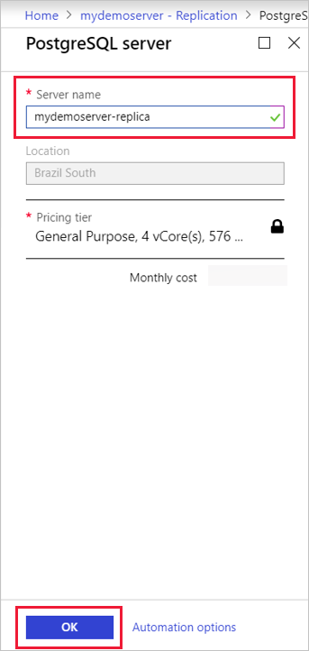
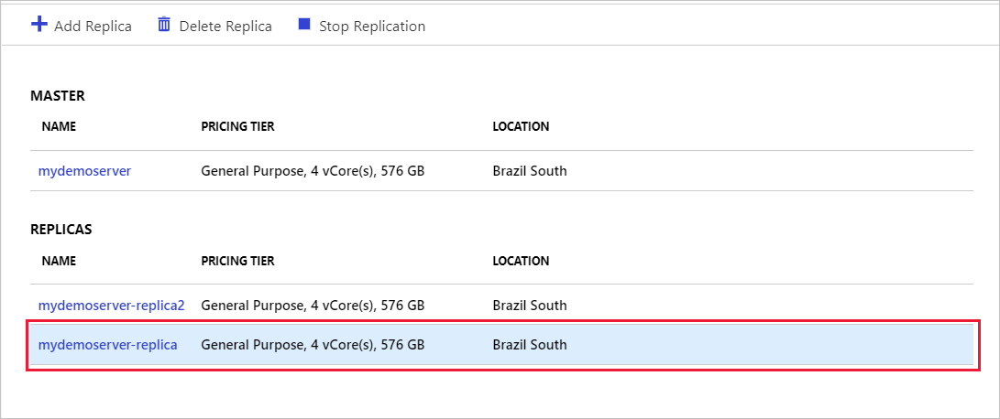
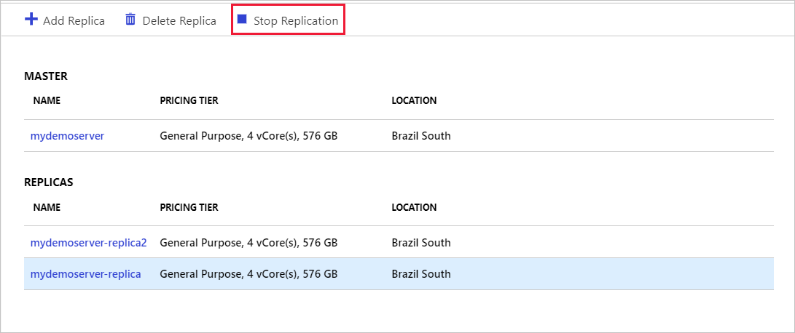
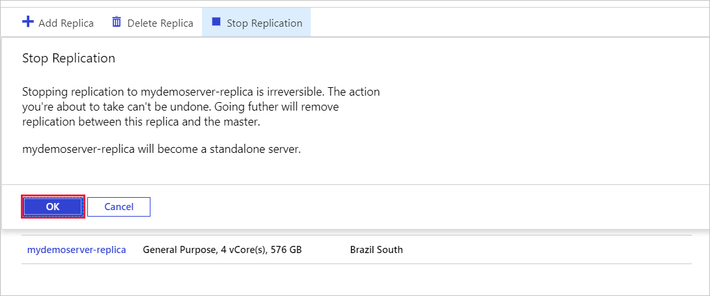
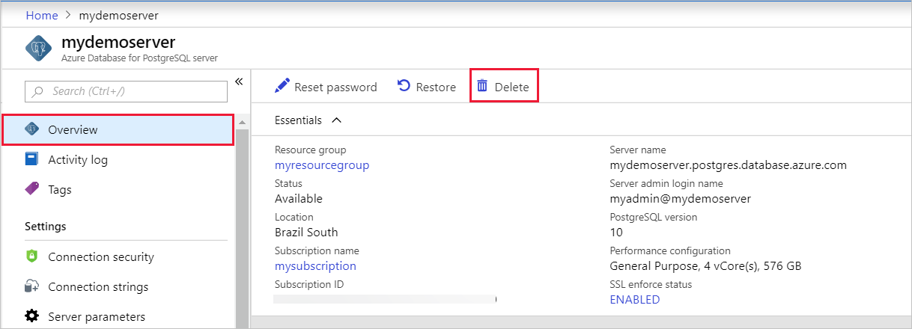
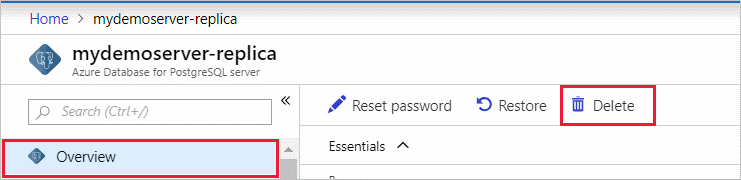
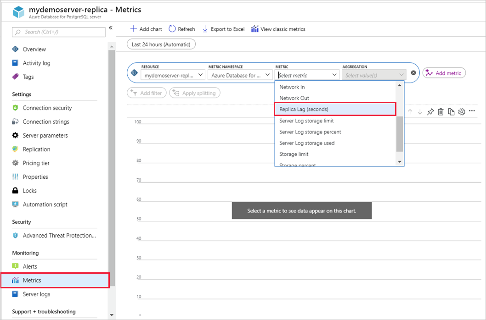

# How to create and manage read replicas in the Azure portal
In this article, you will learn how to create and manage read replicas in the Azure Database for PostgreSQL service using the Azure portal. To learn more about read replicas, [read the concepts documentation](concepts-read-replicas.md).

## Prerequisites
- An [Azure Database for PostgreSQL server]((quickstart-create-server-database-portal.md)) that will be the master server.

## Prepare the master
The **azure.replication_support** parameter must be set to REPLICA on the master server. Changing this parameter requires a server restart to take effect.

1. In the Azure portal, select the existing Azure Database for PostgreSQL server that you want to use as a master.

2. Select **Server Parameters** from the menu on the left.

3. Search for **azure.replication_support**.

4. Set **azure.replication_support** to REPLICA.

5. Save the change.

6. Restart the server to apply the change.

## Create a read replica
Read replicas can be created using the following steps:
1.	Select the existing Azure Database for PostgreSQL server that you want to use as a master. 

2.	Select Replication from the menu, under SETTINGS.

If you haven't set **azure.replication_support** to REPLICA on the master and restarted the server, you will see a message instructing you to do so. Do so before proceeding with the create.

3.	Select Add Replica.
   

4.	Enter a name for the replica server and select OK to confirm the creation of the replica.

    

> [!IMPORTANT]
> Read replicas are created with the same server configuration as the master. The replica configuration can be changed after it has been created. It is recommended that the replica server's configuration should be kept at equal or greater values than the master to ensure the replica is able to keep up with the master. Failing to do so could lead to replication breaking or the servers being unavailable.

Once the replica server has been created, it can be viewed from the Replication window.

 

## Stop replication

> [!IMPORTANT]
> Stopping replication to a server is irreversible. Once replication has stopped between a master and replica, it cannot be undone. The replica server then becomes a standalone server and now supports both read and writes. This server cannot be made into a replica again.

To stop replication between a master and a replica from the Azure portal, use the following steps:
1.	In the Azure portal, select your master Azure Database for PostgreSQL server.

2.	Select Replication from the menu, under SETTINGS.

3.	Select the replica server you wish to stop replication for.
   
 
4.	Select Stop replication.
   
 
5.	Confirm you want to stop replication by clicking OK.
   
 

## Delete a master

> [!IMPORTANT]
> Deleting a master server stops replication to all replica servers. Replica servers become standalone servers that now support both read and writes.
Deleting a master follows the same steps as for a standalone Azure Database for PostgreSQL server. To delete a server from the Azure portal, do the following:
1.	In the Azure portal, select your master Azure Database for PostgreSQL server.

2.	From the Overview, select Delete.
   
 
3.	Type the name of the master server and select Delete to confirm deletion of the master server.
   
 

## Delete a replica
To delete a read replica you, can follow the same steps as with deleting a master server above. First open the Overview page of the replica then select Delete.
   
 
Alternatively, you can delete it from the Replication window.
1.	In the Azure portal, select your master Azure Database for PostgreSQL server.

2.	Select Replication from the menu, under SETTINGS.

3.	Select the replica server you wish to delete. 
   
 
4.	Select Delete replica
   
 
5.	Type the name of the replica and select Delete to confirm deletion of the replica.
   
 

## Monitor a replica
### Max Lag Across Replicas
The **Max lag across replicas** metric shows the lag time between the master and the most lagging replica. 

1.	In the Azure portal, select the **master** Azure Database for PostgreSQL server.

2.	Select Metrics. In the metrics window, select **Max Lag Across Replicas**.
 
3.	Select **Max** as your Aggregation. 

### Replica Lag
The **Replica Lag** metric shows the time since the last replayed transaction on this replica. If there are no transactions occurring on your master, the metric will reflect this time lag.

1.	In the Azure portal, select a **replica** Azure Database for PostgreSQL server.

2.	Select Metrics. In the metrics window, select **Replica Lag**.
   
 
3.	Select **Max** as your Aggregation. 
 
## Next steps
- Learn more about [read replicas in Azure Database for PostgreSQL](concepts-read-replicas.md).