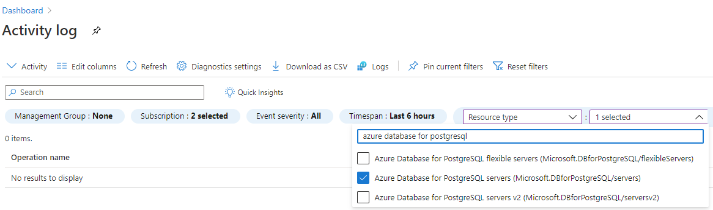
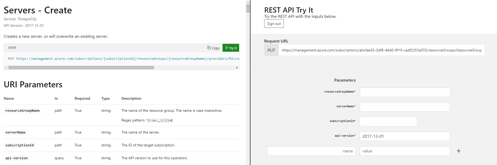

# Restore a dropped Azure Database for PostgreSQL server

When a server is dropped, the database server backup can be retained up to five days in the service. The database backup can be accessed and restored only from the Azure subscription where the server originally resided. The following recommended steps can be followed to recover a dropped PostgreSQL server resource within 5 days from the time of server deletion. The recommended steps will work only if the backup for the server is still available and not deleted from the system. 

## Pre-requisites
To restore a dropped Azure Database for PostgreSQL server, you need following:
- Azure Subscription name hosting the original server
- Location where the server was created

## Steps to restore

1. Browse to the [Azure portal](https://portal.azure.com/#blade/Microsoft_Azure_ActivityLog/ActivityLogBlade). Select the **Azure Monitor** service, then select **Activity Log**.

2. In Activity Log, click on **Add filter** as shown and set following filters for the following

    - **Subscription** = Your Subscription hosting the deleted server
    - **Resource Type** = Azure Database for PostgreSQL servers (Microsoft.DBforPostgreSQL/servers)
    - **Operation** = Delete PostgreSQL Server (Microsoft.DBforPostgreSQL/servers/delete)
 
     []

3. Select the **Delete PostgreSQL Server** event, then select the **JSON tab**. Copy the `resourceId` and `submissionTimestamp` attributes in JSON output. The resourceId is in the following format: `/subscriptions/ffffffff-ffff-ffff-ffff-ffffffffffff/resourceGroups/TargetResourceGroup/providers/Microsoft.DBforPostgreSQL/servers/deletedserver`.


 4. Browse to the PostgreSQL [Create Server REST API Page](/rest/api/PostgreSQL/servers/create) and select the **Try It** tab highlighted in green. Sign in with your Azure account.

 5. Provide the **resourceGroupName**, **serverName** (deleted server name), **subscriptionId** properties, based on the resourceId attribute JSON value captured in the preceding step 3. The api-version property is pre-populated and can be left as-is, as shown in the following image.

     []
  
 6. Scroll below on Request Body section and paste the following replacing the "Dropped server Location", "submissionTimestamp", and "resourceId". For "restorePointInTime", specify a value of "submissionTimestamp" minus **15 minutes** to ensure the command does not error out.
    ```json
        {
          "location": "Dropped Server Location",  
          "properties": 
	          {
    		      "restorePointInTime": "submissionTimestamp - 15 minutes",
    		      "createMode": "PointInTimeRestore",
    		      "sourceServerId": "resourceId"
  	        }
        }
    ```
    For example, if the current time is 2020-11-02T23:59:59.0000000Z, we recommend a minimum of 15 minutes prior restore point in time 2020-11-02T23:44:59.0000000Z.
    > [!Important]
    > There is a time limit of five days after the server was dropped. After five days, an error is expected since the backup file cannot be found.
    
7. If you see Response Code 201 or 202, the restore request is successfully submitted. 

8. The server creation can take time depending on the database size and compute resources provisioned on the original server. The restore status can be monitored from Activity log by filtering for 
   - **Subscription** = Your Subscription
   - **Resource Type** = Azure Database for PostgreSQL servers (Microsoft.DBforPostgreSQL/servers) 
   - **Operation** =  Update PostgreSQL Server Create

## Next steps
- If you are trying to restore a server within five days, and still receive an error after accurately following the steps discussed earlier, open a support incident for assistance. If you are trying to restore a dropped server after five days, an error is expected since the backup file cannot be found. Do not open a support ticket in this scenario. The support team cannot provide any assistance if the backup is deleted from the system. 
- To prevent accidental deletion of servers, we highly recommend using [Resource Locks](https://techcommunity.microsoft.com/t5/azure-database-for-PostgreSQL/preventing-the-disaster-of-accidental-deletion-for-your-PostgreSQL/ba-p/825222).
