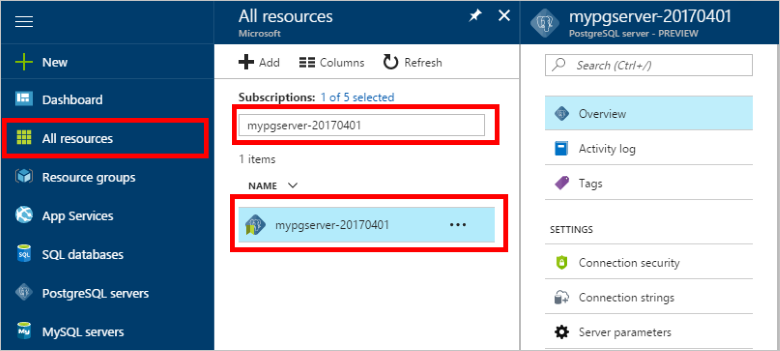
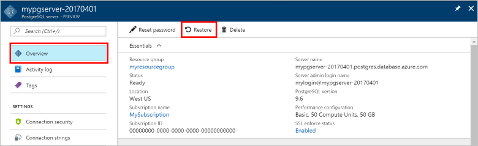
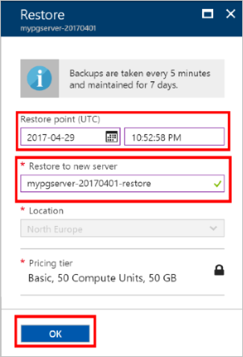

# How To Backup and Restore a server in Azure Database for PostgreSQL using the Azure portal

## Backup happens Automatically
When using Azure Database for PostgreSQL, the database service automatically makes a backup of the service every 5 minutes. 

The backups are available for 7 days when using Basic Tier, and 35 days when using Standard Tier. For more information, see [Azure Database for PostgreSQL service tiers](concepts-service-tiers.md)

Using this automatic backup feature you may restore the server and all its databases into a new server to an earlier point-in-time.

## Restore in the Azure portal
Azure Database for PostgreSQL allows you to restore the server back to a point in time and into to a new copy of the server. You can use this new server to recover your data. 

For example, if a table was accidentally dropped at noon today, you could restore to the time just before noon and retrieve the missing table and data from that new copy of the server.

The following steps restore the sample server to a point in time:
1. Sign into the [Azure portal](https://portal.azure.com/)
2. Locate your Azure Database for PostgreSQL server. In the Azure portal, click **All Resources** from the left-hand menu and type in the name, such as **mypgserver-20170401**, to search for your existing server. Click the server name listed in the search result. The **Overview** page for your server opens and provides options for further configuration.

   

3. On the top of the server overview blade, click **Restore** on the toolbar. The Restore blade opens.

   

4. Fill out the Restore form with the required information:

   
  - **Restore point**: Select a point-in-time that occurs before the server was changed
  - **Target server**: Provide a new server name you want to restore to
  - **Location**: You cannot select the region, by default it is same as the source server
  - **Pricing tier**: You cannot change this value when restoring a server. It is same as the source server. 

5. Click **OK** to restore the server to restore to a point in time. 

6. Once the restore finishes, locate the new server that is created to verify the data was restored as expected.

## Next steps
- [Connection libraries for Azure Database for PostgreSQL](concepts-connection-libraries.md)
