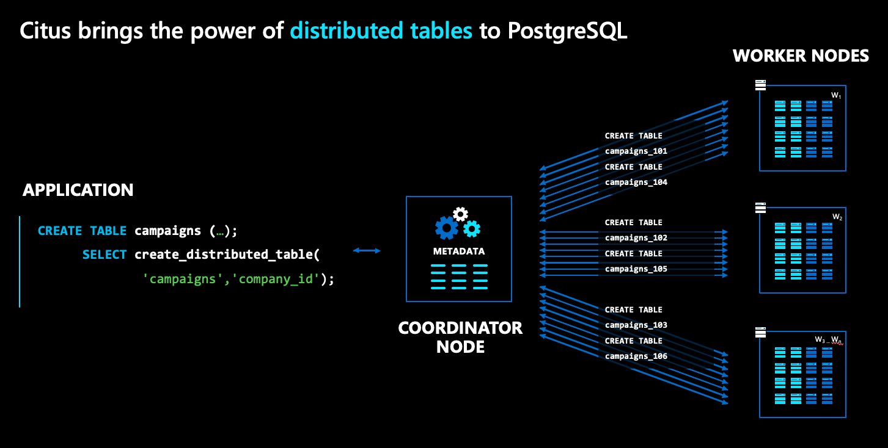
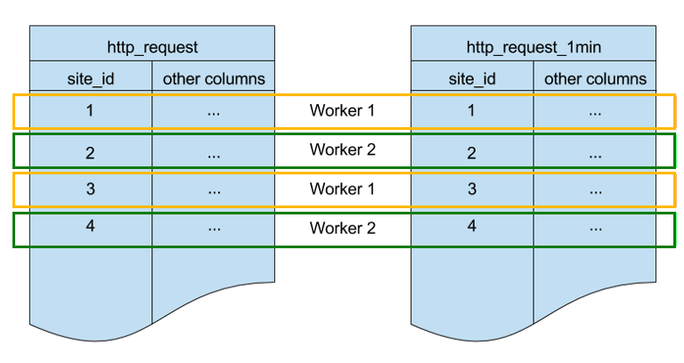

# Fundamental concepts for scaling

Before we investigate the steps of building a new app, it's helpful to see a
quick overview of the terms and concepts involved.

## Architectural overview

Hyperscale (Citus) gives you the power to distribute tables across multiple
machines in a server group and transparently query them the same you query
plain PostgreSQL:



In the Hyperscale (Citus) architecture there are multiple kinds of nodes:

* The **coordinator** node stores distributed table metadata and is responsible
  for distributed planning.
* Whereas the **worker** nodes store the actual data and do the computation.
* Both the coordinator and workers are plain PostgreSQL databases, with the
  `citus` extension loaded.

To distribute a normal PostgreSQL table, like `campaigns` in the diagram above,
run a simple command called `create_distributed_table()`.  Once you run this
command, Hyperscale (Citus) transparently creates shards for the table across
worker nodes. In the diagram, shards are represented as blue boxes.

> [!NOTE] On the basic tier, shards of distributed tables are on the
> coordinator node, not worker nodes.

Shards are plain (but specially-named) PostgreSQL tables that hold slices of
your data. In our example, because we distributed `campaigns` by `company_id`,
the shards hold campaigns, where the campaigns of different companies are
assigned to different shards.

## Distribution column (a.k.a. shard key)

`create_distributed_table()` is the magic function that Hyperscale (Citus)
provides to distribute tables and leverage resources across multiple machines.

```postgresql
SELECT create_distributed_table(
	'table_name',
	'distribution_column);
```

The second argument above picks a column from the table as a **distribution
column**. It can be any column with a native PostgreSQL type (with integer and
text being most common). The value of the distribution column determines which
rows go into which shards. That's why the distribution column is also called
the **shard key**.

Hyperscale (Citus) decides how to run queries based on their use of the shard
key:

| Query involves | Where it runs |
|----------------|---------------|
| just one shard key | on the worker node which holds its shard |
| multiple shard keys | parallelized across multiple nodes |

The choice of shard key dictates the performance and scalability of your
applications.

* Uneven data distribution per shard keys (a.k.a. *data skew*) is not optimal
  for performance. For example, don’t choose a column for which a single value
  represents 50% of data.
* Shard keys with low cardinality can affect scalability. You can use only as
  many shards as there are distinct key values. Choose a key with cardinality
  in the 100s to 1000s.
* Joining two large tables with different shard keys can be slow. Choose a
  common shard key across large tables. More about this in
  [colocation](#colocation).

## Colocation

Another concept closely related to shard key is *colocation*. Tables sharded by
the same distribution column values are colocated - The shards of colocated
tables are stored together on the same workers.

Below are two tables sharded by the same key, `site_id`. They are colocated.



Hyperscale (Citus) ensures that rows with a matching `site_id` value in both
tables are stored on the same worker node.  You can see that, for both tables,
rows with `site_id=1` are stored on worker 1. Similarly for other site IDs.

Colocation helps optimize JOINs across these tables. If you join the two tables
on `site_id`, Hyperscale (Citus) can perform the join locally on worker nodes
without shuffling data between nodes.

## Next steps

> [!div class="nextstepaction"]
> [Classify application workload >](howto-build-scalable-apps-classify.md)

## Classifying application workload

Here are common characteristics of the workloads that are the best fit for
Hyperscale (Citus).

### Characteristics of multi-tenant SaaS

* Tenants see their own data; they cannot see other tenants' data.
* Most B2B SaaS apps are multi-tenant. Examples include Salesforce or Shopify.
* In most B2B SaaS apps, there are 100s to 10s of thousands of tenants, and
  more tenants keep joining.
* Multi-tenant SaaS apps are primarily operational/transactional, with single
  digit milisecond latency requirements for their database queries.
* These apps have a classic relational data model, and are built using ORMs –
  like RoR, Hibernate, Django etc.

### Characteristics of real-time operational analytics

* These apps have a customer/user facing interactive analytics dashboard, with
  a sub-second query latency requirement.
* High concurrency required - at least 20 users.
* Analyzes data that's fresh, within the last one second to few minutes.
* Most have timeseries data such as events, logs, etc.
* Common data models in these apps include:
	* Star Schema - few large/fact tables, the rest being small/dimension tables
	* Mostly fewer than 20 major tables

### Characteristics of high-throughput transactional

* Run NoSQL/document style workloads, but require PostgreSQL features such as
  transactions, foreign/primary keys, triggers, extension like PostGIS, etc.
* The workload is based on a single key. It has CRUD and lookups based on that
  key.
* These apps have high throughput requirements: 1000s to 100s of thousand of
  TPS.
* Query latency in single-digit miliseconds, with a high concurrency
  requirement.
* Timeseries data, such as internet of things.

## Data modeling by workload

### Modeling multi-tenant SaaS apps

#### Tenant ID as the shard key for multi-tenant SaaS apps

#### Optimal data model for multi-tenant SaaS apps

### Modeling real-time operational analytics apps

#### Shard key in real-time analytics co-locates large tables

#### Optimal data model for real-time operational analytics apps

### Modeling high throughput transactional apps

#### Shard key is the column that you mostly filter on

#### Optimal data model for real-time operational analytics apps
