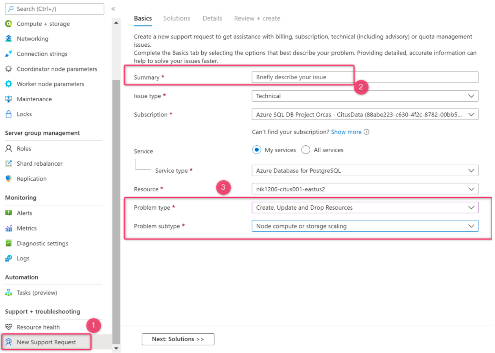

# Change compute quotas in Azure Database for PostgreSQL - Hyperscale (Citus) from the Azure portal

[!INCLUDE[applies-to-postgresql-hyperscale](../includes/applies-to-postgresql-hyperscale.md)]

Azure enforces a vCore quota per subscription per region. There are two
independently adjustable limits: vCores for coordinator nodes, and vCores for
worker nodes.

## Request quota increase

1. Select **New support request** in the Azure portal menu for your Hyperscale
   (Citus) server group.
2. Fill out **Summary** with the quota increase request for your region, for
   example "Quota increase in West Europe region."
3. These fields should be autoselected, but verify:
   * **Issue Type** should be "Technical + your subscription"
   * **Service type** should be "Azure Database for PostgreSQL"
4. Select "Create, Update, and Drop Resources" for **Problem type**.
5. Select "Node compute or storage scaling" for **Problem subtype**.
6. Select **Next: Solutions >>** then **Next: Details >>**
7. In the problem description include two pieces of information:
   * The region where you want the quota(s) increased
   * Quota increase details, for example "Need to increase worker node quota
     in West Europe to 512 vCores"

## Next steps

* Learn about other Hyperscale (Citus) [quotas and limits](reference-limits.md).
