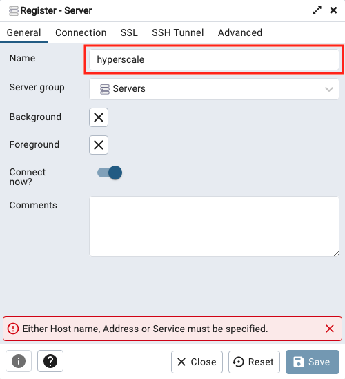
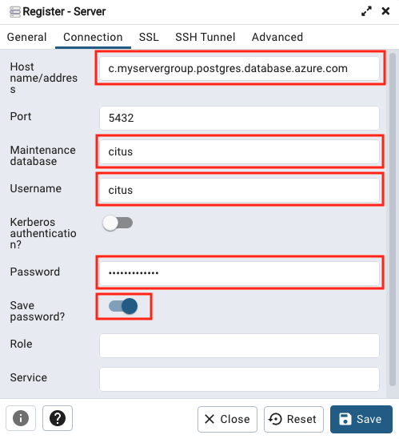
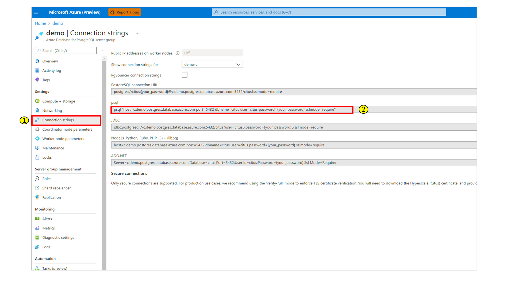

# Connect to a server group

Choose your database client below to learn how to configure it to connect to
Hyperscale (Citus).

# [pgAdmin](#tab/pgadmin)

[pgAdmin](https://www.pgadmin.org/) is a popular and feature-rich open source
administration and development platform for PostgreSQL.

1. [Download](https://www.pgadmin.org/download/) and install pgAdmin.

2. Open the pgAdmin application on your client computer. From the Dashboard,
   select **Add New Server**.

   

3. Choose a **Name** in the General tab. Any name will work.

   

4. Enter connection details in the Connection tab.

   

   Customize the following fields:

   * **Host name/address**: Obtain this value from the **Overview** page for your
     server group in the Azure portal. It's listed there as **Coordinator name**.
     It will be of the form, `c.servergroup.postgres.database.azure.com`.
   * **Maintenance database**: use the value `citus`.
   * **Username**: use the value `citus`.
   * **Password**: the connection password.
   * **Save password**: enable if desired.

5. In the SSL tab, set **SSL mode** to **Require**.

   

6. Select **Save** to save and connect to the database.

# [psql](#tab/psql)

The [psql utility](https://www.postgresql.org/docs/current/app-psql.html) is a
terminal-based front-end to PostgreSQL. It enables you to type in queries
interactively, issue them to PostgreSQL, and see the query results.

1. Install psql. It's included with a [PostgreSQL
   installation](https://www.postgresql.org/docs/current/tutorial-install.html),
   or available separately in package managers for several operating systems.

2. Obtain the connection string. In the server group page, select the
   **Connection strings** menu item.

   

   Find the string marked **psql**. It will be of the form, `psql
   "host=c.servergroup.postgres.database.azure.com port=5432 dbname=citus
   user=citus password={your_password} sslmode=require"`

   * Copy the string.
   * Replace "{your\_password}" with the administrative password you chose earlier.
   * Notice the hostname starts with a `c.`, for instance
     `c.demo.postgres.database.azure.com`. This prefix indicates the
     coordinator node of the server group.
   * The default dbname and username is `citus` and can't be changed.

3. In a local terminal prompt, paste the psql connection string, *substituting
   your password for the string `{your_password}`*, then press enter.

---

**Next steps**

* Now that you can connect to the database, learn how to [build scalable
  apps](howto-build-scalable-apps-overview.md).
* [Verify TLS](howto-ssl-connection-security.md) certificates in your
  connections.