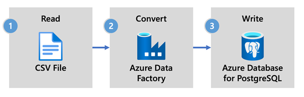

# What is Azure Data Factory(ADF)?

[Azure Data Factory](../../data-factory/introduction.md) is the cloud-based ETL and data integration service that allows you to create data-driven workflows for orchestrating data movement and transforming data at scale. Using Azure Data Factory, you can create and schedule data-driven workflows (called pipelines) that can ingest data from disparate data stores running on-premises, in Azure or other cloud providers for analytics and reporting.
The sink support for Hyperscale (Citus) allows you to bring your data (relational, NoSQL, data lake files) to your favorite open-source database for storage, processing, and reporting.

## ADF for real-time ingestion to Hyperscale (Citus)

Some of the key factors for choosing Azure Data Factory for ingestion with Hyperscale (Citus) are:

* **Easy-to-use**- Offers a code free visual environment for orchestrating and automating data movement.
* **Powerful**- Use the full capacity of underlying network bandwidth, up to 5 GB/s throughput.
* **Built-in Connectors**- Integrate all your data with more than 90 built-in connectors.
* **Cost Effective**- Enjoy a pay-as-you-go, fully managed serverless cloud service that scales on demand.

## Steps to use ADF with Hyperscale (Citus)

In this tutorial, we'll create a data pipeline by using the Azure Data Factory user interface (UI). The pipeline in this data factory copies data from Azure Blob storage to a database in Hyperscale (Citus). For a list of data stores supported as sources and sinks, see the [supported data stores](../../data-factory/copy-activity-overview.md#supported-data-stores-and-formats) table.

In Azure Data Factory, you can use the **Copy** activity to copy data among data stores located on-premises and in the cloud to Hyperscale Citus. If you're new to Azure Data Factory, here's a quick guide on how to get started:

1. Once ADF is provisioned, go to your data factory. You'll see the Data Factory home page as shown in the following image:

2. On the home page, select **Orchestrate**.

3. In the General panel under **Properties**, specify the name of pipeline. 
4. In the **Activities** toolbox, expand the **Move and Transform** category, and drag and drop the **Copy Data** activity to the pipeline designer surface. Specify the activity name.

5. Configure **Source**

   1. Go to the Source tab. Select** + New **to create a source dataset.
   2. In the **New Dataset** dialog box, select **Azure Blob Storage**, and then select **Continue**. 
   3. Choose the format type of your data, and then select **Continue**.
   4. Under the **Linked service** text box, select **+ New**.
   5. Specify Linked Service name and select your storage account from the **Storage account name** list. Test connection
   6. Next to **File path**, select **Browse** and select the desired file from BLOB storage.
   7. Select **Ok** to save the configuration.

6. Configure **Sink**

    1. Go to the Sink tab. Select **+ New** to create a source dataset.
    2. In the **New Dataset** dialog box, select **Azure Database for PostgreSQL**, and then select **Continue**.
    3. Under the **Linked service** text box, select **+ New**. 
    4. Specify Linked Service name and select your server group from the list for PostgreSQL server groups. Add connection details and test connection
    > **_NOTE:_**  If your server group is not there in the drop down, use Enter manually option to add server details.
    5. Select the table name where you want to ingest the data.
    6. Specify **Write method** as COPY command.
    7. Select **Ok** to save the configuration.

7. From the toolbar above the canvas, select **Validate** to validate pipeline settings. Fix errors (if any), revalidate and ensure that the pipeline has been successfully validated.
8. Select Debug from the toolbar execute the pipeline.

9. Once the pipeline can run successfully, in the top toolbar, select **Publish all**. This action publishes entities (datasets, and pipelines) you created to Data Factory.

---
**Calling a Stored Procedure in ADF**

In some specific scenarios, you might want to call a stored procedure/function to push aggregated data from staging table to summary table. As of today, ADF doesn't offer Stored Procedure activity for Azure Database for Postgres, but as a workaround we can use Lookup Activity with query to call a stored procedure as shown below:

---

