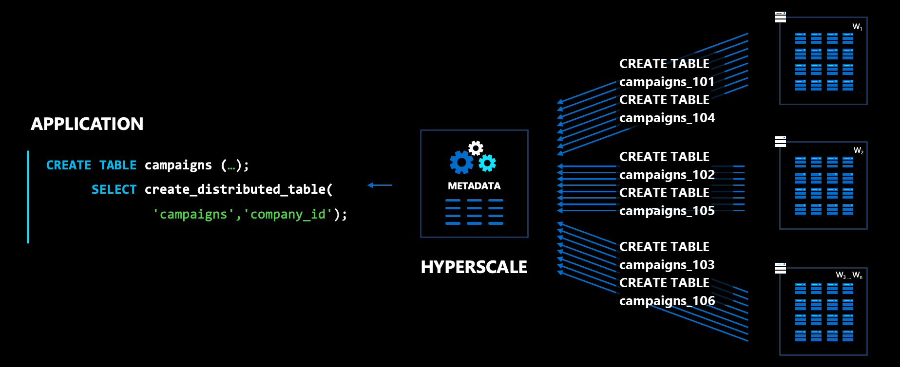
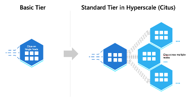

# What is Hyperscale (Citus)?

## The superpower of distributed tables

Hyperscale (Citus) is PostgreSQL extended with the superpower of "distributed
tables." This superpower enables you to build highly scalable relational apps.
You can start building apps on a single node server group, the same way you
would with PostgreSQL. As your app's scalability and performance requirements
grow, you can seamlessly scale to multiple nodes by transparently distributing
your tables.

Real-world customer applications built on Citus include SaaS apps, real-time
operational analytics apps, and high throughput transactional apps. These apps
span various verticals such as sales & marketing automation, healthcare,
IOT/telemetry, finance, logistics, and search.

> [!div class="nextstepaction"]
> [Try the quickstart >](quickstart-create-portal.md)

## Fully managed, resilient database

As Hyperscale (Citus) is a fully managed service, it has all the features for
worry-free operation in production. Features include:

* automatic high availability
* backups
* built-in pgBouncer
* read-replicas
* easy monitoring
* private endpoints
* encryption
* and more

## Always the latest PostgreSQL features

Hyperscale (Citus) is built around the open-source
[Citus](https://github.com/citusdata/citus) extension to PostgreSQL. Because
Citus is an extension--not a fork--of the underlying database, it always
supports the latest PostgreSQL version within one day of release.

Your apps can use the newest PostgreSQL features and extensions, such as
native partitioning for performance, JSONB support to store and query
unstructured data, and geospatial functionality via the PostGIS extension.
It's the speed you need, on the database you love.

## Start simply, scale seamlessly

The Basic Tier allows you to deploy Hyperscale (Citus) as a single node, while
having the superpower of distributing tables. At a few dollars a day, it's the
most cost-effective way to experience Hyperscale (Citus). Later, if your
application requires greater scale, you can add nodes and rebalance your data.

## Watch a demo

> [!VIDEO https://www.youtube.com/embed/Q30KQ5wRGxU]

## Next steps

> [!div class="nextstepaction"]
> [Try the quickstart >](quickstart-create-portal.md)
