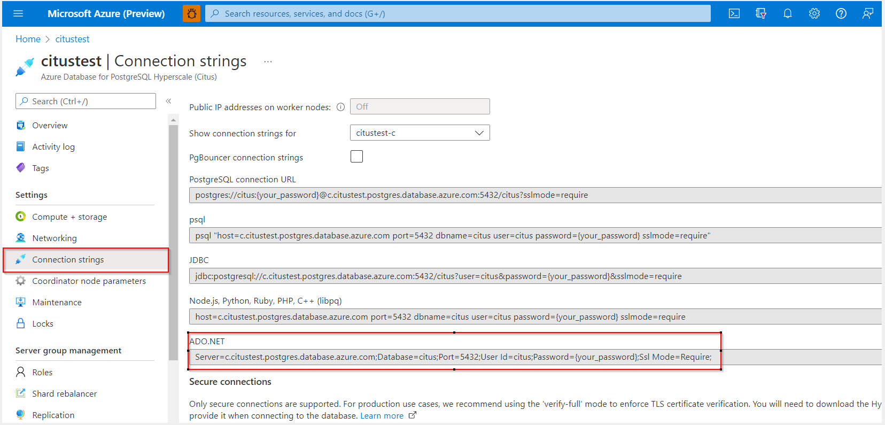

# C# app to connect and query Hyperscale (Citus)

[!INCLUDE[applies-to-postgresql-hyperscale](../includes/applies-to-postgresql-hyperscale.md)]

In this document, you'll learn how to connect to a Hyperscale (Citus) database using a C# application. You'll see how to use SQL statements to query, insert, update, and delete data in the database. The steps in this article assume that you're familiar with developing using C#, and are new to working with Hyperscale (Citus).

> [!TIP]
>
> The process of creating a C# app with Hyperscale (Citus) is the same as working with ordinary PostgreSQL.

## Prerequisites

* An Azure account with an active subscription. [Create an account for free](https://azure.microsoft.com/free)
* Create a Hyperscale (Citus) server group using this link [Create Hyperscale (Citus) server group](quickstart-create-portal.md)
* Install the [.NET SDK](https://dotnet.microsoft.com/download) for your platform (Windows, Ubuntu Linux, or macOS) for your platform.
* Install [Visual Studio](https://www.visualstudio.com/downloads/) to build your project.
* Install the [Npgsql](https://www.nuget.org/packages/Npgsql/) NuGet package in Visual Studio.

## Get database connection information

To get the database credentials, you can use the **Connection strings** tab in the Azure portal. See below screenshot.



## Step 1: Connect, create table, and insert data

Use the following code to connect and load the data using CREATE TABLE and INSERT INTO SQL statements. The code uses these `NpgsqlCommand` class methods:

* [Open()](https://www.npgsql.org/doc/api/Npgsql.NpgsqlConnection.html#Npgsql_NpgsqlConnection_Open) to establish a connection to Hyperscale (Citus),
* [CreateCommand()](https://www.npgsql.org/doc/api/Npgsql.NpgsqlConnection.html#Npgsql_NpgsqlConnection_CreateCommand) to set the CommandText property
* [ExecuteNonQuery()](https://www.npgsql.org/doc/api/Npgsql.NpgsqlCommand.html#Npgsql_NpgsqlCommand_ExecuteNonQuery) to run database commands.

[!INCLUDE[why-connection-pooling](includes/why-connection-pooling.md)]

```csharp
using System;
using Npgsql;
namespace Driver
{
    public class AzurePostgresCreate
    {
       
        static void Main(string[] args)
        {
            // Replace below argument with connection string from portal.
            var connStr = new NpgsqlConnectionStringBuilder("Server = <host> Database = citus; Port = 5432; User Id = citus; Password = {your password}; Ssl Mode = Require; Pooling = true; Minimum Pool Size=0; Maximum Pool Size =50 ");

            connStr.TrustServerCertificate = true;

            using (var conn = new NpgsqlConnection(connStr.ToString()))
            {
                Console.Out.WriteLine("Opening connection");
                conn.Open();
                using (var command = new NpgsqlCommand("DROP TABLE IF EXISTS pharmacy;", conn))
                {
                    command.ExecuteNonQuery();
                    Console.Out.WriteLine("Finished dropping table (if existed)");
                }
                using (var command = new NpgsqlCommand("CREATE TABLE pharmacy (pharmacy_id integer ,pharmacy_name text,city text,state text,zip_code integer);", conn))
                {
                    command.ExecuteNonQuery();
                    Console.Out.WriteLine("Finished creating table");
                }
                using (var command = new NpgsqlCommand("CREATE INDEX idx_pharmacy_id ON pharmacy(pharmacy_id);", conn))
                {
                    command.ExecuteNonQuery();
                    Console.Out.WriteLine("Finished creating index");
                }
                using (var command = new NpgsqlCommand("INSERT INTO  pharmacy  (pharmacy_id,pharmacy_name,city,state,zip_code) VALUES (@n1, @q1, @a, @b, @c)", conn))
                {
                    command.Parameters.AddWithValue("n1", 0);
                    command.Parameters.AddWithValue("q1", "Target");
                    command.Parameters.AddWithValue("a", "Sunnyvale");
                    command.Parameters.AddWithValue("b", "California");
                    command.Parameters.AddWithValue("c", 94001);
                    int nRows = command.ExecuteNonQuery();
                    Console.Out.WriteLine(String.Format("Number of rows inserted={0}", nRows));
                }

            }
            Console.WriteLine("Press RETURN to exit");
            Console.ReadLine();
        }
    }
}
```

## Step 2: Use the super power of distributed tables

Hyperscale (Citus) gives you [the super power of distributing tables](overview.md#the-superpower-of-distributed-tables) across multiple nodes for scalability. The command below enables you to distribute a table. You can learn more about `create_distributed_table` and the distribution column [here](quickstart-build-scalable-apps-concepts.md#distribution-column-also-known-as-shard-key).

> [!TIP]
>
> Distributing your tables is optional if you are using the Basic Tier of Hyperscale (Citus), which is a single-node server group.

```csharp
using System;
using Npgsql;
namespace Driver
{
    public class AzurePostgresCreate
    {
      
        static void Main(string[] args)
        {
            // Replace below argument with connection string from portal.
            var connStr = new NpgsqlConnectionStringBuilder("Server = <host> Database = citus; Port = 5432; User Id = citus; Password = {your password}; Ssl Mode = Require; Pooling = true; Minimum Pool Size=0; Maximum Pool Size =50");

            connStr.TrustServerCertificate = true;

            using (var conn = new NpgsqlConnection(connStr.ToString()))
            {
                Console.Out.WriteLine("Opening connection");
                conn.Open();
                using (var command = new NpgsqlCommand("select create_distributed_table('pharmacy','pharmacy_id');", conn))
                {
                    command.ExecuteNonQuery();
                    Console.Out.WriteLine("Finished distributing the table");
                }

            }
            Console.WriteLine("Press RETURN to exit");
            Console.ReadLine();
        }
    }
}
```

## Step 3: Read data

Use the following code to connect and read the data using a SELECT SQL statement. The code uses these `NpgsqlCommand` class methods:

* [Open()](https://www.npgsql.org/doc/api/Npgsql.NpgsqlConnection.html#Npgsql_NpgsqlConnection_Open) to establish a connection to Hyperscale (Citus).
* [CreateCommand()](https://www.npgsql.org/doc/api/Npgsql.NpgsqlConnection.html#Npgsql_NpgsqlConnection_CreateCommand) and [ExecuteReader()](https://www.npgsql.org/doc/api/Npgsql.NpgsqlCommand.html#Npgsql_NpgsqlCommand_ExecuteReader) to run the database commands.
* [Read()](https://www.npgsql.org/doc/api/Npgsql.NpgsqlDataReader.html#Npgsql_NpgsqlDataReader_Read) to advance to the record in the results.
* [GetInt32()](https://www.npgsql.org/doc/api/Npgsql.NpgsqlDataReader.html#Npgsql_NpgsqlDataReader_GetInt32_System_Int32_) and [GetString()](https://www.npgsql.org/doc/api/Npgsql.NpgsqlDataReader.html#Npgsql_NpgsqlDataReader_GetString_System_Int32_) to parse the values in the record.

```csharp
using System;
using Npgsql;
namespace Driver
{
    public class read
    {

        static void Main(string[] args)
        {
            // Replace below argument with connection string from portal.
            var connStr = new NpgsqlConnectionStringBuilder("Server = <host> Database = citus; Port = 5432; User Id = citus; Password = {your password}; Ssl Mode = Require; Pooling = true; Minimum Pool Size=0; Maximum Pool Size =50 ");

            connStr.TrustServerCertificate = true;

            using (var conn = new NpgsqlConnection(connStr))
            {
                Console.Out.WriteLine("Opening connection");
                conn.Open();
                using (var command = new NpgsqlCommand("SELECT * FROM pharmacy", conn))
                {
                    var reader = command.ExecuteReader();
                    while (reader.Read())
                    {
                        Console.WriteLine(
                            string.Format(
                                "Reading from table=({0}, {1}, {2}, {3}, {4})",
                                reader.GetInt32(0).ToString(),
                                reader.GetString(1),
                                 reader.GetString(2),
                                 reader.GetString(3),
                                reader.GetInt32(4).ToString()
                                )
                            );
                    }
                    reader.Close();
                }
            }
            Console.WriteLine("Press RETURN to exit");
            Console.ReadLine();
        }
    }
}
```

## Step 4: Update data

Use the following code to connect and update data using an UPDATE SQL statement.

```csharp
using System;
using Npgsql;
namespace Driver
{
    public class AzurePostgresUpdate
    {
        static void Main(string[] args)
        {
            // Replace below argument with connection string from portal.
            var connStr = new NpgsqlConnectionStringBuilder("Server = <host> Database = citus; Port = 5432; User Id = citus; Password = {your password}; Ssl Mode = Require; Pooling = true; Minimum Pool Size=0; Maximum Pool Size =50 ");

            connStr.TrustServerCertificate = true;

            using (var conn = new NpgsqlConnection(connStr.ToString()))
            {
                Console.Out.WriteLine("Opening connection");
                conn.Open();
                using (var command = new NpgsqlCommand("UPDATE pharmacy SET city = @q WHERE pharmacy_id = @n", conn))
                {
                    command.Parameters.AddWithValue("n", 0);
                    command.Parameters.AddWithValue("q", "guntur");
                    int nRows = command.ExecuteNonQuery();
                    Console.Out.WriteLine(String.Format("Number of rows updated={0}", nRows));
                }
            }
            Console.WriteLine("Press RETURN to exit");
            Console.ReadLine();
        }
    }
}
```

## Step 5: Delete data

Use the following code to connect and delete data using a DELETE SQL statement.

```csharp
using System;
using Npgsql;
namespace Driver
{
    public class AzurePostgresDelete
    {
       
        static void Main(string[] args)
        {
            // Replace below argument with connection string from portal.
            var connStr = new NpgsqlConnectionStringBuilder("Server = <host> Database = citus; Port = 5432; User Id = citus; Password = {your password}; Ssl Mode = Require; Pooling = true; Minimum Pool Size=0; Maximum Pool Size =50 ");

            connStr.TrustServerCertificate = true;

            using (var conn = new NpgsqlConnection(connStr.ToString()))
            {

                Console.Out.WriteLine("Opening connection");
                conn.Open();
                using (var command = new NpgsqlCommand("DELETE FROM pharmacy WHERE pharmacy_id = @n", conn))
                {
                    command.Parameters.AddWithValue("n", 0);
                    int nRows = command.ExecuteNonQuery();
                    Console.Out.WriteLine(String.Format("Number of rows deleted={0}", nRows));
                }
            }
            Console.WriteLine("Press RETURN to exit");
            Console.ReadLine();
        }
    }
}
```

## COPY command for super fast ingestion

The COPY command can yield [tremendous throughput](https://www.citusdata.com/blog/2016/06/15/copy-postgresql-distributed-tables) while ingesting data into Hyperscale (Citus). The COPY command can ingest data in files, or from micro-batches of data in memory for real-time ingestion.

### COPY command to load data from a file

The following code is an example for copying data from a CSV file to a database table.

It requires the file [pharmacies.csv](https://download.microsoft.com/download/d/8/d/d8d5673e-7cbf-4e13-b3e9-047b05fc1d46/pharmacies.csv).

```csharp
using Npgsql;
public class csvtotable
{

    static void Main(string[] args)
    {
        String sDestinationSchemaAndTableName = "pharmacy";
        String sFromFilePath = "C:\\Users\\Documents\\pharmacies.csv";
       
        // Replace below argument with connection string from portal.
        var connStr = new NpgsqlConnectionStringBuilder("Server = <host> Database = citus; Port = 5432; User Id = citus; Password = {your password}; Ssl Mode = Require; Pooling = true; Minimum Pool Size=0; Maximum Pool Size =50 ");
            
        connStr.TrustServerCertificate = true;

        NpgsqlConnection conn = new NpgsqlConnection(connStr.ToString());
        NpgsqlCommand cmd = new NpgsqlCommand();

        conn.Open();

        if (File.Exists(sFromFilePath))
        {
            using (var writer = conn.BeginTextImport("COPY " + sDestinationSchemaAndTableName + " FROM STDIN WITH(FORMAT CSV, HEADER true,NULL ''); "))
            {
                foreach (String sLine in File.ReadAllLines(sFromFilePath))
                {
                    writer.WriteLine(sLine);
                }
            }
            Console.WriteLine("csv file data copied sucessfully");
        }
    }
}
```

### COPY command to load data in-memory

The following code is an example for copying in-memory data to table.

```csharp
using Npgsql;
using NpgsqlTypes;
namespace Driver
{
    public class InMemory
    {

        static async Task Main(string[] args)
        {
         
             // Replace below argument with connection string from portal.
            var connStr = new NpgsqlConnectionStringBuilder("Server = <host> Database = citus; Port = 5432; User Id = citus; Password = {your password}; Ssl Mode = Require; Pooling = true; Minimum Pool Size=0; Maximum Pool Size =50 ");

            connStr.TrustServerCertificate = true;

            using (var conn = new NpgsqlConnection(connStr.ToString()))
            {
                conn.Open();
                var text = new dynamic[] { 0, "Target", "Sunnyvale", "California", 94001 };
                using (var writer = conn.BeginBinaryImport("COPY pharmacy  FROM STDIN (FORMAT BINARY)"))
                {
                    writer.StartRow();
                    foreach (var item in text)
                    {
                        writer.Write(item);
                    }
                    writer.Complete();
                }
                Console.WriteLine("in-memory data copied sucessfully");
            }
        }
    }
}
```
## App retry during database request failures

[!INCLUDE[app-stack-next-steps](includes/app-stack-retry-intro.md)]

```csharp
using System;
using System.Data;
using System.Runtime.InteropServices;
using System.Text;
using Npgsql;

namespace Driver
{
    public class Reconnect
    {
        static string connStr = new NpgsqlConnectionStringBuilder("Server = <host name>; Database = citus; Port = 5432; User Id = citus; Password = {Your Password}; Ssl Mode = Require; Pooling = true; Minimum Pool Size=0; Maximum Pool Size =50;TrustServerCertificate = true").ToString();
        static string executeRetry(string sql, int retryCount)
        {
            for (int i = 0; i < retryCount; i++)
            {
                try
                {
                    using (var conn = new NpgsqlConnection(connStr))
                    {
                        conn.Open();
                        DataTable dt = new DataTable();
                        using (var _cmd = new NpgsqlCommand(sql, conn))
                        {
                            NpgsqlDataAdapter _dap = new NpgsqlDataAdapter(_cmd);
                            _dap.Fill(dt);
                            conn.Close();
                            if (dt != null)
                            {
                                if (dt.Rows.Count > 0)
                                {
                                    int J = dt.Rows.Count;
                                    StringBuilder sb = new StringBuilder();

                                    for (int k = 0; k < dt.Rows.Count; k++)
                                    {
                                        for (int j = 0; j < dt.Columns.Count; j++)
                                        {
                                            sb.Append(dt.Rows[k][j] + ",");
                                        }
                                        sb.Remove(sb.Length - 1, 1);
                                        sb.Append("\n");
                                    }
                                    return sb.ToString();
                                }
                            }
                        }
                    }
                    return null;
                }
                catch (Exception e)
                {
                    Thread.Sleep(60000);
                    Console.WriteLine(e.Message);
                }
            }
            return null;
        }
        static void Main(string[] args)
        {
            string result = executeRetry("select 1",5);
            Console.WriteLine(result);
        }
    }
}
```

## Next steps

[!INCLUDE[app-stack-next-steps](includes/app-stack-next-steps.md)]
