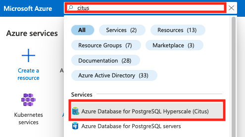
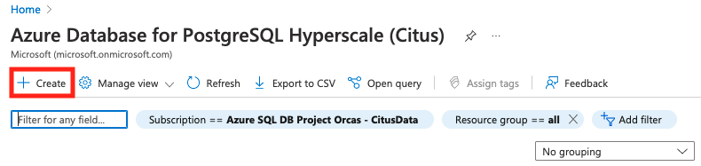
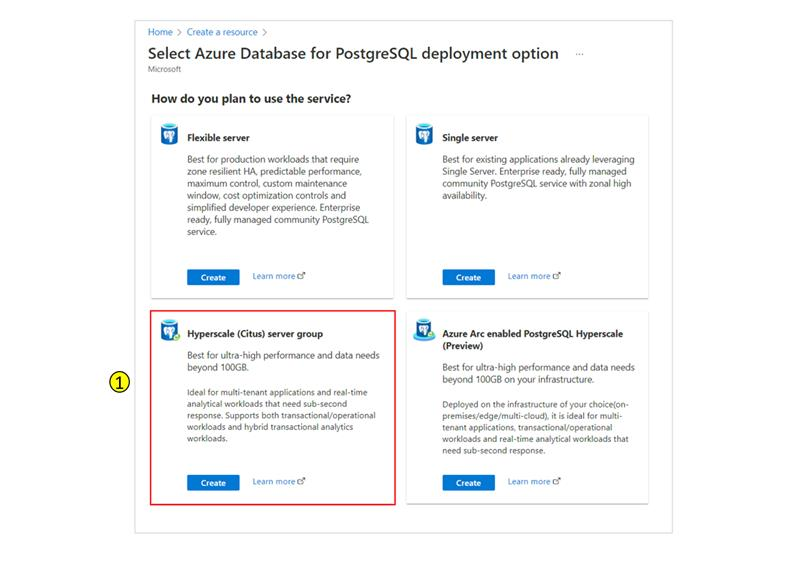
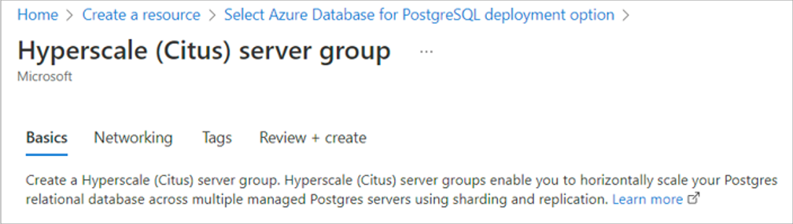
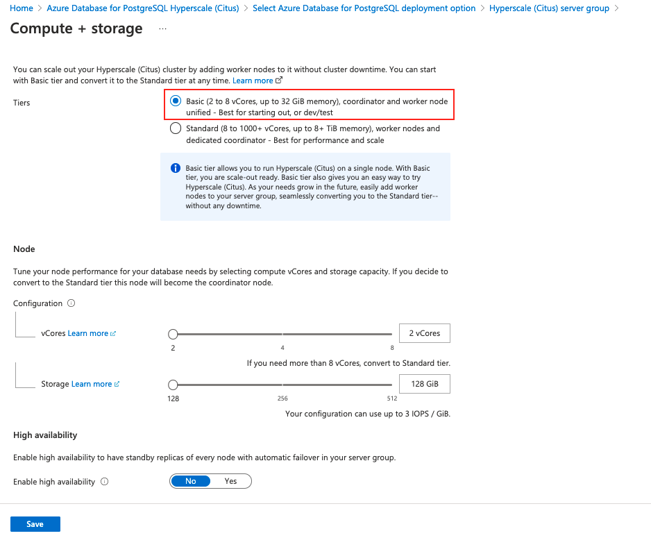
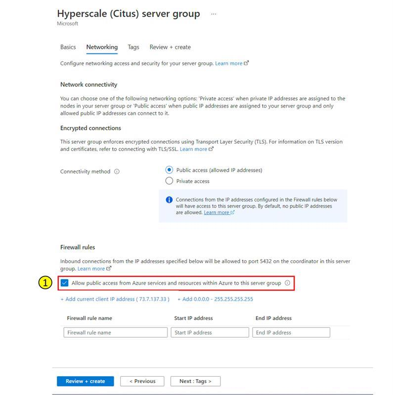

# Create a Hyperscale (Citus) server group in the Azure portal

Azure Database for PostgreSQL - Hyperscale (Citus) is a managed service that
allows you to run horizontally scalable PostgreSQL databases in the cloud.

## Prerequisites

To follow this quickstart, you'll first need to:

* Create a [free account](https://azure.microsoft.com/free/) (If you don't have
  an Azure subscription).
* Sign in to the [Azure portal](https://portal.azure.com).

## Get started with the Basic Tier

The Basic Tier allows you to deploy Hyperscale (Citus) as a single node, while
having the superpower of distributing tables. At a few dollars a day, it's the
most cost-effective way to experience Hyperscale (Citus). Later, if your
application requires greater scale, you can add nodes and rebalance your data.

Let's get started!

# [Direct link](#tab/direct)

Visit [Create Hyperscale (Citus) server group](https://portal.azure.com/#create/Microsoft.PostgreSQLServerGroup) in the Azure portal.

# [Via portal search](#tab/portal-search)

1. Visit the [Azure portal](https://portal.azure.com/) and search for
   **citus**. Select **Azure Database for PostgreSQL Hyperscale (Citus)**.
   
2. Select **+ Create**.
   
3. Select the **Hyperscale (Citus) server group** deployment option.
   

---

1. Fill out the **Basics** form.
   

   Most options are self-explanatory, but keep in mind:

   * The server group name will determine the DNS name your
     applications use to connect, in the form
     `server-group-name.postgres.database.azure.com`.
   * The admin username is required to be the value `citus`.
   * You can choose a database version. Hyperscale (Citus) always supports the
     latest PostgreSQL version, within one day of release.

2. Select **Configure server group**.

   

   For this quickstart, you can accept the default value of **Basic** for
   **Tiers**. The Basic Tier allows you to experiment with a single-node
   server group for a few dollars a day.

3. Select **Save**.

4. Select **Next : Networking >** at the bottom of the screen.
5. In the **Networking** tab, select **Allow public access from Azure services
   and resources within Azure to this server group**.

   

6. Select **Review + create** and then **Create** to create the server.
   Provisioning takes a few minutes.
7. The page will redirect to monitor deployment. When the live status changes
   from **Deployment is in progress** to **Your deployment is complete**.
   After this transition, select **Go to resource**.

## Next steps

With your server group created, it's time to connect with a SQL client.

> [!div class="nextstepaction"]
> [Connect to your server group >](quickstart-connect-psql.md)
