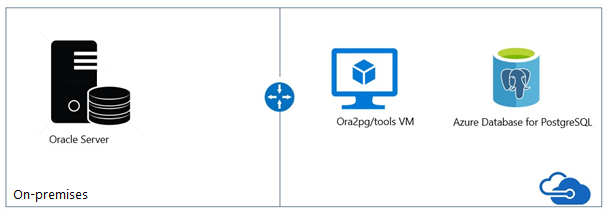

# Migrate Oracle to Azure Database for PostgreSQL

[!INCLUDE[applies-to-postgres-single-flexible-server](../includes/applies-to-postgresql-single-flexible-server.md)]

This guide helps you to migrate your Oracle schema to Azure Database for PostgreSQL. 

For detailed and comprehensive migration guidance, see the [Migration guide resources](https://github.com/microsoft/OrcasNinjaTeam/blob/master/Oracle%20to%20PostgreSQL%20Migration%20Guide/Oracle%20to%20Azure%20Database%20for%20PostgreSQL%20Migration%20Guide.pdf). 

## Prerequisites

To migrate your Oracle schema to Azure Database for PostgreSQL, you need to: 

- Verify your source environment is supported. 
- Download the latest version of [ora2pg](https://ora2pg.darold.net/). 
- Have the latest version of the [DBD module](https://www.cpan.org/modules/by-module/DBD/). 


## Overview

PostgreSQL is one of world's most advanced open-source databases. This article describes how to use the free ora2pg tool to migrate an Oracle database to PostgreSQL. You can use ora2pg to migrate an Oracle database or MySQL database to a PostgreSQL-compatible schema. 

The ora2pg tool connects your Oracle database, scans it automatically, and extracts its structure or data. Then ora2pg generates SQL scripts that you can load into your PostgreSQL database. You can use ora2pg for tasks such as reverse-engineering an Oracle database, migrating a huge enterprise database, or simply replicating some Oracle data into a PostgreSQL database. The tool is easy to use and requires no Oracle database knowledge besides the ability to provide the parameters needed to connect to the Oracle database.

> [!NOTE]
> For more information about using the latest version of ora2pg, see the [ora2pg documentation](https://ora2pg.darold.net/documentation.html).

### Typical ora2pg migration architecture



After you provision the VM and Azure Database for PostgreSQL, you need two configurations to enable connectivity between them: **Allow access to Azure services** and **Enforce SSL Connection**: 

- **Connection Security** blade > **Allow access to Azure services** > **ON**

- **Connection Security** blade > **SSL Settings** > **Enforce SSL Connection** > **DISABLED**

### Recommendations

- To improve the performance of the assessment or export operations in the Oracle server, collect statistics:

   ```
   BEGIN
   
     DBMS_STATS.GATHER_SCHEMA_STATS
     DBMS_STATS.GATHER_DATABASE_STATS
     DBMS_STATS.GATHER_DICTIONARY_STATS
     END;
   ```

- Export data by using the `COPY` command instead of `INSERT`.

- Avoid exporting tables with their foreign keys (FKs), constraints, and indexes. These elements slow down the process of importing data into PostgreSQL.

- Create materialized views by using the *no data clause*. Then refresh the views later.

- If possible, use unique indexes in materialized views. These indexes can speed up the refresh when you use the syntax `REFRESH MATERIALIZED VIEW CONCURRENTLY`.


## Pre-migration 

After you verify that your source environment is supported and that you've addressed any prerequisites, you're ready to start the premigration stage. To begin: 

1. **Discover**: Inventory the databases that you need to migrate. 
2. **Assess**: Assess those databases for potential migration issues or blockers.
3. **Convert**: Resolve any items you uncovered. 
 
For heterogenous migrations such as Oracle to Azure Database for PostgreSQL, this stage also involves making the source database schemas compatible with the target environment.

### Discover

The goal of the discovery phase is to identify existing data sources and details about the features that are being used. This phase helps you better understand and plan for the migration. The process involves scanning the network to identify all your organization's Oracle instances together with the version and features in use.

Microsoft pre-assessment scripts for Oracle run against the Oracle database. The pre-assessment scripts query the Oracle metadata. The scripts provide:

- A database inventory, including counts of objects by schema, type, and status.
- A rough estimate of the raw data in each schema, based on statistics.
- The size of tables in each schema.
- The number of code lines per package, function, procedure, and so on.

Download the related scripts from [github](https://github.com/microsoft/DataMigrationTeam/tree/master/Whitepapers).

### Assess

After you inventory the Oracle databases, you'll have an idea of the database size and potential challenges. The next step is to run the assessment.

Estimating the cost of a migration from Oracle to PostgreSQL isn't easy. To assess the migration cost, ora2pg checks all database objects, functions, and stored procedures for objects and PL/SQL code that it can't automatically convert.

The ora2pg tool has a content analysis mode that inspects the Oracle database to generate a text report. The report describes what the Oracle database contains and what can't be exported.

To activate the *analysis and report* mode, use the exported type `SHOW_REPORT` as shown in the following command:

```
ora2pg -t SHOW_REPORT
```

The ora2pg tool can convert SQL and PL/SQL code from Oracle syntax to PostgreSQL. So after the database is analyzed, ora2pg can estimate the code difficulties and the time necessary to migrate a full database.

To estimate the migration cost in human-days, ora2pg allows you to use a configuration directive called `ESTIMATE_COST`. You can also enable this directive at a command prompt:

```
ora2pg -t SHOW_REPORT --estimate_cost
```

The default migration unit represents around five minutes for a PostgreSQL expert. If this migration is your first, you can increase the default migration unit by using the configuration directive `COST_UNIT_VALUE` or the `--cost_unit_value` command-line option.

The last line of the report shows the total estimated migration code in human-days. The estimate follows the number of migration units estimated for each object.

In the following code example, you see some assessment variations: 
* Tables assessment
* Columns assessment
* Schema assessment that uses a default cost unit of 5 minutes
* Schema assessment that uses a cost unit of 10 minutes

```
ora2pg -t SHOW_TABLE -c c:\ora2pg\ora2pg_hr.conf > c:\ts303\hr_migration\reports\tables.txt 
ora2pg -t SHOW_COLUMN -c c:\ora2pg\ora2pg_hr.conf > c:\ts303\hr_migration\reports\columns.txt
ora2pg -t SHOW_REPORT -c c:\ora2pg\ora2pg_hr.conf --dump_as_html --estimate_cost > c:\ts303\hr_migration\reports\report.html
ora2pg -t SHOW_REPORT -c c:\ora2pg\ora2pg_hr.conf –-cost_unit_value 10 --dump_as_html --estimate_cost > c:\ts303\hr_migration\reports\report2.html
```

Here's the output of the schema assessment migration level B-5:

* Migration levels:

  * A - Migration that can be run automatically
    
  * B - Migration with code rewrite and a human-days cost up to 5 days
    
  * C - Migration with code rewrite and a human-days cost over 5 days
    
* Technical levels:

   * 1 = Trivial: No stored functions and no triggers

   * 2 = Easy: No stored functions, but triggers; no manual rewriting

   * 3 = Simple: Stored functions and/or triggers; no manual rewriting

   * 4 = Manual: No stored functions, but triggers or views with code rewriting

   * 5 = Difficult: Stored functions and/or triggers with code rewriting

The assessment consists of: 
* A letter (A or B) to specify whether the migration needs manual rewriting.

* A number from 1 to 5 to indicate the technical difficulty. 

Another option, `-human_days_limit`, specifies the limit of human-days. Here, set the migration level to C to indicate that the migration needs a large amount of work, full project management, and migration support. The default is 10 human-days. You can use the configuration directive `HUMAN_DAYS_LIMIT` to change this default value permanently.

This schema assessment was developed to help users decide which database to migrate first and which teams to mobilize.

### Convert

In minimal-downtime migrations, your migration source changes. It drifts from the target in terms of data and schema after the one-time migration. During the *Data sync* phase, ensure that all changes in the source are captured and applied to the target in near real time. After you verify that all changes are applied to the target, you can *cut over* from the source to the target environment.

In this step of the migration, the Oracle code and DDL scripts are converted or translated to PostgreSQL. The ora2pg tool exports the Oracle objects in a PostgreSQL format automatically. Some of the generated objects can't be compiled in the PostgreSQL database without manual changes.  

To understand which elements need manual intervention, first compile the files generated by ora2pg against the PostgreSQL database. Check the log, and then make any necessary changes until the schema structure is compatible with PostgreSQL syntax.


#### Create a migration template 

We recommend using the migration template that ora2pg provides. When you use the options `--project_base` and `--init_project`, ora2pg creates a project template with a work tree, a configuration file, and a script to export all objects from the Oracle database. For more information, see the [ora2pg documentation](https://ora2pg.darold.net/documentation.html).

Use the following command: 

```
ora2pg --project_base /app/migration/ --init_project test_project
```

Here's the example output: 
   
```
ora2pg --project_base /app/migration/ --init_project test_project
        Creating project test_project.
        /app/migration/test_project/
                schema/
                        dblinks/
                        directories/
                        functions/
                        grants/
                        mviews/
                        packages/
                        partitions/
                        procedures/
                        sequences/
                        synonyms/
                        tables/
                        tablespaces/
                        triggers/
                        types/
                        views/
                sources/
                        functions/
                        mviews/
                        packages/
                        partitions/
                        procedures/
                        triggers/
                        types/
                        views/
                data/
                config/
                reports/

        Generating generic configuration file
        Creating script export_schema.sh to automate all exports.
        Creating script import_all.sh to automate all imports.
```

The `sources/` directory contains the Oracle code. The `schema/` directory contains the code ported to PostgreSQL. And the `reports/` directory contains the HTML reports and the migration cost assessment.


After the project structure is created, a generic config file is created. Define the Oracle database connection and the relevant config parameters in the config file. For more information about the config file, see the [ora2pg documentation](https://ora2pg.darold.net/documentation.html).


#### Export Oracle objects

Next, export the Oracle objects as PostgreSQL objects by running the file *export_schema.sh*.

```
cd /app/migration/mig_project
./export_schema.sh
```

Run the following command manually.

```
SET namespace="/app/migration/mig_project"

ora2pg -p -t DBLINK -o dblink.sql -b %namespace%/schema/dblinks -c %namespace%/config/ora2pg.conf
ora2pg -p -t DIRECTORY -o directory.sql -b %namespace%/schema/directories -c %namespace%/config/ora2pg.conf
ora2pg -p -t FUNCTION -o functions2.sql -b %namespace%/schema/functions -c %namespace%/config/ora2pg.conf 
ora2pg -p -t GRANT -o grants.sql -b %namespace%/schema/grants -c %namespace%/config/ora2pg.conf 
ora2pg -p -t MVIEW -o mview.sql -b %namespace%/schema/mviews -c %namespace%/config/ora2pg.conf
ora2pg -p -t PACKAGE -o packages.sql -b %namespace%/schema/packages -c %namespace%/config/ora2pg.conf
ora2pg -p -t PARTITION -o partitions.sql -b %namespace%/schema/partitions -c %namespace%/config/ora2pg.conf
ora2pg -p -t PROCEDURE -o procs.sql -b %namespace%/schema/procedures -c %namespace%/config/ora2pg.conf
ora2pg -p -t SEQUENCE -o sequences.sql -b %namespace%/schema/sequences -c %namespace%/config/ora2pg.conf
ora2pg -p -t SYNONYM -o synonym.sql -b %namespace%/schema/synonyms -c %namespace%/config/ora2pg.conf
ora2pg -p -t TABLE -o table.sql -b %namespace%/schema/tables -c %namespace%/config/ora2pg.conf 
ora2pg -p -t TABLESPACE -o tablespaces.sql -b %namespace%/schema/tablespaces -c %namespace%/config/ora2pg.conf
ora2pg -p -t TRIGGER -o triggers.sql -b %namespace%/schema/triggers -c %namespace%/config/ora2pg.conf 
ora2pg -p -t TYPE -o types.sql -b %namespace%/schema/types -c %namespace%/config/ora2pg.conf 
ora2pg -p -t VIEW -o views.sql -b %namespace%/schema/views -c %namespace%/config/ora2pg.conf
```

To extract the data, use the following command.

```
ora2pg -t COPY -o data.sql -b %namespace%/data -c %namespace/config/ora2pg.conf
```

#### Compile files

Finally, compile all files against the Azure Database for PostgreSQL server. You can choose to load the manually generated DDL files or use the second script *import_all.sh* to import those files interactively.

```
psql -f %namespace%\schema\sequences\sequence.sql -h server1-server.postgres.database.azure.com -p 5432 -U username@server1-server -d database -L %namespace%\ schema\sequences\create_sequences.log

psql -f %namespace%\schema\tables\table.sql -h server1-server.postgres.database.azure.com -p 5432 -U username@server1-server -d database -L %namespace%\schema\tables\create_table.log
```

Here's the data import command:

```
psql -f %namespace%\data\table1.sql -h server1-server.postgres.database.azure.com -p 5432 -U username@server1-server -d database -l %namespace%\data\table1.log

psql -f %namespace%\data\table2.sql -h server1-server.postgres.database.azure.com -p 5432 -U username@server1-server -d database -l %namespace%\data\table2.log
```

While the files are being compiled, check the logs and correct any syntax that ora2pg couldn't convert on its own.

For more information, see [Oracle to Azure Database for PostgreSQL migration workarounds](https://github.com/Microsoft/DataMigrationTeam/blob/master/Whitepapers/Oracle%20to%20Azure%20Database%20for%20PostgreSQL%20Migration%20Workarounds.pdf).

## Migrate 

After you have the necessary prerequisites and you've completed the premigration steps, you can start the schema and data migration.

### Migrate schema and data

When you've made the necessary fixes, a stable build of the database is ready to deploy. Run the `psql` import commands, pointing to the files that contain the modified code. This task compiles the database objects against the PostgreSQL database and imports the data.

In this step, you can implement a level of parallelism on importing the data.

### Sync data and cut over

In online (minimal-downtime) migrations, the migration source continues to change. It drifts from the target in terms of data and schema after the one-time migration. 

During the *Data sync* phase, ensure that all changes in the source are captured and applied to the target in near real time. After you verify that all changes are applied, you can cut over from the source to the target environment.

To do an online migration, contact AskAzureDBforPostgreSQL@service.microsoft.com for support.

In a *delta/incremental* migration that uses ora2pg, for each table, use a query that filters (*cuts*) by date, time, or another parameter. Then finish the migration by using a second query that migrates the remaining data.

In the source data table, migrate all the historical data first. Here's an example:

```
select * from table1 where filter_data < 01/01/2019
```

You can query the changes since the initial migration by running a command like this one:

```
select * from table1 where filter_data >= 01/01/2019
```

In this case, we recommended that you enhance validation by checking data parity on both sides, the source and the target.

## Post-migration 

After the *Migration* stage, complete the post-migration tasks to ensure that everything is functioning as smoothly and efficiently as possible.

### Remediate applications

After the data is migrated to the target environment, all the applications that formerly consumed the source need to start consuming the target. The setup sometimes requires changes to the applications.

### Test

After the data is migrated to the target, run tests against the databases to verify that the applications work well with the target. Make sure the source and target are properly migrated by running the manual data validation scripts against the Oracle source and PostgreSQL target databases.

Ideally, if the source and target databases have a networking path, ora2pg should be used for data validation. You can use the `TEST` action to ensure that all objects from the Oracle database have been created in PostgreSQL. 

Run this command:

```
ora2pg -t TEST -c config/ora2pg.conf > migration_diff.txt
```

### Optimize

The post-migration phase is crucial for reconciling any data accuracy issues and verifying completeness. In this phase, you also address performance issues with the workload.

## Migration assets 

For more information about this migration scenario, see the following resources. They support real-world migration project engagement.

| Resource | Description    |
| -------------- | ------------------ |
| [Oracle to Azure PostgreSQL migration cookbook](https://www.microsoft.com/en-us/download/details.aspx?id=103473) | This document helps architects, consultants, database administrators, and related roles quickly migrate workloads from Oracle to Azure Database for PostgreSQL by using ora2pg. |
| [Oracle to Azure PostgreSQL migration workarounds](https://github.com/Microsoft/DataMigrationTeam/blob/master/Whitepapers/Oracle%20to%20Azure%20Database%20for%20PostgreSQL%20Migration%20Workarounds.pdf) | This document helps architects, consultants, database administrators, and related roles quickly fix or work around issues while migrating workloads from Oracle to Azure Database for PostgreSQL. |
| [Steps to install ora2pg on Windows or Linux](https://www.microsoft.com/download/confirmation.aspx?id=105121)                       | This document provides a quick installation guide for migrating schema and data from Oracle to Azure Database for PostgreSQL by using ora2pg on Windows or Linux. For more information, see the [ora2pg documentation](http://ora2pg.darold.net/documentation.html). |

The Data SQL Engineering team developed these resources. This team's core charter is to unblock and accelerate complex modernization for data platform migration projects to the Microsoft Azure data platform.

## More support

For migration help beyond the scope of ora2pg tooling, contact [@Ask Azure DB for PostgreSQL](mailto:AskAzureDBforPostgreSQL@service.microsoft.com).

## Next steps

For a matrix of services and tools for database and data migration and for specialty tasks, see [Services and tools for data migration](../../dms/dms-tools-matrix.md).

Documentation: 
- [Azure Database for PostgreSQL documentation](../index.yml)
- [ora2pg documentation](https://ora2pg.darold.net/documentation.html)
- [PostgreSQL website](https://www.postgresql.org/)
- [Autonomous transaction support in PostgreSQL](http://blog.dalibo.com/2016/08/19/Autonoumous_transactions_support_in_PostgreSQL.html) 
