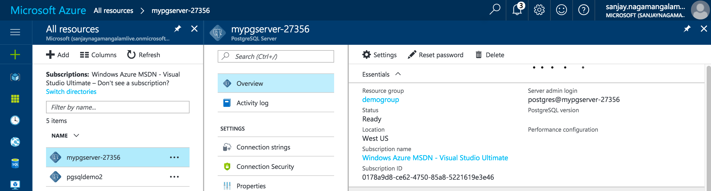

# Connect and Query with psql
This quick start shows how to use the PostgreSQL interactive terminal ([psql](https://www.postgresql.org/docs/9.6/static/app-psql.html)) command line utility to connect to and query a database in an Azure PostgreSQL server.
## Prerequisites
The PostgreSQL interactive terminal ([psql](https://www.postgresql.org/docs/9.6/static/app-psql.html)) is a command line utility that is part of a PostgreSQL installation. To use psql, you must have PostgreSQL installed on your client computer or have the psql command line utility installed on your machine.
This quick start uses an existing Azure PostgreSQL server and database as its starting point. Make sure you have created an Azure PostgreSQL server and enabled server-level firewall rules with one of the following quick starts:
- [Create PostgreSQL server - Portal](postgresql-quickstart-create-server-database-portal.md)
- [Create PostgreSQL server - CLI](postgresql-quickstart-create-server-database-azure-cli.md)

Also make sure you have created a database with the Create an Azure PostgreSQL database quick start.

## Get connection information
Get the fully qualified server name for your Azure PostgreSQL server from the Azure portal. You use the fully qualified server name to connect to your server using any standard PostgreSQL client application and tools.
1. Log in to the [Azure portal](https://portal.azure.com/).
2. Click **All Resources** from the left-hand menu, and click your Azure PostgreSQL server.
3. In the Essentials pane in the Azure portal page for your server, locate and then copy the Server name.



In this example, the server name is mypgsql-27356.database.windows.net, the server admin login is ServerAdmin@mypgserver-27356 and ChangeYourAdminPassword1 was specified as the password when the server was created.

## Connect to the database
You can use a local instance of the [psql](https://www.postgresql.org/docs/9.6/static/app-psql.html) command line utility to connect to a database in your Azure PostgreSQL server. You need to provide host information and access credentials, which you can obtain from the Azure portal as described earlier.
The following format is used to connect to a database in an Azure PostgreSQL server with the **psql** utility:
```
psql --host=<host> --port=<port> --username=<user@servername> --password [DBNAME]
```
The example below connects to the database mypgsqldb in the Azure PostgreSQL server mypgserver-27356.database.windows.net using the connection information we obtained earlier from the Azure portal:
```
psql --host=mypgserver-27356.database.windows.net --port=5432  --username=ServerAdmin@mypgserver-27356 --password mypgsqldb
```
Note that we used the server admin login as the username in the format **user@servername** when connecting to an Azure PostgreSQL server. The **psql** utility prompts you for the password before connecting to the database. Specify the password you used when the server was created (ChangeYourAdminPassword1 in this example).

Depending on your version of **psql**, you should see output similar to what’s below after a successful connection:
```sql
psql (9.6.2, server 9.5.5) 
SSL connection (protocol: TLSv1.2, cipher: ECDHE-RSA-AES256-SHA384,
bits: 256, compression: off) 
Type "help" for help. 
mypgsqldb=>
```
## Create a new table
The CREATE TABLE command creates a new, initially empty table in the current database. The table is owned by the user issuing the command
Copy and paste the following command at the **psql** prompt to create the **inventory** table:
```sql
CREATE TABLE inventory (id serial PRIMARY KEY, name VARCHAR(50),
quantity INTEGER);
```
You should see the following output:
```sql
CREATE TABLE
```
## Insert data into the table
The INSERT INTO command inserts new rows into a table. Copy and paste the following command at the **psql** prompt to add 2 rows to the **inventory** table:
```sql
INSERT INTO inventory (id, name, quantity) VALUES (1, 'banana', 150),
(2, 'orange', 154);
```
You should see the following output:
```sql
INSERT 0 2
```
## Query data in the table
The SELECT command selects rows from a table. Copy and paste the following command at the **psql** prompt to select all rows in the **inventory** table:
```sql
SELECT * FROM inventory;
```
You should see the following output:
```sql
id | name | quantity 
---+--------+---------- 
1 | banana | 150 
2 | orange | 154 
(2 rows)
```
## Update data in the table
The UPDATE command updates existing rows in a table. Copy and paste the following command at the **psql** prompt to update the quantity for bananas:
```sql
UPDATE inventory SET quantity = 200 WHERE name = 'banana';
```
You should see the following output since 1 row was updated. You can verify that the quantity for bananas was update by running the previous SELECT statement again.
```sql
UPDATE 1
```
## Delete data from the table
The DELETE command deletes rows in a table. Copy and paste the following command at the **psql** prompt to delete the row for oranges:
```sql
DELETE FROM inventory WHERE id = 2;
```
You should see the following output since 1 row was deleted. You can verify that the row for oranges was deleted by running the previous SELECT statement again.
```sql
DELETE 1
```
## Clean up resources
If you plan to continue on to work with subsequent quick starts or with the tutorials, do not clean up the table created in this quick start. If you do not plan to continue, use the following command to delete the table created in this quick start.

Copy and paste the following command at the **psql** prompt to drop the **inventory** table:
```sql
DROP TABLE inventory;
```
You should see the following output:
```sql
DROP TABLE
```
## Troubleshooting errors
If the error reported by the **psql** utility is *could not translate host name <server name< to address* or *could not connect to server: Operation timed out* then check that the host name and port number are correct. Also make sure that the server has the necessary firewall rules to allow access from your client computer.

If the error reported by the **psql** utility is *Invalid Username specified* then make sure that the username you specify is in the format **user@servername**.

If the error reported is *password authentication failed for user <username<* then verify that you entered the correct password when prompted by the **psql** utility
## Next steps
- To connect and query using PgAdmin, see [Connect and query - PgAdmin](placeholder.md)
- To migrate data from an existing PostgreSQL database, see [Migrate data](placeholder.md)
- For a technical overview, see [About Azure Database for PostgreSQL ](placeholder.md)
