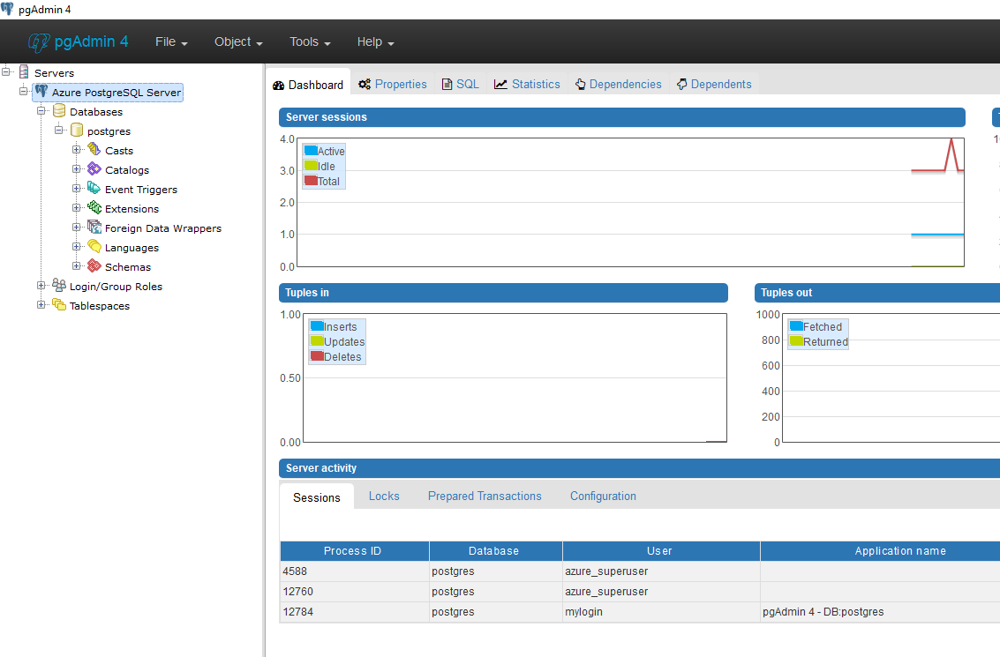
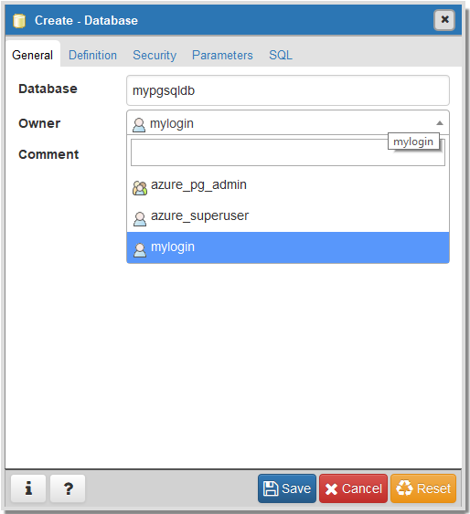
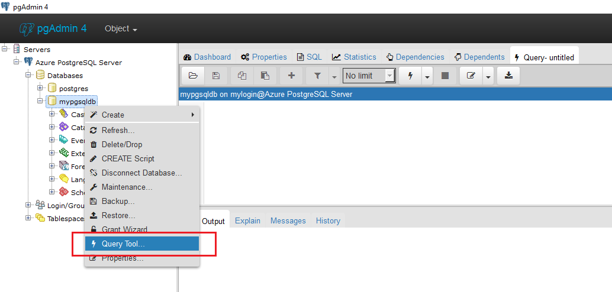
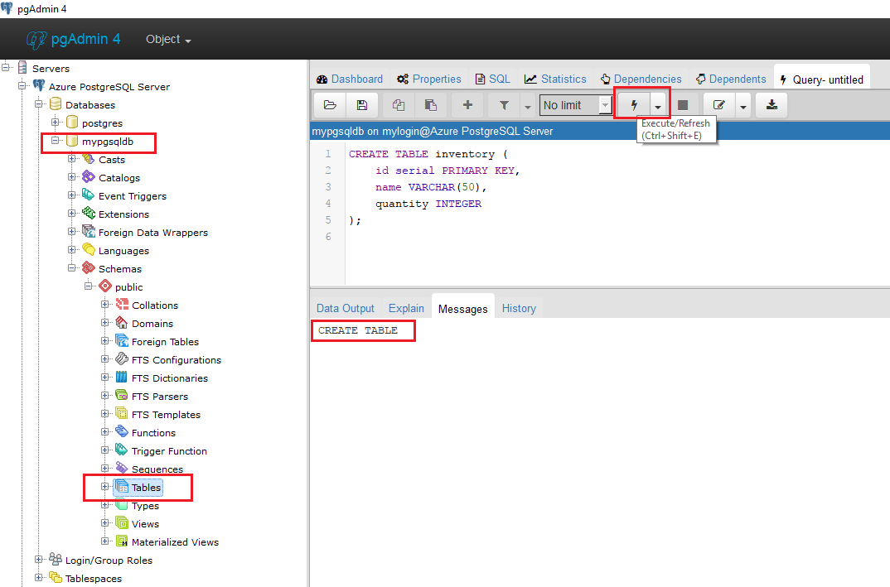

# Connect and Query with pgAdmin GUI tool  

## Prerequisites
This quick start demonstrates how to use the pgAdmin GUI tool to connect to and query a database in an Azure PostgreSQL server.

This quick start uses an existing Azure PostgreSQL server and database as its starting point. Make sure you have created an Azure PostgreSQL server and enabled server-level firewall rules with one of the following quick starts:
- [Create PostgreSQL server - Portal](postgresql-quickstart-create-server-database-portal.md)
- [Create PostgreSQL server - CLI](postgresql-quickstart-create-server-database-azure-cli.md)

## Get connection information
Get the fully qualified server name for your Azure PostgreSQL server from the Azure portal. You use the fully qualified server name to connect to your server using any standard PostgreSQL client application and tools.
1. Log in to the [Azure portal](https://portal.azure.com/).
2. Click **All Resources** from the left-hand menu, and click your Azure PostgreSQL server.
3.	In the **Essentials** pane in the Azure portal page for your server, locate and then copy the **Server name** and the **Server admin login**.


In this example, the server name is mypgserver-20170401.postgres.database.azure.com. The server admin login is mylogin@mypgserver-20170401 and ChangeYourAdminPassword1 was specified as the password when the server was created.

## Connect to the server
To connect to Azure Database for PostgreSQL using a GUI tool _pgAdmin_, you will need to provide host information and access credentials.
1.	Launch the _pgAdmin_ application on your client computer. You can install _pgAdmin_ from http://www.pgadmin.org/.
2.	Choose **Add New Server** from the **Quick Links** menu.
3.	In the **Create - Server** dialog box **General** tab, enter a unique friendly Name for the server. Say **Azure PostgreSQL Server**.

4.	In the **Create - Server** dialog box, **Connection** tab:
    - Enter the server instance endpoint (for example, **mypgserver-20170401.postgres.database.azure.com**) in the **Host Name/ Address** box. 
    - Enter port 5432 into the **Port** box. 
    - Enter the **Server admin login (user@mypgserver)** as obtained in the preceding step and password you entered when you created the server instance into the **Username** and **Password** boxes, respectively.
    - Select **SSL Mode** as **Require**. By default, all Azure PostgreSQL servers are created with SSL enforcing turned ON. To turn OFF SSL enforcing, see instructions for Configuring ~[Enforcing SSL](./placeholder.md).
    
5.	Click **Save**.
6.	In the **Servers** left pane, expand the **Server Groups**. 


## Create a database
Once you are connected to the server, create a blank database to work with.
1.	Choose the **Server** you connected to, and then choose **Databases** under it. 
2.	Right-click on **Databases** to Create a Database…
3.	Choose a database name **mypgsqldb** and the owner for it as server admin login **mylogin**.



## Create a new table
Create a database schema with table to store the inventory information.
1.	For your server in left pane, right-click **mypgsqldb** and click **Query Tool**. A blank query window opens that is connected to your database.


2.	In the query window, execute the following query to create the table in your database: 
```sql
CREATE TABLE inventory (
	id serial PRIMARY KEY, 
	name VARCHAR(50), 
	quantity INTEGER
);
```


 
3.	Expand the **Tables** node in the pgAdmin tool to see the table you created.

## Insert data into the table
In the query window, execute the following query to add 2 rows to the **inventory** table:

```sql
INSERT INTO inventory (id, name, quantity) VALUES (1, 'banana', 150); 
INSERT INTO inventory (id, name, quantity) VALUES (2, 'orange', 154);
```
You have now two rows of sample data into the table you created earlier.

## Query the table – Read, Update, Delete
In the query window, execute the following query to retrieve information from the **inventory** table. 

```sql
SELECT * FROM inventory
WHERE name = 'banana';
```

You can also update the data in the tables
```sql
UPDATE inventory 
SET quantity = 200 
WHERE name = 'banana';
```

The row gets updated accordingly when you retrieve data.
```sql
SELECT * FROM inventory;
```
To delete the row for oranges filtered by id:
```sql
DELETE FROM inventory 
WHERE id = 2;
```

## Clean up resources
Other quick starts in this collection build upon this quick start.

[!TIP]
If you plan to continue on to work with subsequent quick starts, do not clean up the resources created in this quick start. If you do not plan to continue, use the following steps to delete all resources created by this quick start in the pgAdmin tool itself.

```sql
DROP TABLE inventory;
```

To delete the entire database **mypgsqldb**, right-click on the database in the left pane and click **Delete/ Drop** and confirm.

## Next steps
- To connect and query using psql, see [Connect & query - psql](postgresql-quickstart-connect-query-using-psql.md)
- To migrate data from an existing PostgreSQL database, see [Migrate data](howto-migrate-using-export-and-import.md)
- For a technical overview, see [About Azure Database for PostgreSQL ](overview.md)
