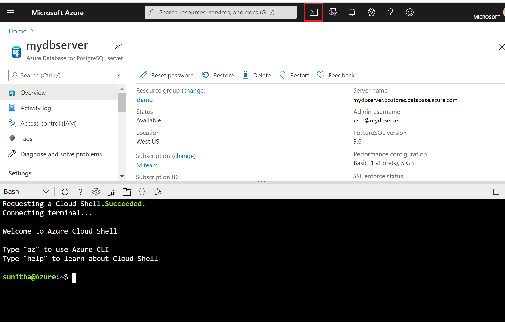

# Quickstart: Create an Azure Database for PostgreSQL server in the Azure portal

Azure Database for PostgreSQL is a managed service that you use to run, manage, and scale highly available PostgreSQL databases in the cloud. This Quickstart shows you how to create an Azure Database for PostgreSQL server in about five minutes using the Azure portal.

If you don't have an Azure subscription, create a [free Azure account](https://azure.microsoft.com/free/) before you begin.

## Sign in to the Azure portal
Open your web browser and go to the [portal](https://portal.azure.com/). Enter your credentials to sign in to the portal. The default view is your service dashboard.

## Create an Azure Database for PostgreSQL server

An Azure Database for PostgreSQL server is created with a configured set of [compute and storage resources](./concepts-pricing-tiers.md). The server is created within an [Azure resource group](../azure-resource-manager/management/overview.md).

To create an Azure Database for PostgreSQL server, take the following steps:
1. Select **Create a resource** (+) in the upper-left corner of the portal.

2. Select **Databases** > **Azure Database for PostgreSQL**.

   > [!div class="mx-imgBorder"]
   > 

3. Select the **Single server** deployment option.

   > [!div class="mx-imgBorder"]
   > 

4. Fill out the **Basics** form with the following information:

   > [!div class="mx-imgBorder"]
   > 

   Setting|Suggested Value|Description
   ---|---|---
   Subscription|Your subscription name|The Azure subscription that you want to use for your server. If you have multiple subscriptions, choose the subscription in which you're billed for the resource.
   Resource group|*myresourcegroup*| A new resource group name or an existing one from your subscription.
   Server name |*mydemoserver*|A unique name that identifies your Azure Database for PostgreSQL server. The domain name *postgres.database.azure.com* is appended to the server name you provide. The server can contain only lowercase letters, numbers, and the hyphen (-) character. It must contain at least 3 through 63 characters.
   Data source | *None* | Select *None* to create a new server from scratch. (You would select *Backup* if you were creating a server from a geo-backup of an existing Azure Database for PostgreSQL server).
   Admin username |*myadmin*| Your own login account to use when you connect to the server. The admin login name can't be **azure_superuser**, **azure_pg_admin**, **admin**, **administrator**, **root**, **guest**, or **public**. It can't start with **pg_**.
   Password |Your password| A new password for the server admin account. It must contain between 8 and 128 characters. Your password must contain characters from three of the following categories: English uppercase letters, English lowercase letters, numbers (0 through 9), and non-alphanumeric characters (!, $, #, %, etc.).
   Location|The region closest to your users| The location that is closest to your users.
   Version|The latest major version| The latest PostgreSQL major version, unless you have specific requirements otherwise.
   Compute + storage | **General Purpose**, **Gen 5**, **2 vCores**, **5 GB**, **7 days**, **Geographically Redundant** | The compute, storage, and backup configurations for your new server. Select **Configure server**. Next, select the appropriate pricing tier, for more information, see [Pricing Details](https://azure.microsoft.com/pricing/details/postgresql/server/). To enable your server backups in geo-redundant storage, select **Geographically Redundant** from the **Backup Redundancy Options**. Select **OK**.

   > [!NOTE]
   > Consider using the Basic pricing tier if light compute and I/O are adequate for your workload. Note that servers created in the Basic pricing tier cannot later be scaled to General Purpose or Memory Optimized. 
   
5. Select **Review + create** to review your selections. Select **Create** to provision the server. This operation may take a few minutes.

6. On the toolbar, select the **Notifications** icon (a bell) to monitor the deployment process. Once the deployment is complete, select **Go to resource** opens the server's **Overview** page.

An empty database, **postgres** is created. You will also find **azure_maintenance** database that is used to separate the managed service processes from user actions.You cannot access **azure_maintenance** database.

## Configure a server-level firewall rule
By default the server created is not publicly accessible and you need to give permissions to your IP. To give access to your IP, go to your server resource in the Azure portal and select **Connection security** from left side menu for your server resource. If you are not sure how to find your resource, see [How to open a resource](https://docs.microsoft.com/azure/azure-resource-manager/management/manage-resources-portal#open-resources).

> [!div class="mx-imgBorder"]
> 
  
Now select **Add current client IP address** and then select **Save**. You can add additional IPs or provide an IP range to connect to your server from those IPs. For more information, see [How to manage firewall rules](./concepts-firewall-rules.md)
   
> [!NOTE]
> Check if your network allows outbound traffic over port 5432 that is used by Azure Database for PostgreSQL to avoid connectivity issues.  

## Connect to Azure Database for PostgreSQL server using psql

You can use [psql](http://postgresguide.com/utilities/psql.html) or [pgAdmin](https://www.pgadmin.org/docs/pgadmin4/latest/connecting.html) which are popular PostgreSQL clients. For this quickstart, we will connect using psql in [Azure Cloud Shell](https://docs.microsoft.com/azure/cloud-shell/overview) within the Azure portal.

1. Make a note of your server name, server admin login name, password, and subscription Id for your newly created server from the **Overview** section of your server as shown in the image below.

2. Launch Azure Cloud Shell in the portal by selecting the icon on the top-left side as highlighted in the image below.

   > [!NOTE]
   > If you are launching Cloud Shell for the first time, you will see a prompt to create a resource group, storage account. This is a one-time step and will be automatically attached for all sessions. 

   > [!div class="mx-imgBorder"]
   > 

3. Run this command on Azure Cloud Shell terminal. Replace values with your actual server name and admin user login name. Use the empty database **postgres** with admin user in this format '<admin-username>@<servername> as shown below for Azure Database for PostgreSQL.

   ```azurecli-interactive
   psql --host=mydemoserver.postgres.database.azure.com --port=5432 --username=myadmin@mydemoserver --dbname=postgres
   ```
 
   Here is how the experience looks like in the Cloud Shell terminal
   
   ```bash
    Requesting a Cloud Shell.Succeeded.
    Connecting terminal...

    Welcome to Azure Cloud Shell
 
    Type "az" to use Azure CLI
    Type "help" to learn about Cloud Shell

    user@Azure:~$psql --host=mydemoserver.postgres.database.azure.com --port=5432 --username=myadmin@mydemoserver --dbname=postgres
    Password for user myadmin@mydemoserver.postgres.database.azure.com:
    psql (12.2 (Ubuntu 12.2-2.pgdg16.04+1), server 11.6)
    SSL connection (protocol: TLSv1.2, cipher: ECDHE-RSA-AES256-GCM-SHA384, bits: 256, compression: off)
    Type "help" for help.

    postgres=>
    ```
4. In the same Azure Cloud Shell terminal, create a database **guest**
   ```bash
   postgres=> CREATE DATABASE guest;
   ```

5. Now to switch connections to the newly created database **guest**

   ```bash
   \c guest
   ```
6. Type `\q`, and then select the Enter key to quit psql. 

## Clean up resources
You have successfully created an Azure Database for PostgreSQL server in a resource group.  If you don't expect to need these resources in the future, you can delete them by deleting the resource group or just delete the PostgreSQL server. To delete the resource group, follow these steps:

1. In the Azure portal, search for and select **Resource groups**. 
2. In the resource group list, choose the name of your resource group.
3. In the Overview page of your resource group, select **Delete resource group**.
4. In the confirmation dialog box, type the name of your resource group, and then select **Delete**.

To delete the server, you can click on **Delete** button on **Overview** page of your server as shown below:
> [!div class="mx-imgBorder"]
> 

## Next steps
> [!div class="nextstepaction"]
> [Migrate your database using Export and Import](./howto-migrate-using-export-and-import.md)
