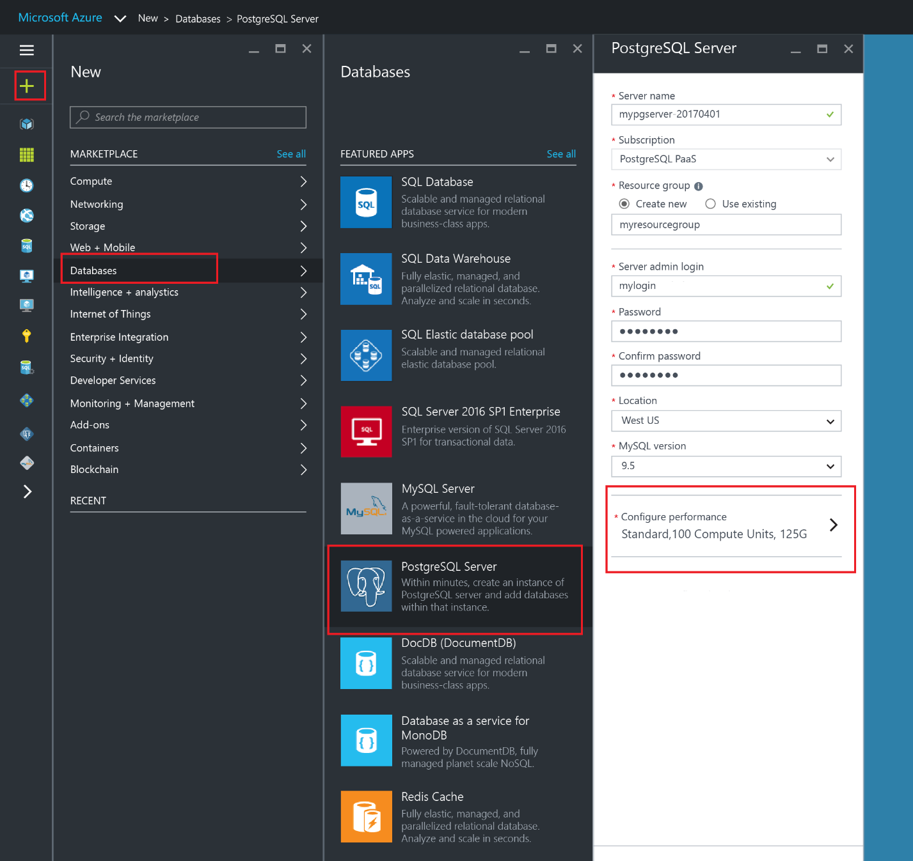
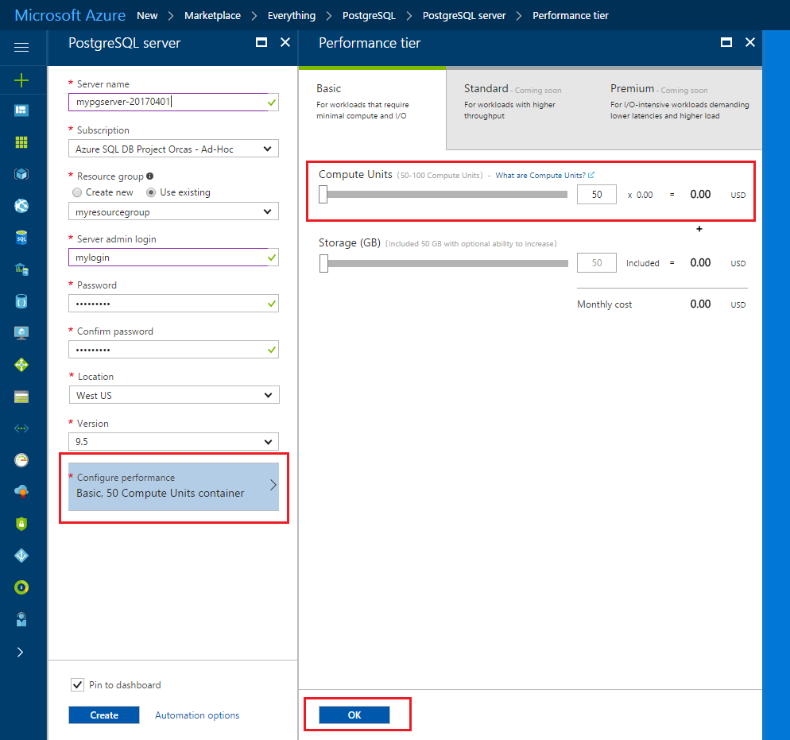
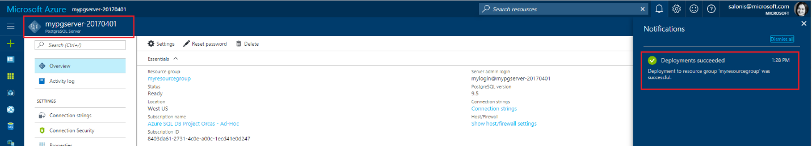
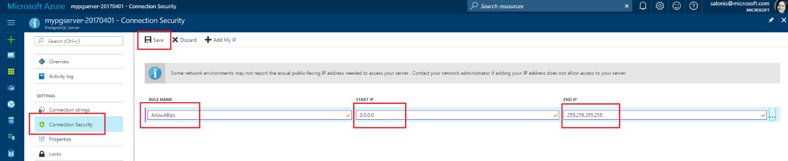
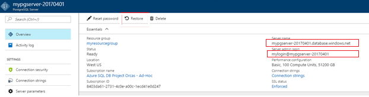
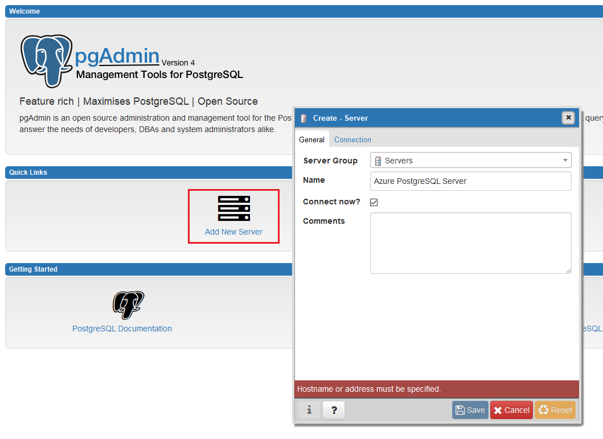
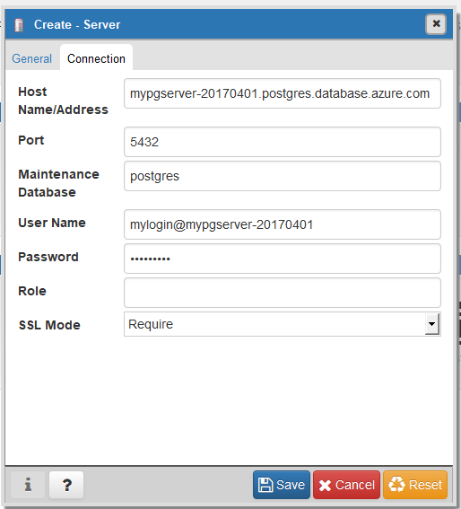
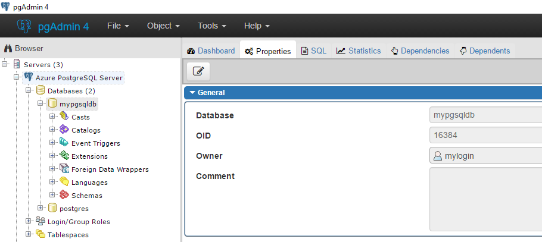
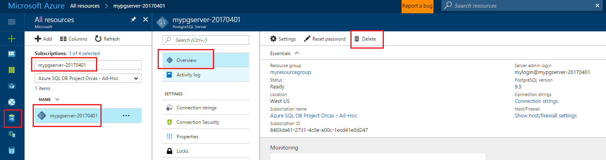

# Create an Azure Database for PostgreSQL in the Azure portal
This quick start guide walks through how to create a PostgreSQL server in Azure. Azure Database for PostgreSQL is a managed service that enables you to run, manage, and scale highly-available PostgreSQL databases in the cloud. This quick start shows you how to get started by creating a new PostgreSQL server using the Azure portal.

If you don't have an Azure subscription, create a [free](https://azure.microsoft.com/free/) account before you begin.

## Log in to the Azure portal
Log in to the [Azure portal](https://portal.azure.com).

## Create an Azure PostgreSQL server
An Azure PostgreSQL server is created with a defined set of [compute and storage resources](placeholder.md). The server is created within an [Azure resource group](../azure-resource-manager/resource-group-overview.md).

Follow these steps to create an Azure Database for PostgreSQL server with default database ‘postgres’.
1.	Click the **New** button found on the upper left-hand corner of the Azure portal.
2.	Select **Databases** from the **New** page, and select **Azure Database for PostgreSQL** from the **Databases** page.


3.	Fill out the Azure Database for PostgreSQL form with the following information, as shown on the preceding image:
- Server name: **mypgserver-20170401** (a globally unique server name)
- Resource group: **myresourcegroup**
- Server admin login and password of your choice
- Location
- PostgreSQL Version

4.	Click **Service tier** to specify the service tier and performance level for your new database. For this quick start, select **200 Compute Units** and **125** GB of included storage.


5.	Click **Ok**.
6.	Click **Create** to provision the server. Provisioning takes a few minutes.
    > [!NOTE]
    > Check the **Pin to dashboard** option to allow easy tracking of your deployments.

7.	On the toolbar, click **Notifications** to monitor the deployment process.

<<<<<<< Updated upstream
 
=======

   > [!IMPORTANT]
   > By default, **postgres** database gets created under your server. The [postgres](https://www.postgresql.org/docs/9.6/static/app-initdb.html) database is a default database meant for use by users, utilities and third party applications. 

>>>>>>> Stashed changes

## Create a server-level firewall rule
The Azure Database for PostgreSQL service creates a firewall at the server-level. This prevents external applications and tools from connecting to the server or any databases on the server unless a firewall rule is created to open the firewall for specific IP addresses. 

<<<<<<< Updated upstream
1.	After the deployment completes, click **Azure Database for PostgreSQL** from the left-hand menu and click your newly created server, **mypgserver-20170401**. The **Overview** page for your server opens and provides options for further configuration.
=======
1.	After the deployment completes, click **Azure Database for PostgreSQL** from the left-hand menu and choose your newly created server **mypgserver-20170401**. The **Overview** page for your server opens and provides options for further configuration.
>>>>>>> Stashed changes


2.	Navigate to the Settings blade of the server. In the Settings blade, select **Connection Security**. 

3.	Click in the text box under **Rule Name,** and add a new firewall rule to whitelist the IP range for connectivity. For this quick start, let’s allow all IPs by typing in **Rule Name = AllowAllIps**, **Start IP = 0.0.0.0** and **End IP = 255.255.255.255** and then click **Save**. A server-level firewall rule is created for your specified IP address range.

 
4.	Click **OK** and then click the **X** to close the **Connections Security** page.

<<<<<<< Updated upstream
> [!NOTE]
> You can set a firewall rule that covers an IP range to be able to connect from your network.

## Connect to Azure Database for PostgreSQL using psql in Cloud Console
When we created our PostgreSQL server, the default ‘postgres’ database also gets created. Let’s now use the psql command line utility to connect to the Azure Database for PostgreSQL server. To connect to your database server, you need to provide host information and access credentials.

1.	Select your server’s **Properties** page. Make a note of the **Server name** and **Server Admin Login**.


2.	Launch the Azure Cloud Console via the terminal icon on the top navigation pane. 


3.	This enables a bash shell experience in your browser.

 
4.	At the Cloud Console prompt, connect to your Azure Database for PostgreSQL server using the psql commands. The following format is used to connect to an Azure Database for PostgreSQL server with the [psql](https://www.postgresql.org/docs/9.6/static/app-psql.html) utility:

```dos
psql --host=<myserver> --port=<port> --username=<server admin login> --password ******* --dbname=<database name>
=======
    > [!NOTE] You can set a firewall rule that covers an IP range to be able to connect from your network.

## Get the connection information
When we created our Azure PostgreSQL server, the default ‘postgres’ database also gets created. To connect to your database server, you need to provide host information and access credentials.

1. From the left-hand menu in Azure portal, click **Azure Database for PostgreSQL** and search for the server you just created **mypgserver-20170401**.
2. Click on the server name **mypgserver-20170401**.
3. Select the server’s **Overview** page. Make a note of the **Server name** and **Server admin login**.


## Connect to a PostgreSQL database using psql in Cloud Console
Let’s now use the psql command line utility to connect to the Azure Database for PostgreSQL server. 
1. Launch the Azure Cloud Console via the terminal icon on the top navigation pane. 


2. This enables a bash shell experience in your browser.


3. At the Cloud Console prompt, connect to your Azure Database for PostgreSQL server using the psql commands. The following format is used to connect to an Azure Database for PostgreSQL server with the [psql](https://www.postgresql.org/docs/9.6/static/app-psql.html) utility:

```dos
psql --host=<myserver> --port=<port> --username=<server admin login> --password --dbname=<database name>
>>>>>>> Stashed changes
```

For example, the following command connects to the default database called **postgres** on your PostgreSQL server **mypgserver-20170401.postgres.database.azure.com** using access credentials:

```dos
<<<<<<< Updated upstream
psql --host=mypgserver-20170401.postgres.database.azure.com --port=5432 
--username=mylogin@mypgserver-20170401 --password ****** –dbname postgres
```

## Clean up resources
Other quick starts in this collection build upon this quick start. If you plan to continue working with subsequent quick starts or with the tutorials, do not clean up the resources created in this quick start. If you do not plan to continue, use the following steps to delete all resources created by this quick start in the Azure portal.
=======
psql --host=mypgserver-20170401.postgres.database.azure.com --port=5432 --username=mylogin@mypgserver-20170401 --password --dbname=postgres
```

4.  Once you’re connected to the server, create a blank database to work with.

```dos
postgres=> CREATE DATABASE mypgsqldb;
```

5.  At the prompt, execute the following command to switch connection to the newly created database **mypgsqldb**:

```dos
postgres=> \c mypgsqldb
```


## Connect to a PostgreSQL database using pgAdmin

To connect to Azure PostgreSQL server using the GUI tool _pgAdmin_
1.	Launch the _pgAdmin_ application on your client computer. You can install _pgAdmin_ from http://www.pgadmin.org/.
2.	Choose **Add New Server** from the **Quick Links** menu.
3.	In the **Create - Server** dialog box **General** tab, enter a unique friendly Name for the server. Say **Azure PostgreSQL Server**.

4.	In the **Create - Server** dialog box, **Connection** tab:
    - Enter the fully qualified server name (for example, **mypgserver-20170401.postgres.database.azure.com**) in the **Host Name/ Address** box. 
    - Enter port 5432 into the **Port** box. 
    - Enter the **Server admin login (user@mypgserver)** as obtained in the preceding step and password you entered when you created the server instance into the **Username** and **Password** boxes, respectively.
    - Select **SSL Mode** as **Require**. By default, all Azure PostgreSQL servers are created with SSL enforcing turned ON. To turn OFF SSL enforcing, see instructions for Configuring [Enforcing SSL](./placeholder.md).

    
5.	Click **Save**.
6.	In the **Servers** left pane, expand the **Server Groups**. Choose your server **Azure PostgreSQL Server**.
7.  Once you are connected to the server, create a blank database to work with.
8.  Choose the **Server** you connected to, and then choose **Databases** under it. 
9.	Right-click on **Databases** to Create a Database…
10.	Choose a database name **mypgsqldb** and the owner for it as server admin login **mylogin**.
11. Click **Save** to create the database.
12. In the Browser, expand the **Server Groups**. Choose the Server you created, and you should be able to see the database **mypgsqldb** under it.



## Clean up resources
Other quick starts in this collection build upon this quick start. 

> [!TIP]
> If you plan to continue on to work with subsequent quick starts, do not clean up the resources created in this quick start. If you do not plan to continue, use the following steps to delete all resources created by this quick start in the Azure portal.
>>>>>>> Stashed changes

1.	From the left-hand menu in the Azure portal, click **Resource groups** and then click **myresourcegroup**.
2.	On your resource group page, click **Delete**, type **myresourcegroup** in the text box, and then click Delete.

If you just would like to delete the newly created server:
1.	From the left-hand menu in Azure portal, click PostgreSQL servers and then search for the server you just created
2.	On the Overview page, click the Delete button on the top pane
<<<<<<< Updated upstream

=======

>>>>>>> Stashed changes

3.	Confirm the server name you want to delete, and show the databases under it that is affected. Type **mypgserver-20170401** in the text box, and then click Delete.

## Next steps
<<<<<<< Updated upstream
- To create PostgreSQL server via Azure CLI, see [Create PostgreSQL server – CLI](./quickstart-create-server-database-azure-cli.md).
- To connect and query using pgAdmin GUI tool, see [Connect and query with pgAdmin](./quickstart-connect-query-using-pgadmin.md).
- To connect and query using psql command line utility, see [Connect and query with psql](./quickstart-connect-query-using-psql.md).
=======
- Migrate your database using [Export and Import]((./howto-migrate-using-export-and-import.md) or [Dump and Restore](./howto-migrate-using-dump-and-restore.md).
- To create PostgreSQL server via Azure CLI, see [Create PostgreSQL server – CLI](./quickstart-create-server-database-azure-cli.md).
>>>>>>> Stashed changes
- For a technical overview, see [About the Azure Database for PostgreSQL service](./overview.md).