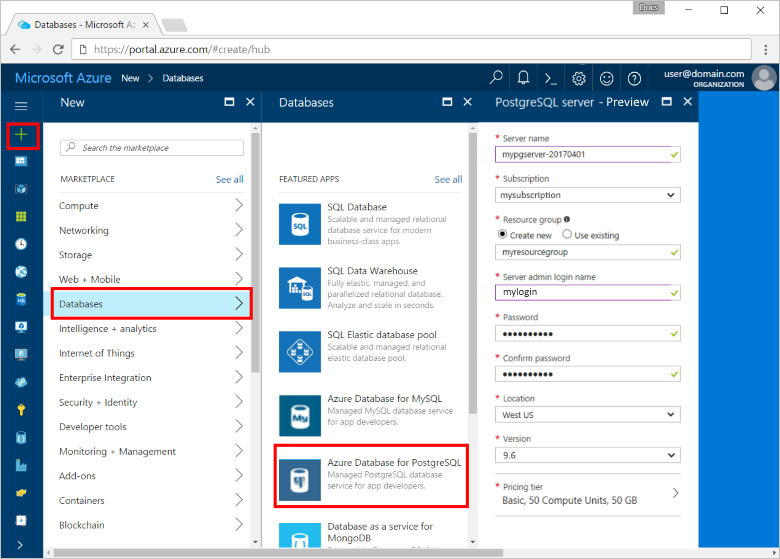
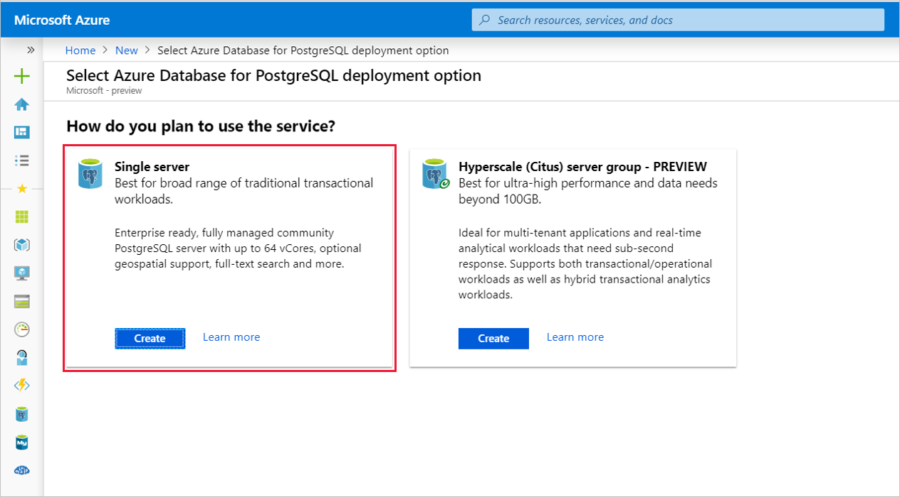
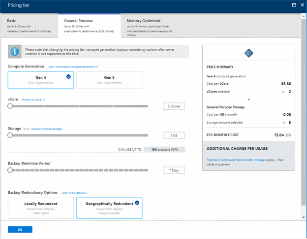
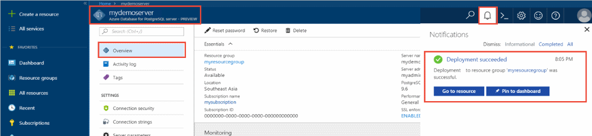
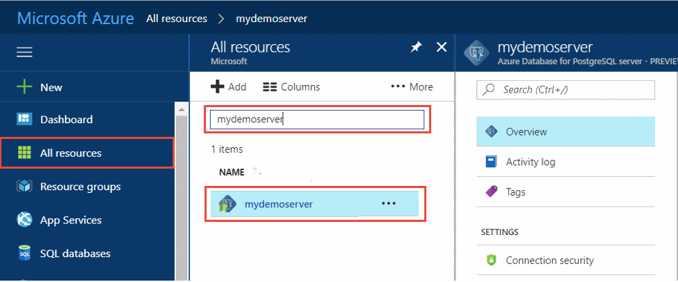
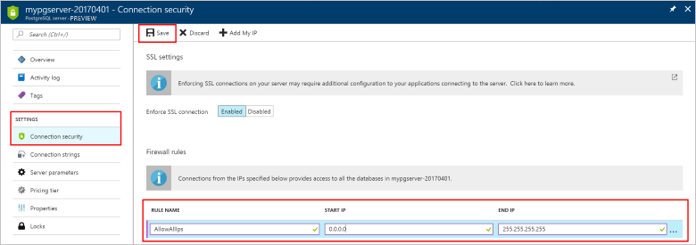
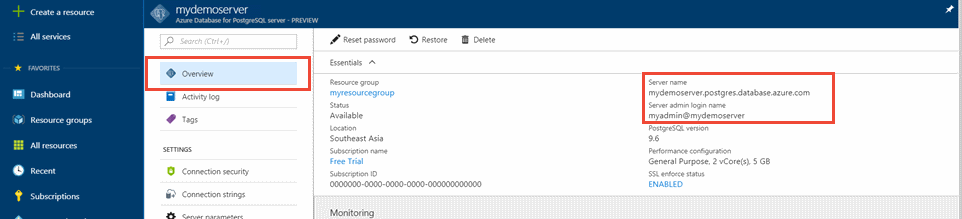
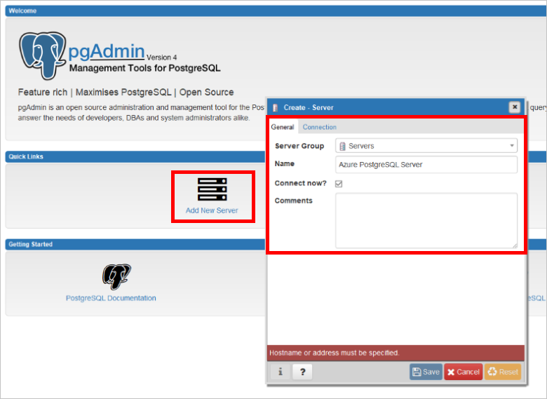
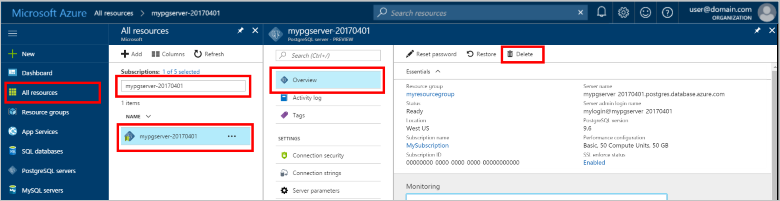

# Quickstart: Create an Azure Database for PostgreSQL server in the Azure portal

Azure Database for PostgreSQL is a managed service that you use to run, manage, and scale highly available PostgreSQL databases in the cloud. This Quickstart shows you how to create an Azure Database for PostgreSQL server in about five minutes using the Azure portal.

If you don't have an Azure subscription, create a [free Azure account](https://azure.microsoft.com/free/) before you begin.

## Sign in to the Azure portal
Open your web browser and go to the [portal](https://portal.azure.com/). Enter your credentials to sign in to the portal. The default view is your service dashboard.

## Create an Azure Database for PostgreSQL server

An Azure Database for PostgreSQL server is created with a configured set of [compute and storage resources](./concepts-pricing-tiers.md). The server is created within an [Azure resource group](../azure-resource-manager/management/overview.md).

To create an Azure Database for PostgreSQL server, take the following steps:
1. Select **Create a resource** (+) in the upper-left corner of the portal.

2. Select **Databases** > **Azure Database for PostgreSQL**.

    

3. Select the **Single server** deployment option.

   

4. Fill out the **Basics** form with the following information:

    

    Setting|Suggested Value|Description
    ---|---|---
    Subscription|Your subscription name|The  Azure subscription that you want to use for your server. If you have multiple subscriptions, choose the subscription in which you're billed for the resource.
    Resource group|*myresourcegroup*| A new resource group name or an existing one from your subscription.
    Server name |*mydemoserver*|A unique name that identifies your Azure Database for PostgreSQL server. The domain name *postgres.database.azure.com* is appended to the server name you provide. The server can contain only lowercase letters, numbers, and the hyphen (-) character. It must contain at least 3 through 63 characters.
    Data source | *None* | Select *None* to create a new server from scratch. (You would select *Backup* if you were creating a server from a geo-backup of an existing Azure Database for PostgreSQL server).
    Admin username |*myadmin*| Your own login account to use when you connect to the server. The admin login name can't be **azure_superuser**, **azure_pg_admin**, **admin**, **administrator**, **root**, **guest**, or **public**. It can't start with **pg_**.
    Password |Your password| A new password for the server admin account. It must contain between 8 and 128 characters. Your password must contain characters from three of the following categories: English uppercase letters, English lowercase letters, numbers (0 through 9), and non-alphanumeric characters (!, $, #, %, etc.).
    Location|The region closest to your users| The location that is closest to your users.
    Version|The latest major version| The latest PostgreSQL major version, unless you have specific requirements otherwise.
    Compute + storage | **General Purpose**, **Gen 5**, **2 vCores**, **5 GB**, **7 days**, **Geographically Redundant** | The compute, storage, and backup configurations for your new server. Select **Configure server**. Next, select the **General Purpose** tab. *Gen 5*, *4 vCores*, *100 GB*, and *7 days* are the default values for **Compute Generation**, **vCore**, **Storage**, and **Backup Retention Period**. You can leave those sliders as is or adjust them. To enable your server backups in geo-redundant storage select **Geographically Redundant** from the **Backup Redundancy Options**. To save this pricing tier selection, select **OK**. The next screenshot captures these selections.

   > [!NOTE]
   > Consider using the Basic pricing tier if light compute and I/O are adequate for your workload. Note that servers created in the Basic pricing tier cannot later be scaled to General Purpose or Memory Optimized. See the [pricing page](https://azure.microsoft.com/pricing/details/postgresql/) for more information.
   > 

    

5. Select **Review + create** to review your selections. Select **Create** to provision the server. This operation may take a few minutes.

6. On the toolbar, select the **Notifications** icon (a bell) to monitor the deployment process. Once the deployment is done, you can select **Pin to dashboard**, which creates a tile for this server on your Azure portal dashboard as a shortcut to the server's **Overview** page. Selecting **Go to resource** opens the server's **Overview** page.

    
   
   By default, a **postgres** database is created under your server. The [postgres](https://www.postgresql.org/docs/9.6/static/app-initdb.html) database is a default database that's meant for use by users, utilities, and third-party applications. (The other default database is **azure_maintenance**. Its function is to separate the managed service processes from user actions. You cannot access this database.)

## Configure a server-level firewall rule

Azure Database for PostgreSQL creates a firewall at the server level. It prevents external applications and tools from connecting to the server and any databases on the server, unless you create a rule to open the firewall for specific IP addresses. 

1. After the deployment finishes, locate your server. If needed, you can search for it. For example, on the menu on the left, select **All resources**. Enter your server name, such as the example, **mydemoserver**, to search for your newly created server. Select your server name from the search result list. The **Overview** page for your server opens and provides options for further configuration.
 
    

2. On the server page, select **Connection security**.

3. Under the **Firewall rules**, in the **Rule Name** column, select the blank text box to begin creating the firewall rule. 

   Fill in the text boxes with a name, and the start and end IP range of the clients that will be accessing your server. If it is a single IP, use the same value for the start IP and end IP.

   
     

4. On the upper toolbar of the **Connection security** page, select **Save**. Wait until the notification appears stating that the connection security update has finished successfully before you continue.

    > [!NOTE]
    > Connections to your Azure Database for PostgreSQL server communicate over port 5432. When you try to connect from within a corporate network, outbound traffic over port 5432 might not be allowed by your network's firewall. If so, you can't connect to your server unless your IT department opens port 5432.
    >

## Get the connection information

When you create your Azure Database for PostgreSQL server, a default database named **postgres** is created. To connect to your database server, you need your full server name and admin login credentials. You might have noted those values earlier in the Quickstart article. If you didn't, you can easily find the server name and login information on the server **Overview** page in the portal.

Open your server's **Overview** page. Make a note of the **Server name** and the **Server admin login name**. Hover your cursor over each field, and the copy symbol appears to the right of the text. Select the copy symbol as needed to copy the values.

 

## Connect to the PostgreSQL database using psql

There are a number of applications you can use to connect to your Azure Database for PostgreSQL server. If your client computer has PostgreSQL installed, you can use a local instance of [psql](https://www.postgresql.org/docs/current/static/app-psql.html) to connect to an Azure PostgreSQL server. Let's now use the psql command-line utility to connect to the Azure PostgreSQL server.

1. Run the following psql command to connect to an Azure Database for PostgreSQL server
   ```bash
   psql --host=<servername> --port=<port> --username=<user@servername> --dbname=<dbname>
   ```

   For example, the following command connects to the default database called **postgres** on your PostgreSQL server **mydemoserver.postgres.database.azure.com** using access credentials. Enter the `<server_admin_password>` you chose when prompted for password.
  
   ```bash
   psql --host=mydemoserver.postgres.database.azure.com --port=5432 --username=myadmin@mydemoserver --dbname=postgres
   ```

   > [!TIP]
   > If you prefer to use a URL path to connect to Postgres, URL encode the @ sign in the username with `%40`. For example the connection string for psql would be, 
   > ```
   > psql postgresql://myadmin%40mydemoserver@mydemoserver.postgres.database.azure.com:5432/postgres
   > ```

   After you connect, the psql utility displays a postgres prompt where you type sql commands. In the initial connection output, a warning may appear because the psql you're using might be a different version than the Azure Database for PostgreSQL server version. 

   Example psql output:
   ```bash
   psql (9.5.7, server 9.6.2)
   WARNING: psql major version 9.5, server major version 9.6.
    Some psql features might not work.
    SSL connection (protocol: TLSv1.2, cipher: ECDHE-RSA-AES256-SHA384, bits: 256, compression: off)
   Type "help" for help.

   postgres=> 
   ```

   > [!TIP]
   > If the firewall is not configured to allow the IP address of your client, the following error occurs:
   > 
   > "psql: FATAL:  no pg_hba.conf entry for host `<IP address>`, user "myadmin", database "postgres", SSL on FATAL: SSL connection is required. Specify SSL options and retry.
   > 
   > Confirm your client's IP is allowed in the firewall rules step above.

2. Create a blank database called "mypgsqldb" at the prompt by typing the following command:
    ```bash
    CREATE DATABASE mypgsqldb;
    ```

3. At the prompt, execute the following command to switch connections to the newly created database **mypgsqldb**:
    ```bash
    \c mypgsqldb
    ```

4. Type  `\q`, and then select the Enter key to quit psql. 

You connected to the Azure Database for PostgreSQL server via psql, and you created a blank user database. Continue to the next section to connect by using another common tool, pgAdmin.

## Connect to the PostgreSQL Server using pgAdmin

pgAdmin is an open-source tool used with PostgreSQL. You can install pgAdmin from the [pgAdmin website](https://www.pgadmin.org/). The pgAdmin version you're using may be different from what is used in this Quickstart. Read the pgAdmin documentation if you need additional guidance.

1. Open the pgAdmin application on your client computer.

2. From the toolbar go to **Object**, hover over **Create**, and select **Server**.

3. In the **Create - Server** dialog box, on the **General** tab, enter a unique friendly name for the server, such as **mydemoserver**.

    

4. In the **Create - Server** dialog box, on the **Connection** tab, fill in the settings table.

   

    pgAdmin parameter |Value|Description
    ---|---|---
    Host name/address | Server name | The server name value that you used when you created the Azure Database for PostgreSQL server earlier. Our example server is **mydemoserver.postgres.database.azure.com.** Use the fully qualified domain name (**\*.postgres.database.azure.com**) as shown in the example. If you don't remember your server name, follow the steps in the previous section to get the connection information. 
    Port | 5432 | The port to use when you connect to the Azure Database for PostgreSQL server. 
    Maintenance database | *postgres* | The default system-generated database name.
    Username | Server admin login name | The server admin login username that you supplied when you created the Azure Database for PostgreSQL server earlier. If you don't remember the username, follow the steps in the previous section to get the connection information. The format is *username\@servername*.
    Password | Your admin password | The password you chose when you created the server earlier in this Quickstart.
    Role | Leave blank | There's no need to provide a role name at this point. Leave the field blank.
    SSL mode | *Require* | You can set the TLS/SSL mode in pgAdmin's SSL tab. By default, all Azure Database for PostgreSQL servers are created with TLS enforcing turned on. To turn off TLS enforcing, see [Configure Enforcement of TLS](./concepts-ssl-connection-security.md#configure-enforcement-of-tls).
    
5. Select **Save**.

6. In the **Browser** pane on the left, expand the **Servers** node. Select your server, for example, **mydemoserver**, to connect to it.

7. Expand the server node, and then expand **Databases** under it. The list should include your existing *postgres* database and any other databases you've created. You can create multiple databases per server with Azure Database for PostgreSQL.

8. Right-click **Databases**, select the **Create** menu, and then select **Database**.

9. Enter a database name of your choice in the **Database** field, such as **mypgsqldb2**.

10. Select the **Owner** for the database from the list box. Select your server admin login name, such as the example, **my admin**.

    

11. Select **Save** to create a new blank database.

12. In the **Browser** pane, you can see the database that you created in the list of databases under your server name.


## Clean up resources
You can clean up the resources that you created in the Quickstart in one of two ways. You can delete the [Azure resource group](../azure-resource-manager/management/overview.md), which includes all the resources in the resource group. If you want to keep the other resources intact, delete only the server resource.

> [!TIP]
> Other Quickstarts in this collection build on this Quickstart. If you plan to continue working with Quickstarts, don't clean up the resources that you created in this Quickstart. If you don't plan to continue, follow these steps to delete the resources that were created by this Quickstart in the portal.

To delete the entire resource group, including the newly created server:
1. Locate your resource group in the portal. On the menu on the left, select **Resource groups**. Then select the name of your resource group, such as the example, **myresourcegroup**.

2. On your resource group page, select **Delete**. Enter the name of your resource group, such as the example, **myresourcegroup**, in the text box to confirm deletion. Select **Delete**.

To delete only the newly created server:
1. Locate your server in the portal, if you don't have it open. On the menu on the left, select **All resources**. Then search for the server you created.

2. On the **Overview** page, select **Delete**.

    

3. Confirm the name of the server you want to delete, and view the databases under it that are affected. Enter your server name in the text box, such as the example, **mydemoserver**. Select **Delete**.

## Next steps
> [!div class="nextstepaction"]
> [Migrate your database using Export and Import](./howto-migrate-using-export-and-import.md)
