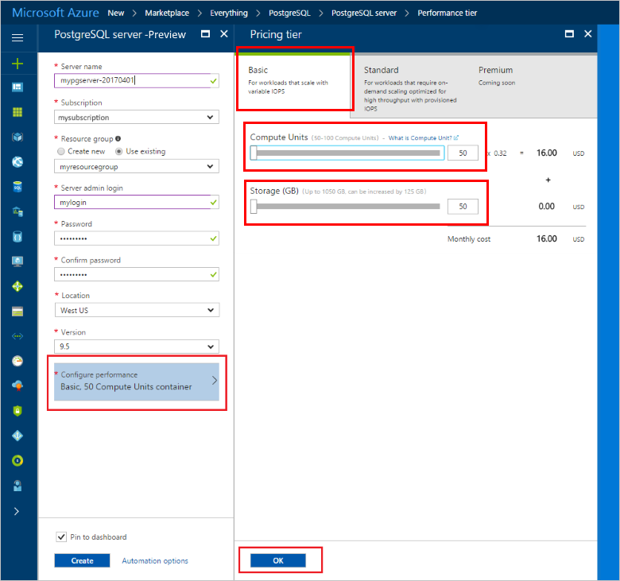

# Create an Azure Database for PostgreSQL in the Azure portal

Azure Database for PostgreSQL is a managed service that enables you to run, manage, and scale highly available PostgreSQL databases in the cloud. This quickstart shows you how to create an Azure Database for PostgreSQL server using the Azure portal.

If you don't have an Azure subscription, create a [free](https://azure.microsoft.com/free/) account before you begin.

## Log in to the Azure portal

Log in to the [Azure portal](https://portal.azure.com).

## Create an Azure Database for PostgreSQL

An Azure Database for PostgreSQL server is created with a defined set of [compute and storage resources](./concepts-compute-unit-and-storage.md). The server is created within an [Azure resource group](../azure-resource-manager/resource-group-overview.md).

Follow these steps to create an Azure Database for PostgreSQL server:
1.	Click the **New** button found on the upper left-hand corner of the Azure portal.
2.	Select **Databases** from the **New** page, and select **Azure Database for PostgreSQL** from the **Databases** page.
 

3.	Fill out the new server details form with the following information, as shown on the preceding image:
    - Server name: **mypgserver-20170401** (name of a server maps to DNS name and is thus required to be globally unique) 
    - Subscription: If you have multiple subscriptions, choose the appropriate subscription in which the resource exists or is billed for.
    - Resource group: **myresourcegroup**
    - Server admin login and password of your choice
    - Location
    - PostgreSQL Version

  > [!IMPORTANT]
  > The server admin login and password that you specify here are required to log in to the server and its databases later in this quick start. Remember or record this information for later use.

4.	Click **Pricing tier** to specify the service tier and performance level for your new database. For this quick start, select **Basic** Tier, **50 Compute Units** and **50 GB** of included storage.
 
5.	Click **Ok**.
6.	Click **Create** to provision the server. Provisioning takes a few minutes.

  > [!TIP]
  > Check the **Pin to dashboard** option to allow easy tracking of your deployments.

7.	On the toolbar, click **Notifications** to monitor the deployment process.
 
   
  By default, **postgres** database gets created under your server. The [postgres](https://www.postgresql.org/docs/9.6/static/app-initdb.html) database is a default database meant for use by users, utilities, and third-party applications. 

## Configure a server-level firewall rule

The Azure Database for PostgreSQL service creates a firewall at the server-level. This firewall prevents external applications and tools from connecting to the server and any databases on the server unless a firewall rule is created to open the firewall for specific IP addresses. 

1.	After the deployment completes, click **All Resources** from the left-hand menu and type in the name **mypgserver-20170401** to search for your newly created server. Click the server name listed in the search result. The **Overview** page for your server opens and provides options for further configuration.
 
 

2.	In the server blade, select **Connection Security**. 
3.	Click in the text box under **Rule Name,** and add a new firewall rule to whitelist the IP range for connectivity. For this quick start, let's allow all IPs by typing in **Rule Name = AllowAllIps**, **Start IP = 0.0.0.0** and **End IP = 255.255.255.255** and then click **Save**. You can set a firewall rule that covers an IP range to be able to connect from your network.

 

4.	Click **Save** and then click the **X** to close the **Connections Security** page.

  > [!NOTE]
  > Azure PostgreSQL server communicates over port 5432. If you are trying to connect from within a corporate network, outbound traffic over port 5432 may not be allowed by your network's firewall. If so, you will not be able to connect to your Azure SQL Database server unless your IT department opens port 5432.
  >

## Get the connection information

When we created our Azure Database for PostgreSQL server, the default **postgres** database also gets created. To connect to your database server, you need to provide host information and access credentials.

1. From the left-hand menu in Azure portal, click **All resources** and search for the server you just created **mypgserver-20170401**.

  

2. Click the server name **mypgserver-20170401**.
3. Select the server's **Overview** page. Make a note of the **Server name** and **Server admin login name**.

 

## Connect to PostgreSQL database using psql in Cloud Shell

Let's now use the psql command-line utility to connect to the Azure Database for PostgreSQL server. 
1. Launch the Azure Cloud Shell via the terminal icon on the top navigation pane.

   

2. The Azure Cloud Shell opens in your browser, enabling you to type bash commands.

   

3. At the Cloud Shell prompt, connect to your Azure Database for PostgreSQL server using the psql commands. The following format is used to connect to an Azure Database for PostgreSQL server with the [psql](https://www.postgresql.org/docs/9.6/static/app-psql.html) utility:
   ```bash
   psql --host=<myserver> --port=<port> --username=<server admin login> --dbname=<database name>
   ```

   For example, the following command connects to the default database called **postgres** on your PostgreSQL server **mypgserver-20170401.postgres.database.azure.com** using access credentials. Enter your server admin password when prompted.

   ```bash
   psql --host=mypgserver-20170401.postgres.database.azure.com --port=5432 --username=mylogin@mypgserver-20170401 --dbname=postgres
   ```
4.  Once you're connected to the server, create a blank database at the prompt.
```bash
CREATE DATABASE mypgsqldb;
```

5.  At the prompt, execute the following command to switch connection to the newly created database **mypgsqldb**.
```bash
\c mypgsqldb
```

## Connect to PostgreSQL database using pgAdmin

To connect to Azure PostgreSQL server using the GUI tool _pgAdmin_
1.	Launch the _pgAdmin_ application on your client computer. You can install _pgAdmin_ from http://www.pgadmin.org/.
2.	Choose **Add New Server** from the **Quick Links** menu.
3.	In the **Create - Server** dialog box **General** tab, enter a unique friendly Name for the server, such as **Azure PostgreSQL Server**.

4.	In the **Create - Server** dialog box, **Connection** tab, use the settings as specified and click **Save**.
   
    - **Host Name/Address**: mypgserver-20170401.postgres.database.azure.com 
        - Fully qualified server name.
    - **Port:**  5432
        - Port number used by this database server is 5432.
    - **Maintenance Database**: postgres 
        - Default system generated database name.
    - **User Name:** mylogin@mypgserver-20170401 
        - The Server admin login (user@mypgserver) obtained earlier in this quickstart.
    - **Password**: The password you chose when you created the server earlier in this quickstart.
    - **SSL Mode**: Require
        - By default, all Azure PostgreSQL servers are created with SSL enforcing turned ON. To turn OFF SSL enforcing, see details in [Enforcing SSL](./concepts-ssl-connection-security.md).
5.	Click **Save**.
6.	In the Browser left pane, expand the **Server Groups**. Choose your server **Azure PostgreSQL Server**.
7.  Choose the **Server** you connected to, and then choose **Databases** under it. 
8.	Right-click on **Databases** to Create a Database.
9.	Choose a database name **mypgsqldb** and the owner for it as server admin login **mylogin**.
10. Click **Save** to create a blank database.
11. In the **Browser**, expand the **Server**. Expand the server you created, and see the database **mypgsqldb** under it.
 


## Clean up resources
Clean up all resources you created in the quickstart by deleting the [Azure resource group](../azure-resource-manager/resource-group-overview.md).

> [!TIP]
> Other quickstarts in this collection build upon this quick start. If you plan to continue on to work with subsequent quickstarts, do not clean up the resources created in this quickstart. If you do not plan to continue, use the following steps to delete all resources created by this quickstart in the Azure portal.

1.	From the left-hand menu in the Azure portal, click **Resource groups** and then click **myresourcegroup**.
2.	On your resource group page, click **Delete**, type **myresourcegroup** in the text box, and then click Delete.

If you just would like to delete the newly created server:
1.	From the left-hand menu in Azure portal, click PostgreSQL servers and then search for the server you just created
2.	On the Overview page, click the Delete button on the top pane

3.	Confirm the server name you want to delete, and show the databases under it that is affected. Type **mypgserver-20170401** in the text box, and then click Delete.

## Next steps
- Migrate your database using [Export and Import](./howto-migrate-using-export-and-import.md) or [Dump and Restore](./howto-migrate-using-dump-and-restore.md).
- To create Azure Database for PostgreSQL server using Azure CLI, see [Create PostgreSQL server - CLI](./quickstart-create-server-database-azure-cli.md).
- For a technical overview, see [About the Azure Database for PostgreSQL service](./overview.md).