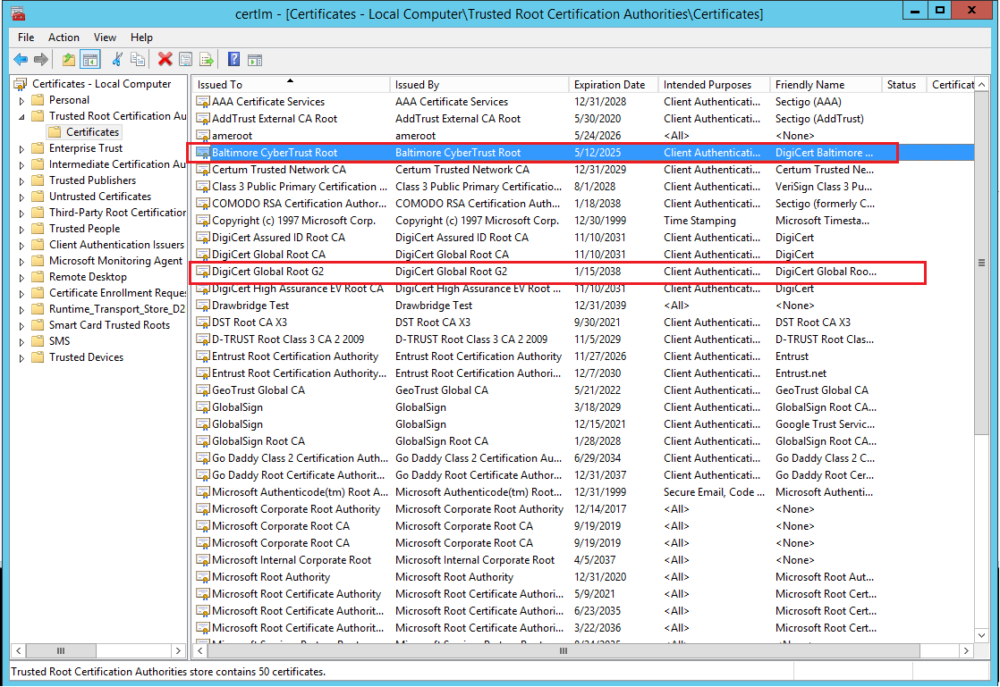

# Understanding the changes in the Root CA change for Azure Database for PostgreSQL Single server

[!INCLUDE [applies-to-postgresql-single-server](../includes/applies-to-postgresql-single-server.md)]

[!INCLUDE [azure-database-for-postgresql-single-server-deprecation](../includes/azure-database-for-postgresql-single-server-deprecation.md)]

Azure Database for PostgreSQL Single Server planning the root certificate change starting  **December 2022 (12/2022)** as part of standard maintenance and security best practices. This article gives you more details about the changes, the resources affected, and the steps needed to ensure that your application maintains connectivity to your database server.

## Why root certificate update is required?

Historically, Azure database for PostgreSQL users could only use the predefined certificate to connect to their PostgreSQL server, which is located [here](https://www.digicert.com/CACerts/BaltimoreCyberTrustRoot.crt.pem). However, [Certificate Authority (CA) Browser forum](https://cabforum.org/) recently published reports of multiple certificates issued by CA vendors to be non-compliant.

As per the industry's compliance requirements, CA vendors began revoking CA certificates for non-compliant CAs, requiring servers to use certificates issued by compliant CAs, and signed by CA certificates from those compliant CAs. Since Azure Database for PostgreSQL used one of these non-compliant certificates, we needed to rotate the certificate to the compliant version to minimize the potential threat to your Postgres servers.

The new certificate is rolled out and in effect starting December, 2022 (12/2022). 

## What change was scheduled to be performed starting December 2022 (12/2022)?

Starting December 2022, the [BaltimoreCyberTrustRoot root certificate](https://www.digicert.com/CACerts/BaltimoreCyberTrustRoot.crt.pem) is  replaced with a **compliant version** known as [DigiCertGlobalRootG2 root certificate ](https://cacerts.digicert.com/DigiCertGlobalRootG2.crt.pem). If your applications take advantage of **verify-ca** or **verify-full** as value of [**sslmode** parameter](https://www.postgresql.org/docs/current/libpq-ssl.html) in the database client connectivity need to follow directions to add new certificates to certificate store to maintain connectivity.

## Do I need to make any changes on my client to maintain connectivity?

There are no code or application  changes required on client side. if you follow our certificate update recommendation below, you'll still be able to continue to connect as long as **BaltimoreCyberTrustRoot certificate isn't removed** from the combined CA certificate. **We recommend to not remove the BaltimoreCyberTrustRoot from your combined CA certificate until further notice to maintain connectivity.**

## Do I need to make any changes to client certificates

By default, PostgreSQL doesn't perform any verification of the server certificate. This means that it's still theoretically possible to spoof the server identity (for example by modifying a DNS record or by taking over the server IP address) without the client knowing. In order to prevent any possibility spoofing, SSL certificate verification on the client must be used. Such verification can be set via application client connection string [**ssl mode**](https://www.postgresql.org/docs/13/libpq-ssl.html) value - **verify-ca** or **verify-full**.  If these ssl-mode values are chosen,  you should follow directions in next section. 

### Client Certificate Update Recommendation

*   Download BaltimoreCyberTrustRoot & DigiCertGlobalRootG2 Root CA from links below:
    *   https://www.digicert.com/CACerts/BaltimoreCyberTrustRoot.crt.pem
    *   https://cacerts.digicert.com/DigiCertGlobalRootG2.crt.pem
*   Optionally, to prevent future disruption, it's also recommended to add the following roots to the trusted store:
    * [DigiCert Global Root G3](https://www.digicert.com/kb/digicert-root-certificates.htm) (thumbprint: 7e04de896a3e666d00e687d33ffad93be83d349e)
    * [Microsoft RSA Root Certificate Authority 2017](https://www.microsoft.com/pkiops/certs/Microsoft%20RSA%20Root%20Certificate%20Authority%202017.crt) (thumbprint: 73a5e64a3bff8316ff0edccc618a906e4eae4d74)
    * [Microsoft ECC Root Certificate Authority 2017](https://www.microsoft.com/pkiops/certs/Microsoft%20ECC%20Root%20Certificate%20Authority%202017.crt) (thumbprint: 999a64c37ff47d9fab95f14769891460eec4c3c5)

*   Generate a combined CA certificate store with both **BaltimoreCyberTrustRoot** and **DigiCertGlobalRootG2** certificates are included.
    *   For Java (PostgreSQL JDBC) users using DefaultJavaSSLFactory, execute:

          ```console
          keytool -importcert -alias PostgreSQLServerCACert  -file D:\BaltimoreCyberTrustRoot.crt.pem  -keystore truststore -storepass password -noprompt
          ```

          ```console
          keytool -importcert -alias PostgreSQLServerCACert2  -file D:\DigiCertGlobalRootG2.crt.pem -keystore truststore -storepass password  -noprompt
          ```

          Then replace the original keystore file with the new generated one:
        *   System.setProperty("javax.net.ssl.trustStore","path_to_truststore_file"); 
        *   System.setProperty("javax.net.ssl.trustStorePassword","password");

    *   For .NET (Npgsql) users on Windows, make sure **Baltimore CyberTrust Root** and **DigiCert Global Root G2** both exist in Windows Certificate Store, Trusted Root Certification Authorities. If any certificates don't exist, import the missing certificate.

        

    *   For .NET (Npgsql) users on Linux using SSL_CERT_DIR, make sure **BaltimoreCyberTrustRoot** and **DigiCertGlobalRootG2** both exist in the directory indicated by SSL_CERT_DIR. If any certificates don't exist, create the missing certificate file.

    *   For other PostgreSQL client users, you can merge two CA certificate files like this format below

        </br>-----BEGIN CERTIFICATE-----
</br>(Root CA1: BaltimoreCyberTrustRoot.crt.pem)
</br>-----END CERTIFICATE-----
</br>-----BEGIN CERTIFICATE-----
</br>(Root CA2: DigiCertGlobalRootG2.crt.pem)
</br>-----END CERTIFICATE-----

*   Replace the original root CA pem file with the combined root CA file and restart your application/client.
*    In future, after the new certificate deployed on the server side, you can change your CA pem file to DigiCertGlobalRootG2.crt.pem.

> [!NOTE]
> Please don't drop or alter **Baltimore certificate** until the cert change is made. We will send a communication once the change is done, after which it's safe for them to drop the Baltimore certificate.

## What if we removed the BaltimoreCyberTrustRoot certificate?

You may start receiving connectivity errors while connecting to your Azure Database for PostgreSQL server. You  need to configure SSL with [BaltimoreCyberTrustRoot](https://www.digicert.com/CACerts/BaltimoreCyberTrustRoot.crt.pem) certificate again to maintain connectivity.

## Frequently asked questions

###    1. If I am not using SSL/TLS, do I still need to update the root CA?

No actions required if you aren't using SSL/TLS.

### 2. If I am using SSL/TLS, do I need to restart my database server to update the root CA?

No, you don't need to restart the database server to start using the new certificate. This is a client-side change and the incoming client connections need to use the new certificate to ensure that they can connect to the database server.

### 3. How do I know if I'm using SSL/TLS with root certificate verification?

You can identify whether your connections verify the root certificate by reviewing your connection string.
-  If your connection string includes `sslmode=verify-ca` or `sslmode=verify-full`, you need to update the certificate.
-  If your connection string includes `sslmode=disable`, `sslmode=allow`, `sslmode=prefer`, or `sslmode=require`, you do not need to update certificates.
-  If your connection string doesn't specify sslmode, you don't need to update certificates.

If you are using a client that abstracts the connection string away, review the client's documentation to understand whether it verifies certificates.  To understand PostgreSQL sslmode, review the [SSL mode descriptions](https://www.postgresql.org/docs/11/libpq-ssl.html#ssl-mode-descriptions) in PostgreSQL documentation.

### 4. What is the impact if using App Service with Azure Database for PostgreSQL?

For Azure app services, connecting to Azure Database for PostgreSQL, we can have two possible scenarios and it depends on how on you are using SSL with your application.
*   This new certificate has been added to App Service at platform level. If you are using the SSL certificates included on App Service platform in your application, then no action is needed.
*   If you are explicitly including the path to SSL cert file in your code, then you would need to download the new cert and update the code to use the new cert. A good example of this scenario is when you use custom containers in App Service as shared in the [App Service documentation](../../app-service/tutorial-multi-container-app.md#configure-database-variables-in-wordpress)

### 5. What is the impact if using Azure Kubernetes Services (AKS) with Azure Database for PostgreSQL?

If you are trying to connect to the Azure Database for PostgreSQL using Azure Kubernetes Services (AKS), it's similar to access from a dedicated customers host environment. Refer to the steps [here](../../aks/ingress-own-tls.md).

### 6. What is the impact if using Azure Data Factory to connect to Azure Database for PostgreSQL?

For connector using Azure Integration Runtime, the connector leverage certificates in the Windows Certificate Store in the Azure-hosted environment. These certificates are already compatible to the newly applied certificates and therefore no action is needed.

For connector using Self-hosted Integration Runtime where you explicitly include the path to SSL cert file in your connection string, you  need to download the [new certificate](https://cacerts.digicert.com/DigiCertGlobalRootG2.crt.pem) and update the connection string to use it.

### 7. Do I need to plan a database server maintenance downtime for this change?

No. Since the change here is only on the client side to connect to the database server, there's no maintenance downtime needed for the database server for this change.

### 8. If I create a new server after November 30, 2022, will I be impacted?
For servers created after November 30, 2022, you'll continue to use the [BaltimoreCyberTrustRoot](https://www.digicert.com/CACerts/BaltimoreCyberTrustRoot.crt.pem)  together with new [DigiCertGlobalRootG2](https://cacerts.digicert.com/DigiCertGlobalRootG2.crt.pem) root certificates in your database client SSL certificate store for your applications to connect using SSL.

### 9. How often does Microsoft update their certificates or what is the expiry policy?

These certificates used by Azure Database for PostgreSQL are provided by trusted Certificate Authorities (CA). So the support of these certificates is tied to the support of these certificates by CA. The [BaltimoreCyberTrustRoot](https://www.digicert.com/CACerts/BaltimoreCyberTrustRoot.crt.pem) certificate is scheduled to expire in 2025 so Microsoft  need to perform a certificate change before the expiry. Also in case if there are unforeseen bugs in these predefined certificates, Microsoft  needs to make the certificate rotation at the earliest similar to the change performed on February 15, 2021 to ensure the service is secure and compliant always.

### 10. If I am using read replicas, do I need to perform this update only on the primary server , or the read replicas?

Since this update is a client-side change, if the client used to read data from the replica server, you need to apply the changes for those clients as well.

### 11. Do we have server-side query to verify if SSL is being used?

To verify if you are using SSL connection to connect to the server refer [SSL verification](concepts-ssl-connection-security.md#applications-that-require-certificate-verification-for-tls-connectivity).

### 12. Is there an action needed if I already have the DigiCertGlobalRootG2 in my certificate file?

No. There's no action needed if your certificate file already has the **DigiCertGlobalRootG2**.


### 13. How can I check the certificate that is sent by the server?

There are many tools that you can use. For example, DigiCert has a handy [tool](https://www.digicert.com/help/) that  shows you the certificate chain of any server name. (This tool works with publicly accessible server; it cannot connect to server that is contained in a virtual network (VNET)). 
Another tool you can use is OpenSSL in the command line, you can use this syntax to check certificates:
```bash
openssl s_client -showcerts -connect <your-postgresql-server-name>:443
```

### 14. What if I have further questions?
If you have questions, get answers from community experts in [Microsoft Q&A](mailto:AzureDatabaseforPostgreSQL@service.microsoft.com). If you have a support plan and you need technical help,  please create a [support request](../../azure-portal/supportability/how-to-create-azure-support-request.md):
* For *Issue type*, select *Technical*.  
* For *Subscription*, select your *subscription*.  
* For *Service*, select *My Services*, then select *Azure Database for PostgreSQL – Single Server*.
* For *Problem type*, select *Security*.  
* For *Problem subtype*, select  *Azure Encryption and Infrastructure Double Encryption*