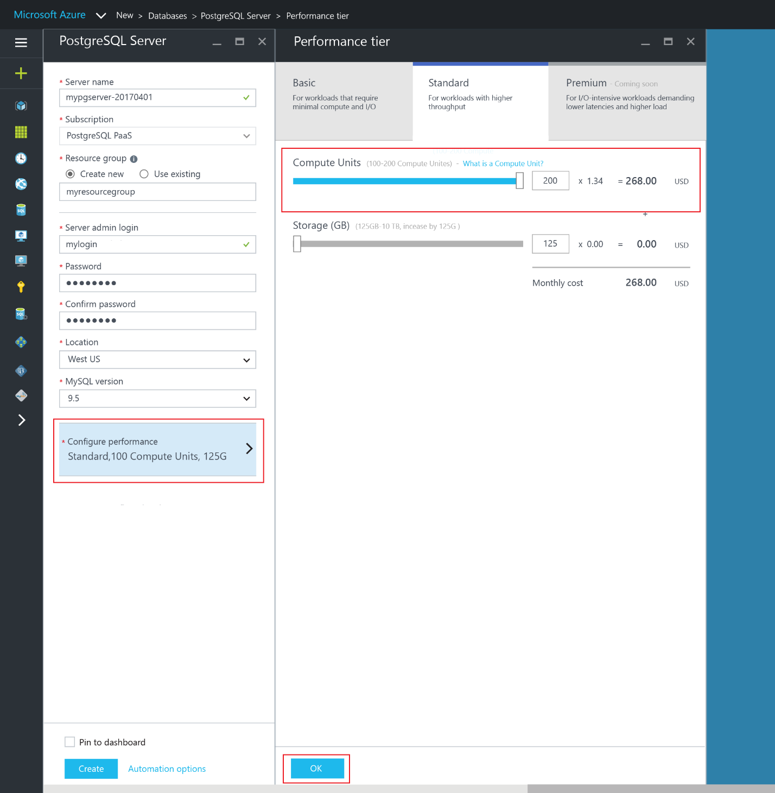
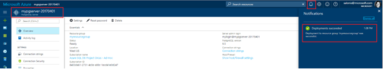
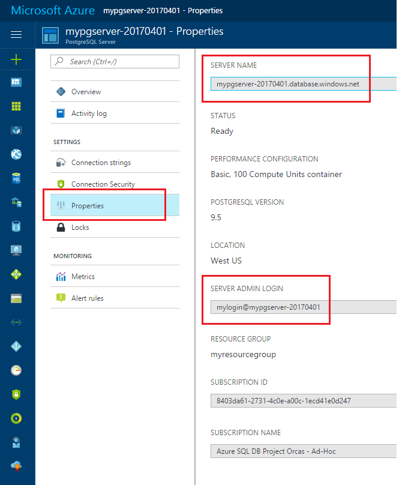
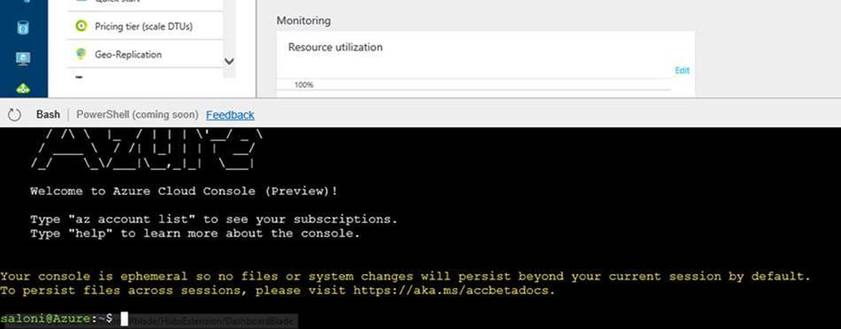

# Design your first Azure Database for PostgreSQL
In this tutorial, you will use the Azure portal to create a server with a server-level firewall. You will then use [psql](https://www.postgresql.org/docs/9.6/static/app-psql.html) utility to create a database, table in the database, load data into that table, query the table, and update data in the table. Finally, you will use the service's automated backups to restore the database to an earlier point-in-time before you added this new table.

## Step 1 - Log in to the Azure portal
Log in to the [Azure portal](https://portal.azure.com/).

## Step 2 - Create an Azure PostgreSQL server
An Azure PostgreSQL server is created with a defined set of [compute and storage resources](./placeholders.md). The server is created within an [Azure resource group](../azure-resource-manager/resource-group-overview.md).


Follow these steps to create an Azure Database for PostgreSQL server with default database ‘postgres’.
1.	Click the **New** button found on the upper left-hand corner of the Azure portal.

2.	Select **Databases** from the **New** page, and select **Azure Database for PostgreSQL** from the **Databases** page.


3.	Fill out the Azure Database for PostgreSQL form with the following information, as shown on the preceding image:
- Server name: **mypgserver-20170401** (a globally unique server name)
- Resource group: **myresourcegroup**
- Server admin login and password of your choice
- Location
- PostgreSQL Version

4.	Click **Service tier** to specify the service tier and performance level for your new database. For this quick start, select **Standard Tier**, **200 Compute Units** and **125 GB** of included storage.


5.	Click **Ok**.

6.	Click **Create** to provision the server. Provisioning takes a few minutes.

>[!Note] 
> Check the **Pin to dashboard** option to allow easy tracking of your deployments.

7.	On the toolbar, click **Notifications** to monitor the deployment process.


## Step 3 - Create a server-level firewall rule
The Azure Database for PostgreSQL service creates a firewall at the server-level preventing external applications and tools from connecting to the server or any databases on the server unless a firewall rule is created to open the firewall for specific IP addresses. 

1.	After the deployment completes, click **Azure Database for PostgreSQL** from the left-hand menu and click your newly created server, **mypgserver-20170401**. The **Overview** page for your server opens and provides options for further configuration.


2.	Navigate to the Settings blade of the server. In the Settings blade, select **Connection Security**.

3.	Click in the text box under **Rule Name,** and add a new firewall rule to whitelist the IP range for connectivity. For this quick start let’s allow all IPs by typing in **Rule Name** = **AllowAllIps**, **Start IP** = **0.0.0.0** and **End IP** = **255.255.255.255** and then click Save. A server-level firewall rule is created for your specified IP address range.
 

 
4.	Click **OK** and then click the **X** to close the **Connections Security** page.

>[!Note]
> You can set a firewall rule that covers an IP range to be able to connect from your network.

## Step 4 - Connect to Azure Database for PostgreSQL using psql in Cloud Shell
When we created our PostgreSQL server, the default 'postgres' database also gets created. Let’s now use the [psql](https://www.postgresql.org/docs/9.6/static/app-psql.html) command line utility to connect to the Azure Database for PostgreSQL server. To connect to your database server, you need to provide host information and access credentials.

1.	Select your server’s **Properties** page. Make a note of the **Server name** and **Server admin login**.
 

2.	Launch the Azure Cloud Console via the terminal icon on the top navigation pane. 
  

3.	This will enable a bash shell experience in your browser.
  
 
4.	At the Cloud Console prompt, connect to your Azure Database for PostgreSQL server using the [psql](https://www.postgresql.org/docs/9.6/static/app-psql.html) command line utility. Connect to the default database called **postgres** on your PostgreSQL server **mypgserver-20170401.postgres.database.azure.com** using access credentials:
```dos
psql --host=mypgserver-20170401.postgres.database.azure.com --port=5432 --username=mylogin@mypgserver-20170401 --password --dbname=postgres
```

## Step 5 - Create a New Database
Once you’re connected to the server, create a blank database to work with.
```sql
postgres=> CREATE DATABASE mypgsqldb;
```

At the prompt, run the following command to switch connection to the newly created database:
```sql
postgres=> \c mypgsqldb
```

## Step 6 - Create tables in the database
Now that you know how to connect to the Azure PostgreSQL database, we can go over how to complete some basic tasks.

First, we can create a table and load it with some data. Let's create a table that stores inventory information.
```sql
CREATE TABLE inventory (
	id serial PRIMARY KEY, 
	name VARCHAR(50), 
	quantity INTEGER
);
```

You can see the new table by typing:
```sql
mypgsqldb=> \d
```

## Step 7 - Load data into the tables
Now that we have a table, we can insert some data into it. At the open command prompt window, run the following query to insert some rows of data
```sql
INSERT INTO inventory (id, name, quantity) VALUES (1, 'banana', 150); 
INSERT INTO inventory (id, name, quantity) VALUES (2, 'orange', 154);
```

You have now two rows of sample data into the table you created earlier.

## Step 8 - Query and update the data in the tables
Execute the following query to retrieve information from the database table. 
```sql
SELECT * FROM inventory;
```

You can also update the data in the tables
```sql
UPDATE inventory SET quantity = 200 WHERE name = 'banana';
```

The row gets updated accordingly when you retrieve data.
```sql
SELECT * FROM inventory;
```

## Step 9 - Restore a database to a previous point in time
Imagine you have accidentally deleted this table. This is something you cannot easily recover from. Azure Database for PostgreSQL allows you to go back to any point in time in the last up to 35 days and restore this point in time to a new server. You can use this new server to recover your deleted data. The following steps restore the sample server to a point before the table was added.

1.	On the Azure Database for PostgreSQL page for your server, click **Restore** on the toolbar. The **Restore** page opens.
  
 
2.	Fill out the **Restore** form with the required information:
- **Restore point**: Select a point-in-time that occurs before the server was changed
- **Target server**: Provide a new server name you want to restore to
- **Location**: You cannot select the region, by default it is same as the source server
- **Pricing tier**: You cannot change this value when restoring a server. It is same as the source server. 
  
 
3.	Click **OK** to restore the server to [restore to a point in time](./howto-restore-server-portal.md)before the tables was deleted. Restoring a server to a different point in time creates a duplicate new server as the original server as of the point in time you specify, provided that it is within the retention period for your [service tier](./concepts-service-tiers.md).


## Next Steps
For Azure CLI samples for common tasks, see [Azure Database for PostgreSQL - Azure CLI samples](./sample-scripts-azure-cli.md)

