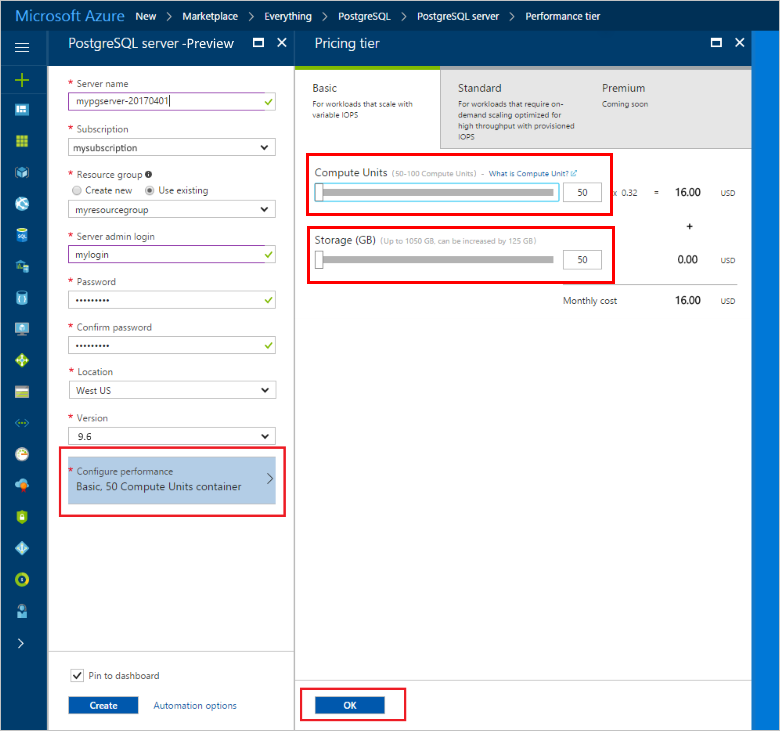
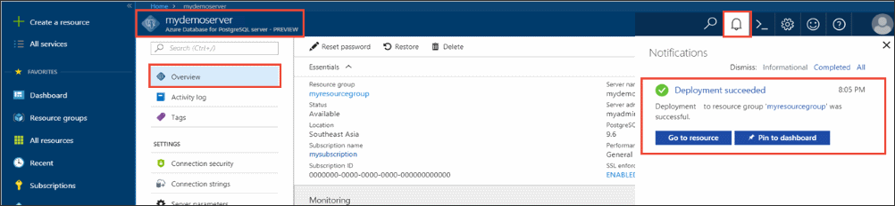

# Design your first Azure Database for PostgreSQL using the Azure portal

Azure Database for PostgreSQL is a managed service that enables you to run, manage, and scale highly available PostgreSQL databases in the cloud. Using the Azure portal, you can easily manage your server and design a database.

In this tutorial, you use the Azure portal to learn how to:
> [!div class="checklist"]
> * Create an Azure Database for PostgreSQL
> * Configure the server firewall
> * Use [**psql**](https://www.postgresql.org/docs/9.6/static/app-psql.html) utility to create a database
> * Load sample data
> * Query data
> * Update data
> * Restore data

## Prerequisites
If you don't have an Azure subscription, create a [free](https://azure.microsoft.com/free/) account before you begin.

## Log in to the Azure portal
Log in to the [Azure portal](https://portal.azure.com).

## Create an Azure Database for PostgreSQL

An Azure Database for PostgreSQL server is created with a defined set of [compute and storage resources](./concepts-compute-unit-and-storage.md). The server is created within an [Azure resource group](../azure-resource-manager/resource-group-overview.md).

Follow these steps to create an Azure Database for PostgreSQL server:
1.	Click the **+ New**  button found on the upper left-hand corner of the Azure portal.
2.	Select **Databases** from the **New** page, and select **Azure Database for PostgreSQL** from the **Databases** page.
 

3.	Fill out the new server details form with the following information, as shown on the preceding image:
    - Server name: **mypgserver-20170401** (name of a server maps to DNS name and is thus required to be globally unique) 
    - Subscription: If you have multiple subscriptions, choose the appropriate subscription in which the resource exists or is billed for.
    - Resource group: **myresourcegroup**
    - Server admin login and password of your choice
    - Location
    - PostgreSQL Version

  > [!IMPORTANT]
  > The server admin login and password that you specify here are required to log in to the server and its databases later in this quick start. Remember or record this information for later use.

4.	Click **Pricing tier** to specify the service tier and performance level for your new database. For this quick start, select **Basic** Tier, **50 Compute Units** and **50 GB** of included storage.
 
5.	Click **Ok**.
6.	Click **Create** to provision the server. Provisioning takes a few minutes.

  > [!TIP]
  > Check the **Pin to dashboard** option to allow easy tracking of your deployments.

7.	On the toolbar, click **Notifications** to monitor the deployment process.
 
   
  By default, **postgres** database gets created under your server. The [postgres](https://www.postgresql.org/docs/9.6/static/app-initdb.html) database is a default database meant for use by users, utilities, and third-party applications. 

## Configure a server-level firewall rule

The Azure Database for PostgreSQL service creates a firewall at the server-level. This firewall prevents external applications and tools from connecting to the server and any databases on the server unless a firewall rule is created to open the firewall for specific IP addresses. 

1.	After the deployment completes, click **All Resources** from the left-hand menu and type in the name **mypgserver-20170401** to search for your newly created server. Click the server name listed in the search result. The **Overview** page for your server opens and provides options for further configuration.
 
 

2.	In the server blade, select **Connection Security**. 
3.	Click in the text box under **Rule Name,** and add a new firewall rule to whitelist the IP range for connectivity. For this tutorial, let's allow all IPs by typing in **Rule Name = AllowAllIps**, **Start IP = 0.0.0.0** and **End IP = 255.255.255.255** and then click **Save**. You can set a firewall rule that covers an IP range to be able to connect from your network.
 
 

4.	Click **Save** and then click the **X** to close the **Connections Security** page.

  > [!NOTE]
  > Azure PostgreSQL server communicates over port 5432. If you are trying to connect from within a corporate network, outbound traffic over port 5432 may not be allowed by your network's firewall. If so, you will not be able to connect to your Azure SQL Database server unless your IT department opens port 5432.
  >


## Get the connection information

When we created our Azure Database for PostgreSQL server, the default **postgres** database also gets created. To connect to your database server, you need to provide host information and access credentials.

1. From the left-hand menu in Azure portal, click **All resources** and search for the server you just created **mypgserver-20170401**.

  

3. Click the server name **mypgserver-20170401**.
4. Select the server's **Overview** page. Make a note of the **Server name** and **Server admin login name**.

 


## Connect to PostgreSQL database using psql in Cloud Shell

Let's now use the psql command-line utility to connect to the Azure Database for PostgreSQL server. 
1. Launch the Azure Cloud Shell via the terminal icon on the top navigation pane.

   

2. The Azure Cloud Shell opens in your browser, enabling you to type bash commands.

   

3. At the Cloud Shell prompt, connect to your Azure Database for PostgreSQL server using the psql commands. The following format is used to connect to an Azure Database for PostgreSQL server with the [psql](https://www.postgresql.org/docs/9.6/static/app-psql.html) utility:
   ```bash
   psql --host=<myserver> --port=<port> --username=<server admin login> --dbname=<database name>
   ```

   For example, the following command connects to the default database called **postgres** on your PostgreSQL server **mypgserver-20170401.postgres.database.azure.com** using access credentials. Enter your server admin password when prompted.

   ```bash
   psql --host=mypgserver-20170401.postgres.database.azure.com --port=5432 --username=mylogin@mypgserver-20170401 --dbname=postgres
   ```

## Create a New Database
Once you're connected to the server, create a blank database at the prompt.
```bash
CREATE DATABASE mypgsqldb;
```

At the prompt, execute the following command to switch connection to the newly created database **mypgsqldb**.
```bash
\c mypgsqldb
```
## Create tables in the database
Now that you know how to connect to the Azure Database for PostgreSQL, we can go over how to complete some basic tasks.

First, we can create a table and load it with some data. Let's create a table that tracks inventory information.
```sql
CREATE TABLE inventory (
	id serial PRIMARY KEY, 
	name VARCHAR(50), 
	quantity INTEGER
);
```

You can see the newly created table in the list of tabvles now by typing:
```sql
\dt
```

## Load data into the tables
Now that we have a table, we can insert some data into it. At the open command prompt window, run the following query to insert some rows of data
```sql
INSERT INTO inventory (id, name, quantity) VALUES (1, 'banana', 150); 
INSERT INTO inventory (id, name, quantity) VALUES (2, 'orange', 154);
```

You have now two rows of sample data into the table you created earlier.

## Query and update the data in the tables
Execute the following query to retrieve information from the database table. 
```sql
SELECT * FROM inventory;
```

You can also update the data in the tables
```sql
UPDATE inventory SET quantity = 200 WHERE name = 'banana';
```

The row gets updated accordingly when you retrieve data.
```sql
SELECT * FROM inventory;
```

## Restore data to a previous point in time
Imagine you have accidentally deleted this table. This situation is something you cannot easily recover from. Azure Database for PostgreSQL allows you to go back to any point-in-time (in the last up to 7 days (Basic) and 35 days (Standard)) and restore this point-in-time to a new server. You can use this new server to recover your deleted data. The following steps restore the sample server to a point before the table was added.

1.	On the Azure Database for PostgreSQL page for your server, click **Restore** on the toolbar. The **Restore** page opens.
  
2.	Fill out the **Restore** form with the required information:

  
  - **Restore point**: Select a point-in-time that occurs before the server was changed
  - **Target server**: Provide a new server name you want to restore to
  - **Location**: You cannot select the region, by default it is same as the source server
  - **Pricing tier**: You cannot change this value when restoring a server. It is same as the source server. 
3.	Click **OK** to restore the server to [restore to a point-in-time](./howto-restore-server-portal.md) before the tables was deleted. Restoring a server to a different point in time creates a duplicate new server as the original server as of the point in time you specify, provided that it is within the retention period for your [service tier](./concepts-service-tiers.md).

## Next Steps
In this tutorial, you learned how to use the Azure portal and other utilities to:
> [!div class="checklist"]
> * Create an Azure Database for PostgreSQL
> * Configure the server firewall
> * Use [**psql**](https://www.postgresql.org/docs/9.6/static/app-psql.html) utility to create a database
> * Load sample data
> * Query data
> * Update data
> * Restore data

Next, learn how to use Azure CLI to do similar tasks, review this tutorial: 
[Design your first Azure Database for PostgreSQL using Azure CLI](tutorial-design-database-using-azure-cli.md)
