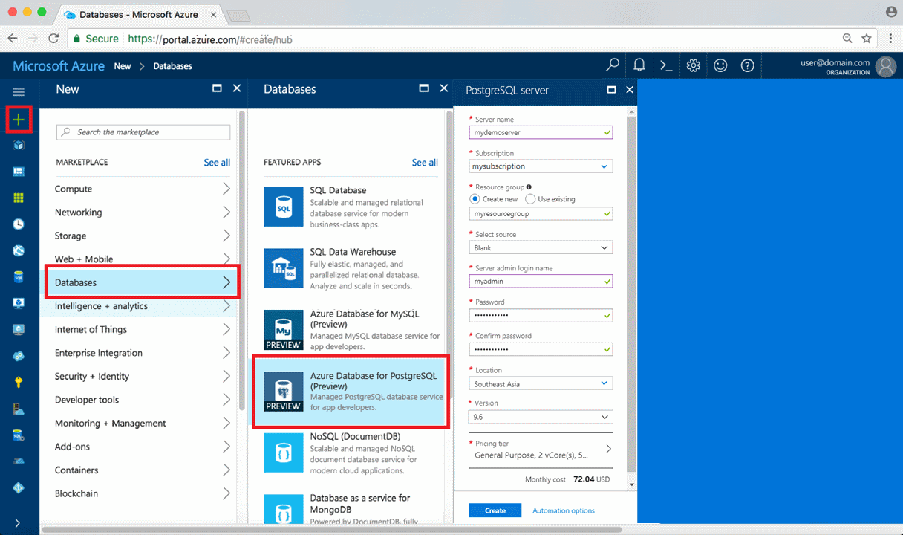
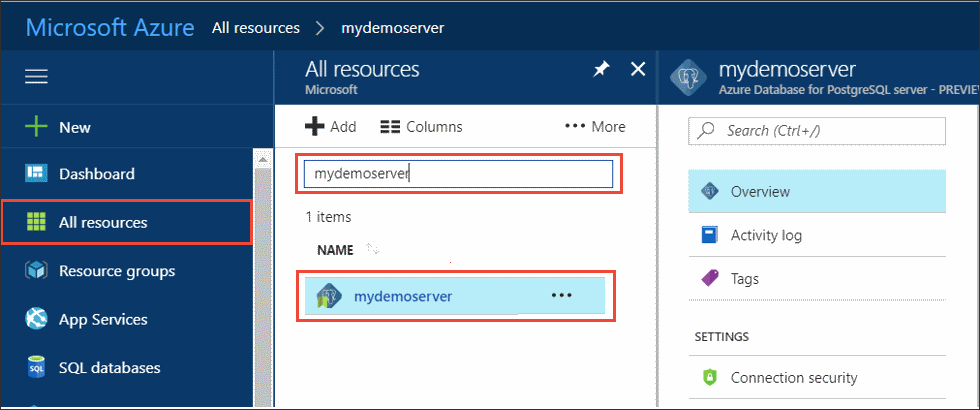
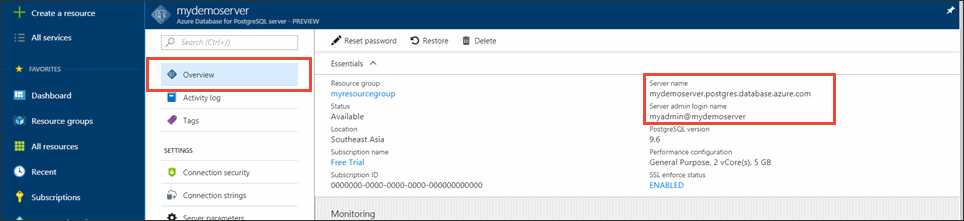
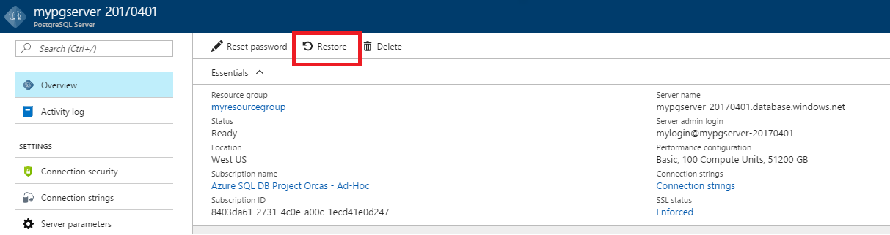
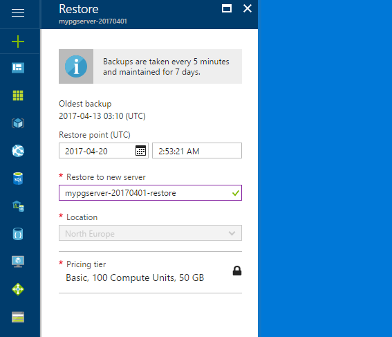

# Tutorial: Design an Azure Database for PostgreSQL - Single Server using the Azure portal

Azure Database for PostgreSQL is a managed service that enables you to run, manage, and scale highly available PostgreSQL databases in the cloud. Using the Azure portal, you can easily manage your server and design a database.

In this tutorial, you use the Azure portal to learn how to:
> [!div class="checklist"]
> * Create an Azure Database for PostgreSQL server
> * Configure the server firewall
> * Use [**psql**](https://www.postgresql.org/docs/9.6/static/app-psql.html) utility to create a database
> * Load sample data
> * Query data
> * Update data
> * Restore data

## Prerequisites
If you don't have an Azure subscription, create a [free](https://azure.microsoft.com/free/) account before you begin.

## Create an Azure Database for PostgreSQL

An Azure Database for PostgreSQL server is created with a defined set of [compute and storage resources](./concepts-compute-unit-and-storage.md). The server is created within an [Azure resource group](../azure-resource-manager/management/overview.md).

Follow these steps to create an Azure Database for PostgreSQL server:
1. Click **Create a resource**  in the upper left-hand corner of the Azure portal.
2. Select **Databases** from the **New** page, and select **Azure Database for PostgreSQL** from the **Databases** page.
   

3. Select the **Single server** deployment option.

   

4. Fill out the **Basics** form with the following information:

    

    Setting|Suggested Value|Description
    ---|---|---
    Subscription|Your subscription name|The  Azure subscription that you want to use for your server. If you have multiple subscriptions, choose the subscription in which you're billed for the resource.
    Resource group|*myresourcegroup*| A new resource group name or an existing one from your subscription.
    Server name |*mydemoserver*|A unique name that identifies your Azure Database for PostgreSQL server. The domain name *postgres.database.azure.com* is appended to the server name you provide. The server can contain only lowercase letters, numbers, and the hyphen (-) character. It must contain at least 3 through 63 characters.
    Data source | *None* | Select *None* to create a new server from scratch. (You would select *Backup* if you were creating a server from a geo-backup of an existing Azure Database for PostgreSQL server).
    Admin username |*myadmin*| Your own login account to use when you connect to the server. The admin login name can't be **azure_superuser**, **azure_pg_admin**, **admin**, **administrator**, **root**, **guest**, or **public**. It can't start with **pg_**.
    Password |Your password| A new password for the server admin account. It must contain between 8 and 128 characters. Your password must contain characters from three of the following categories: English uppercase letters, English lowercase letters, numbers (0 through 9), and non-alphanumeric characters (!, $, #, %, etc.).
    Location|The region closest to your users| The location that is closest to your users.
    Version|The latest major version| The latest PostgreSQL major version, unless you have specific requirements otherwise.
    Compute + storage | **General Purpose**, **Gen 5**, **2 vCores**, **5 GB**, **7 days**, **Geographically Redundant** | The compute, storage, and backup configurations for your new server. Select **Configure server**. Next, select the **General Purpose** tab. *Gen 5*, *4 vCores*, *100 GB*, and *7 days* are the default values for **Compute Generation**, **vCore**, **Storage**, and **Backup Retention Period**. You can leave those sliders as is or adjust them. To enable your server backups in geo-redundant storage select **Geographically Redundant** from the **Backup Redundancy Options**. To save this pricing tier selection, select **OK**. The next screenshot captures these selections.

   > [!NOTE]
   > Consider using the Basic pricing tier if light compute and I/O are adequate for your workload. Note that servers created in the Basic pricing tier cannot later be scaled to General Purpose or Memory Optimized. See the [pricing page](https://azure.microsoft.com/pricing/details/postgresql/) for more information.
   > 

    

    > [!TIP]
    > With **auto-growth** enabled your server increases storage when you are approaching the allocated limit, without impacting your workload.

5. Select **Review + create** to review your selections. Select **Create** to provision the server. This operation may take a few minutes.

6. On the toolbar, select the **Notifications** icon (a bell) to monitor the deployment process. Once the deployment is done, you can select **Pin to dashboard**, which creates a tile for this server on your Azure portal dashboard as a shortcut to the server's **Overview** page. Selecting **Go to resource** opens the server's **Overview** page.

    
   
   By default, a **postgres** database is created under your server. The [postgres](https://www.postgresql.org/docs/9.6/static/app-initdb.html) database is a default database that's meant for use by users, utilities, and third-party applications. (The other default database is **azure_maintenance**. Its function is to separate the managed service processes from user actions. You cannot access this database.)


## Configure a server-level firewall rule

The Azure Database for PostgreSQL service uses a firewall at the server-level. By default, this firewall prevents all external applications and tools from connecting to the server and any databases on the server unless a firewall rule is created to open the firewall for a specific IP address range. 

1. After the deployment completes, click **All Resources** from the left-hand menu and type in the name **mydemoserver** to search for your newly created server. Click the server name listed in the search result. The **Overview** page for your server opens and provides options for further configuration.

   

2. In the server page, select **Connection security**. 

3. Click in the text box under **Rule Name,** and add a new firewall rule to specify the IP range for connectivity. Enter your IP range. Click **Save**.

   

4. Click **Save** and then click the **X** to close the **Connections security** page.

   > [!NOTE]
   > Azure PostgreSQL server communicates over port 5432. If you are trying to connect from within a corporate network, outbound traffic over port 5432 may not be allowed by your network's firewall. If so, you cannot connect to your Azure SQL Database server unless your IT department opens port 5432.
   >

## Get the connection information

When you created the Azure Database for PostgreSQL server, the default **postgres** database was also created. To connect to your database server, you need to provide host information and access credentials.

1. From the left-hand menu in the Azure portal, click **All resources** and search for the server you just created.

   

2. Click the server name **mydemoserver**.

3. Select the server's **Overview** page. Make a note of the **Server name** and **Server admin login name**.

   


## Connect to PostgreSQL database using psql
If your client computer has PostgreSQL installed, you can use a local instance of [psql](https://www.postgresql.org/docs/9.6/static/app-psql.html), or the Azure Cloud Console to connect to an Azure PostgreSQL server. Let's now use the psql command-line utility to connect to the Azure Database for PostgreSQL server.

1. Run the following psql command to connect to an Azure Database for PostgreSQL database:
   ```
   psql --host=<servername> --port=<port> --username=<user@servername> --dbname=<dbname>
   ```

   For example, the following command connects to the default database called **postgres** on your PostgreSQL server **mydemoserver.postgres.database.azure.com** using access credentials. Enter the `<server_admin_password>` you chose when prompted for password.
  
   ```
   psql --host=mydemoserver.postgres.database.azure.com --port=5432 --username=myadmin@mydemoserver --dbname=postgres
   ```

   > [!TIP]
   > If you prefer to use a URL path to connect to Postgres, URL encode the @ sign in the username with `%40`. For example the connection string for psql would be,
   > ```
   > psql postgresql://myadmin%40mydemoserver@mydemoserver.postgres.database.azure.com:5432/postgres
   > ```

2. Once you are connected to the server, create a blank database at the prompt:
   ```sql
   CREATE DATABASE mypgsqldb;
   ```

3. At the prompt, execute the following command to switch connection to the newly created database **mypgsqldb**:
   ```sql
   \c mypgsqldb
   ```

## Create tables in the database
Now that you know how to connect to the Azure Database for PostgreSQL, you can complete some basic tasks:

First, create a table and load it with some data. Let's create a table that tracks inventory information using this SQL code:
```sql
CREATE TABLE inventory (
	id serial PRIMARY KEY, 
	name VARCHAR(50), 
	quantity INTEGER
);
```

You can see the newly created table in the list of tables now by typing:
```sql
\dt
```

## Load data into the tables
Now that you have a table, insert some data into it. At the open command prompt window, run the following query to insert some rows of data.
```sql
INSERT INTO inventory (id, name, quantity) VALUES (1, 'banana', 150); 
INSERT INTO inventory (id, name, quantity) VALUES (2, 'orange', 154);
```

You have now two rows of sample data into the inventory table you created earlier.

## Query and update the data in the tables
Execute the following query to retrieve information from the inventory database table. 
```sql
SELECT * FROM inventory;
```

You can also update the data in the table.
```sql
UPDATE inventory SET quantity = 200 WHERE name = 'banana';
```

You can see the updated values when you retrieve the data.
```sql
SELECT * FROM inventory;
```

## Restore data to a previous point in time
Imagine you have accidentally deleted this table. This situation is something you cannot easily recover from. Azure Database for PostgreSQL allows you to go back to any point-in-time for which your server has backups (determined by the backup retention period you configured) and restore this point-in-time to a new server. You can use this new server to recover your deleted data. The following steps restore the **mydemoserver** server to a point before the inventory table was added.

1. On the Azure Database for PostgreSQL **Overview** page for your server, click **Restore** on the toolbar. The **Restore** page opens.

   

2. Fill out the **Restore** form with the required information:

   

   - **Restore point**: Select a point-in-time that occurs before the server was changed
   - **Target server**: Provide a new server name you want to restore to
   - **Location**: You cannot select the region, by default it is same as the source server
   - **Pricing tier**: You cannot change this value when restoring a server. It is same as the source server. 
3. Click **OK** to [restore the server to a point-in-time](./howto-restore-server-portal.md) before the table was deleted. Restoring a server to a different point in time creates a duplicate new server as the original server as of the point in time you specify, provided that it is within the retention period for your [pricing tier](./concepts-pricing-tiers.md).

## Next steps
In this tutorial, you learned how to use the Azure portal and other utilities to:
> [!div class="checklist"]
> * Create an Azure Database for PostgreSQL server
> * Configure the server firewall
> * Use [**psql**](https://www.postgresql.org/docs/9.6/static/app-psql.html) utility to create a database
> * Load sample data
> * Query data
> * Update data
> * Restore data

Next, to learn how to use the Azure CLI to do similar tasks, review this tutorial: 
[Design your first Azure Database for PostgreSQL using Azure CLI](tutorial-design-database-using-azure-cli.md)
