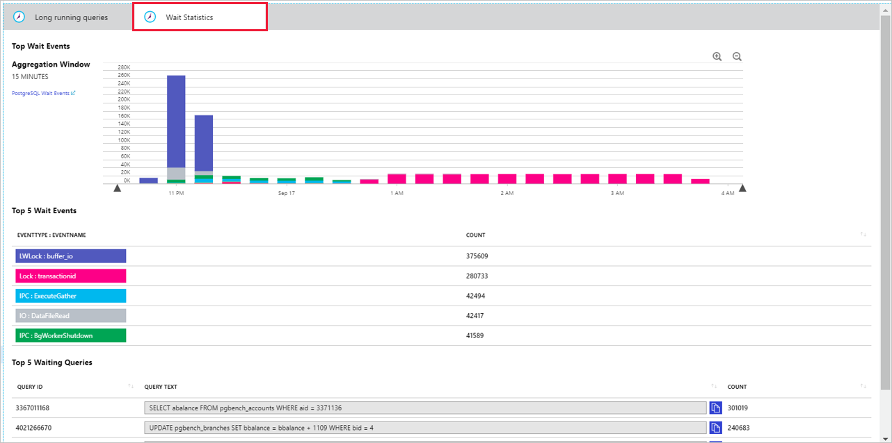

# Tutorial: Monitor and tune Azure Database for PostgreSQL - Single Server

Azure Database for PostgreSQL has features that help you understand and improve your server performance. In this tutorial you will learn how to:
> [!div class="checklist"]
> * Enable query and wait statistics collection
> * Access and utilize the data collected
> * View query performance and wait statistics over time
> * Analyze a database to get performance recommendations
> * Apply performance recommendations

## Before you begin
You need an Azure Database for PostgreSQL server with PostgreSQL version 9.6 or 10. You can follow the steps in the [Create tutorial](tutorial-design-database-using-azure-portal.md) to create a server.

> [!IMPORTANT]
> **Query Store**, **Query Performance Insight**, and **Performance Recommendation** are in Public Preview.

## Enabling data collection
The [Query Store](concepts-query-store.md) captures a history of queries and wait statistics on your server and stores it in the **azure_sys** database on your server. It is an opt-in feature. To enable it:

1. Open the Azure portal.

2. Select your Azure Database for PostgreSQL server.

3. Select **Server parameters** which is in the **Settings** section of the menu on the left.

4. Set **pg_qs.query_capture_mode** to **TOP** to start collecting query performance data. Set **pgms_wait_sampling.query_capture_mode** to **ALL** to start collecting wait statistics. Save.
   
   

5. Allow up to 20 minutes for the first batch of data to persist in the **azure_sys** database.

## Performance insights
The [Query Performance Insight](concepts-query-performance-insight.md) view in the Azure portal will surface visualizations on key information from Query Store. 

1. In the portal page of your Azure Database for PostgreSQL server, select **Query performance Insight** under the **Support + troubleshooting** section of the menu on the left.

2. The **Long running queries** tab shows the top 5 queries by average duration per execution, aggregated in 15 minute intervals. 
   
   

   You can view more queries by selecting from the **Number of Queries** drop down. The chart colors may change for a specific Query ID when you do this.

3. You can click and drag in the chart to narrow down to a specific time window.

4. Use the zoom in and out icons to view a smaller or larger period of time respectively.

5. View the table below the chart to learn more details about the long-running queries in that time window.

6. Select the **Wait Statistics** tab to view the corresponding visualizations on waits in the server.
   
   

### Permissions
**Owner** or **Contributor** permissions required to view the text of the queries in Query Performance Insight. **Reader** can view charts and tables but not query text.

## Performance recommendations
The [Performance Recommendations](concepts-performance-recommendations.md) feature analyzes workloads across your server to identify indexes with the potential to improve performance.

1. Open **Performance Recommendations** from the **Support + troubleshooting** section of the menu bar on the Azure portal page for your PostgreSQL server.
   
   

2. Select **Analyze** and choose a database. This will begin the analysis.

3. Depending on your workload, this may take several minutes to complete. Once the analysis is done, there will be a notification in the portal.

4. The **Performance Recommendations** window will show a list of recommendations if any were found. 

5. A recommendation will show information about the relevant **Database**, **Table**, **Column**, and **Index Size**.

   

6. To implement the recommendation, copy the query text and run it from your client of choice.

### Permissions
**Owner** or **Contributor** permissions required to run analysis using the Performance Recommendations feature.

## Next steps
- Learn more about [monitoring and tuning](concepts-monitoring.md) in Azure Database for PostgreSQL.