<properties
	pageTitle="Tutorial: Create a custom API using Azure Resource Manager in PowerApps and Logic Flows | Microsoft Azure"
	description="Azure Resource Manager tutorial to create a custom API in PowerApps and Logic Flows"
	services=""
    suite="powerapps"
	documentationCenter="" 
	authors="sunaysv"
	manager="erikre"
	editor=""/>

<tags
   ms.service="powerapps"
   ms.devlang="na"
   ms.topic="article"
   ms.tgt_pltfrm="na"
   ms.workload="na" 
   ms.date="07/12/2016"
   ms.author="mandia"/>

# Tutorial: Create a custom AAD protected ARM API for PowerApps and Logic Flows 

This tutorial walks you through the required steps to register a Swagger file describing the [ARM API][6], and  then connect to the custom API in PowerApps. 

>[AZURE.IMPORTANT] This topic has moved to powerapps.microsoft.com at [Tutorial: Create a custom AAD protected ARM API for PowerApps and Flows](https://powerapps.microsoft.com/tutorials/customapi-azure-resource-manager-tutorial/). Please go to PowerApps for the latest version. This Azure link is being archived.

## What you need to get started

- An Azure subscription
- A PowerApps account

## Enable authentication in Azure Active Directory

First, we need to create an Azure Active Directory (AAD) application that performs authentication when calling the ARM API endpoint. 

1. To create an AAD application, sign in to your [Azure subscription][7], and go to **Active Directory**:  
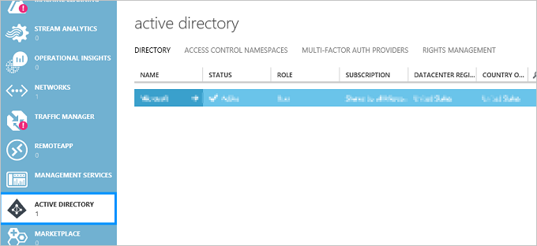  

2. On this page, choose the directory that you want to create your AAD application in. Select the directory, go to the **Applications** tab, and select **Add**:  
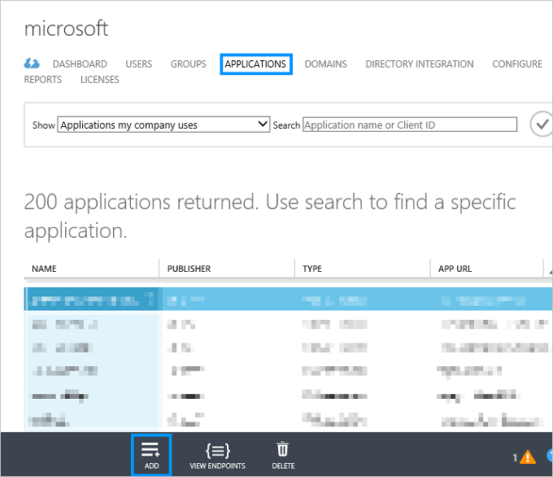

3. Enter a name for your application, select **Web application and/or Web API**, and then select **Next**:  
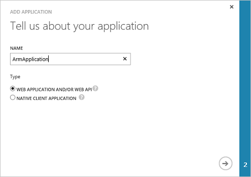  

4. In **Sign-on URL**, enter: *http://login.windows.net*. In **App ID URI**, enter any unique URI. Then, select **Complete**:    
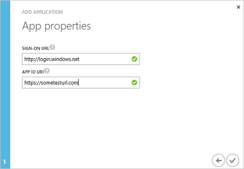  

5. Once the AAD application is created, go to the **Configure** tab. In this tab, we configure the permissions on the application. 

6. Under **permissions to other applications**, select **Add application**, and enter the following permissions as shown:  
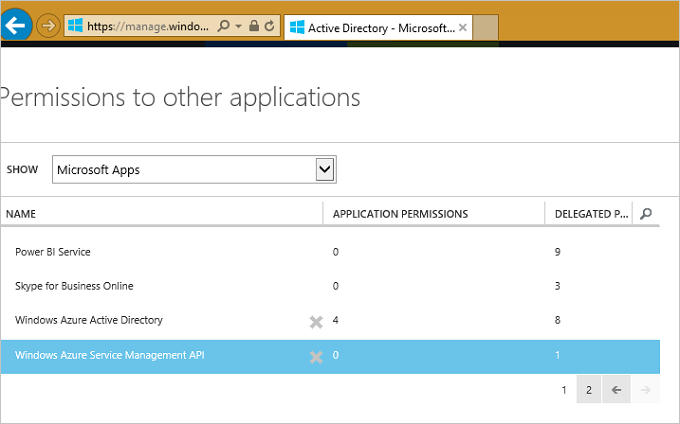  

	Make sure you delegate the necessary permissions for your application:  
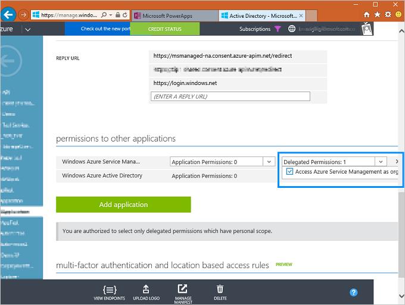

7. Under **keys**, select any duration. **Copy and save the key to a safe location**; we need this later. Also make a note of the __Client ID__:  
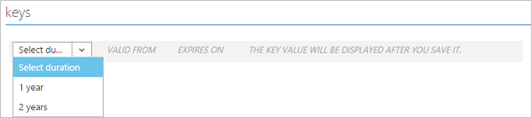	

8. Under **single sign-on**, enter the following URL in __reply-URL__: https://msmanaged-na.consent.azure-apim.net/redirect:  
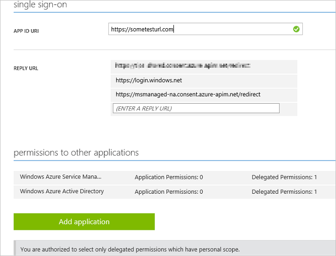

9. **Save** your changes. **Copy and save the key to a safe location**.

## Add the connection in PowerApps or Logic Flows

Now that the AAD application is configured, let's add the custom API. 

1. Open the [PowerApps web portal][1], go to the **Connections** tab, and select __Add a connection__ in the top right corner:  
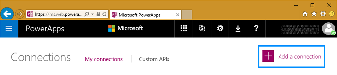  

2. Select __Add a Custom API__:  
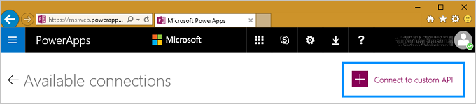

3. Upload the ARM Swagger file, which is available [to download][8]:  
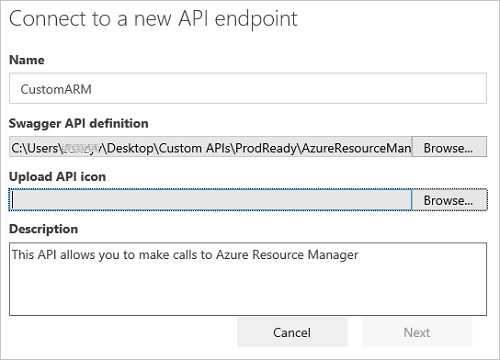

4. On the next screen, since our Swagger file is detected to use AAD authentication, we need to enter the AAD client ID, the client secret (the **key** you stored in a safe location), and other settings:  
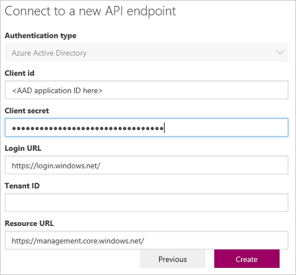

5. If everything is setup correctly, you can use the ARM custom API by creating a connection, and then referencing it while building your PowerApp or Logic Flow:  
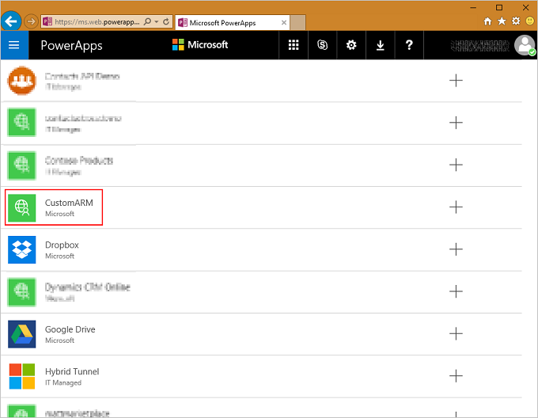

You can similarly access any data that is exposed using RESTful APIs and authenticated using AAD OAuth2.

For a more detailed experience on creating PowerApps and Logic Flows, see the following: 

- [Connect to Office 365, Twitter, and Microsoft Translator][5]
- [Show data from Office 365 ][4]
- [Create an app from data][3]
- [Get started with logic flows][2]

For questions or comments on Custom APIs, email [customapishelp@microsoft.com](mailto:customapishelp@microsoft.com).

<!--Reference links in article-->
[1]: https://web.powerapps.com
[2]: https://powerapps.microsoft.com/tutorials/get-started-logic-flow/
[3]: https://powerapps.microsoft.com/tutorials/get-started-create-from-data/
[4]: https://powerapps.microsoft.com/tutorials/show-office-data/
[5]: https://powerapps.microsoft.com/tutorials/powerapps-api-functions/
[6]: https://msdn.microsoft.com/library/azure/dn790568.aspx
[7]: https://manage.windowsazure.com
[8]: http://pwrappssamples.blob.core.windows.net/samples/AzureResourceManager.json
