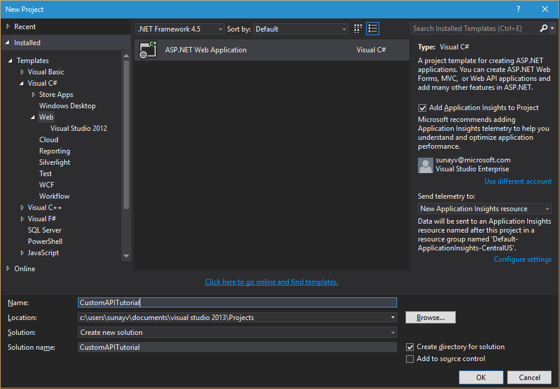
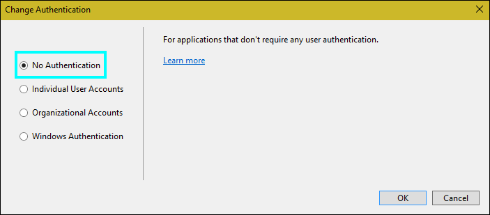
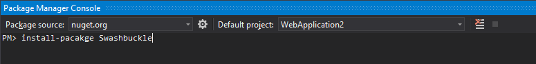

<properties
	pageTitle="Tutorial: Create a custom API using an ASP.Net web app in PowerApps and Logic Flows | Microsoft Azure"
	description="ASP.Net web app tutorial to create a custom API in PowerApps and Logic Flows"
	services=""
    suite="powerapps"
	documentationCenter="" 
	authors="sunaysv"
	manager="erikre"
	editor=""/>

<tags
   ms.service="powerapps"
   ms.devlang="na"
   ms.topic="article"
   ms.tgt_pltfrm="na"
   ms.workload="na" 
   ms.date="07/12/2016"
   ms.author="mandia"/>

# Tutorial: Create a custom AAD protected web API for PowerApps and Logic Flows

This tutorial shows you how to create a ASP.Net web API, host it on Azure Webapps, enable AAD authentication (via easy auth), and then register the web API in PowerApps and Logic flows. 

>[AZURE.IMPORTANT] This topic has moved to powerapps.microsoft.com at [Tutorial: Create a custom AAD protected Web API for PowerApps and Flow](https://powerapps.microsoft.com/tutorials/customapi-web-api-tutorial/). Please go to PowerApps for the latest version. This Azure link is being archived.

## What you need to get started

* An Azure subscription
* A PowerApps account
* Visual Studio 2013 or higher

## Step 1: Create a WebAPI and deploy it on Azure
1. Open Visual Studio and create a new C# ASP.NET web application:  


2. On the next screen, select the web API template, and select **No Authentication**:  


	>[AZURE.IMPORTANT] Make sure you set authentication to "No Authentication".

3. When the project is created, you need to build the web API for your resources. For this tutorial, we do not go in to the specifics of building a web API.

4. Next, Generate a Swagger file for the web API. You can do this easily by opening the __Package Manager Console__, and installing __Swashbuckle__:  


5. Once installed and enabled, browse the following Swagger docs and UI endpoints respectively:  
 **\<your-root-url\>/swagger/docs/v1**  

 	**\<your-root-url\>/swagger**  

6. Once you are comfortable with your web API, publish it to Azure. To publish in Visual Studio, go to **BUILD**, and select **PUBLISH** .

7. Extract the swagger json by navigating to ***https://\<azure-webapp-url\>/swagger/docs/v1***.  

	> [AZURE.IMPORTANT] A swagger document with duplicate operationid(s) is invalid. If you are using the sample C# template, the operation-id "Values_Get" is repeated twice. Change one instance to "Value_Get".


You can download the swagger used in this tutorial [here][6]. Be sure to replace/remove the comments before using it. Comments start with `//`.

## Step 2: Set up AAD authentication

This tutorial assumes you know how to create an AAD application in Azure. To learn more about how to create an AAD application, read the [Azure resource manager tutorial](powerapps-azure-resource-manager-tutorial.md). We need two AAD applications for this tutorial. 

1. The first AAD application is used to secure the web API. Name it **webAPI**.
2. The second AAD application is used to secure the custom API registration and acquire delegated access to the web API protected by the first app. Name this one **webAPI-customAPI** .
3. For **webAPI**, use the following configuration:  

  1. Sign-on url: ***https://login.windows.net***
  2. App-ID Uri: ***https://\<your-root-url\>*** (typically the url of your website deployed on Azure)
  3. Reply url: ***https://\<your-root-url\>/.auth/login/aad/callback***  
  
	>[AZURE.IMPORTANT] You need the Client ID of this app later, so note it.

4. For **webAPI-customAPI**, use the following configuration:  
  
  1. Sign-on url: **https://login.windows.net**
  2. App-ID Uri: ***can be any unique URL***
  3. Reply url: ***https://msmanaged-na.consent.azure-apim.net/redirect***
  4. Add permissions to have delegated access to webAPI.
  5. You need the Client ID of this app later as well, so note it.
  6. Generate a key and store is somewhere safe. We need this key later.

>[AZURE.IMPORTANT] Both apps must be in the same directory.

## Step 3: Set up easy auth on your web app

1. Sign in to the [Azure portal](https://portal.azure.com), and go to your web app that you deployed in **Step 1** (in this topic).
2. In **Settings**, select **"Authentication / Authorization"**.
3. Turn on **App Service Authentication**, and select **Azure Active Directory**.  On the next blade, select **Express**.  
4. Click on the **Select Existing AD App**, and select the first AAD application you created as part of Step two. In this case, select **webAPI**.

This should setup AAD authentication for you web app.

## Step 4: Set up the Custom API 

1. We need to modify our swagger a bit to enter the `securityDefintions` object and AAD authentication used for the web app. Add the following lines of code: 

	```javascript
  "host": "<your-root-url>",
  "schemes": [
    "https"						//Change scheme to https 
  ],
  "securityDefinitions": {
    "AAD": {
      "type": "oauth2",
      "flow": "implicit",
      "authorizationUrl": "https://login.windows.net/common/oauth2/authorize",
      "scopes": []
    }
  },
	```

2. Go to the PowerApps [web portal][1], and add a custom API.  [Use Custom APIs in Logic Flows and PowerApps](powerapps-register-custom-api.md) lists the steps.

3. Once you have uploaded your Swagger, the wizard auto-detects that you are using AAD authentication for your webAPI.

4. Configure the AAD authentication for your custom API:  

  1. Client ID: ***Client ID of webAPI-CustomAPI*** from 4.5 in **Step 2** (in this topic)
  2. Secret: ***Key from webPI-CustomAPI*** from 4.6 in **Step 2** (in this topic)
  3. Login url: ***https://login.windows.net***
  4. ResourceUri: ***Client ID of webAPI*** from 3.4 in **Step 2** (in this topic)

5. Select **Create**, and try creating a connection on the Custom API. If everything is setup correctly, you should be able to sign-in successfully. 

For a more detailed experience on creating PowerApps and Logic Flows, see the following: 

- [Connect to Office 365, Twitter, and Microsoft Translator][5]
- [Show data from Office 365][4]
- [Create an app from data][3]
- [Get started with logic flows][2]

For questions or comments, email [customapishelp@microsoft.com](mailto:customapishelp@microsoft.com).

<!--Reference links in article-->
[1]: https://web.powerapps.com
[2]: https://powerapps.microsoft.com/tutorials/get-started-logic-flow/
[3]: https://powerapps.microsoft.com/tutorials/get-started-create-from-data/
[4]: https://powerapps.microsoft.com/tutorials/show-office-data/
[5]: https://powerapps.microsoft.com/tutorials/powerapps-api-functions/
[6]: http://pwrappssamples.blob.core.windows.net/samples/webAPI.json
