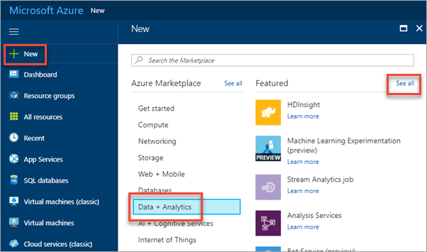
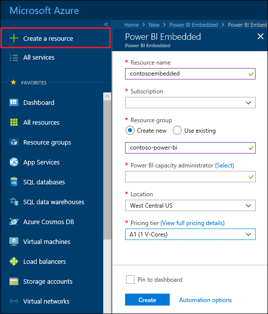
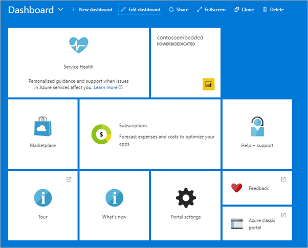

# Create Power BI Embedded capacity in the Azure portal

This article walks through how to create a Power BI Embedded capacity in Microsoft Azure. Power BI Embedded simplifies Power BI capabilities by helping you quickly add stunning visuals, reports, and dashboards into your apps.

If you don't have an Azure subscription, create a [free account](https://azure.microsoft.com/free/) before you begin.

> [!VIDEO https://www.youtube.com/embed/aXrvFfg_iSk]

## Before you begin

To complete this quickstart, you need:

* **Azure subscription:** Visit [Azure Free Trial](https://azure.microsoft.com/free/) to create an account.
* **Azure Active Directory:** Your subscription must be associated with an Azure Active Directory tenant. And, ***you need to be signed in to Azure with an account in that tenant***. Microsoft accounts are not supported. To learn more, see Authentication and user permissions.
* **Resource group:** Use a resource group you already have or [create a new one](../azure-resource-manager/resource-group-overview.md).

## Create a capacity

1. Sign into the [Azure portal](https://portal.azure.com/).

2. Select **+ (New)** > **Data + analytics**.

3. Select **See all** within **Featured**.

    

4. Under **Data analytics**, select **Power BI Embedded**.

5. Within Power BI Embedded, select **Create**.

6. Fill in the required information and then select **Create**.

    

    |Setting |Description |
    |---------|---------|
    |**Resource name**|A name to identify the capacity. The resource name is displayed within the Power BI admin portal in addition to the Azure portal.|
    |**Subscription**|The subscription you would like to create the capacity against.|
    |**Resource group**|The resource group that contains this new capacity. Pick from an existing resource group, or create another. For more information, see [Azure Resource Manager overview](../azure-resource-manager/resource-group-overview.md).|
    |**Power BI capacity administrator**|The initial Power BI capacity administrator. By default, the capacity administrator is your account. The capacity administrator must be within your Power BI tenant.|
    |**Location**|The region to create the capacity within. It is recommended that you select the region that your Power BI tenant is in.|
    |**Pricing tier**|Select the SKU and v-core count that meets your needs. For details, see [Power BI Embedded pricing](https://azure.microsoft.com/pricing/details/power-bi-embedded/)|

7. Select **Create**.

Creation usually takes under a minute; often just a few seconds. If you selected **Pin to dashboard**, navigate to your dashboard to see your new capacity. Or, navigate to **More services** > **Power BI Embedded** to see if your capacity is ready.

## Next steps

To use your new Power BI Embedded capacity, browse to the Power BI admin portal to assign workspaces. For more information, see [Manage capacities within Power BI Premium and Power BI Embedded](https://powerbi.microsoft.com/documentation/powerbi-admin-premium-manage/).

If you don't need to use this capacity, pause it to stop billing. For more information, see [Pause and start your Power BI Embedded capacity in the Azure portal](pause-start.md).

To begin embedding Power BI content within your application, see [How to embed your Power BI dashboards, reports and tiles](https://powerbi.microsoft.com/documentation/powerbi-developer-embedding-content/).

More questions? [Try asking the Power BI Community](http://community.powerbi.com/)