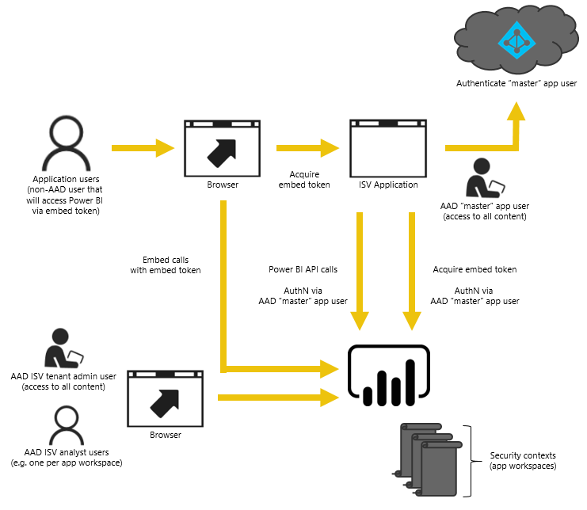

# Get started with Microsoft Power BI Embedded

**Power BI Embedded** offers independent software vendors (ISVs) and developers a way to quickly add stunning visuals, reports, and dashboards into their applications through a capacity-based, hourly metered model.

Power BI Embedded has benefits for an ISV, their developers, and customers. For example, an ISV can start creating visuals for free with Power BI Desktop. ISVs can achieve faster time to market by minimizing visual analytic development efforts and stand out among the competition with differentiated data experiences. ISVs also can opt to charge a premium for the additional value created with embedded analytics.

Developers can spend time focused on building the core competency of their application rather than spending time developing visuals and analytics. Developers can rapidly meet customer report and dashboard demands and can embed easily with fully documented APIs and SDKs. Lastly, by enabling easy-to-navigate data exploration in their apps, ISVs allow their customers to make quick, data-driven decisions in context and with confidence from any device.

## Register an application within Azure Active Directory

A registered application within Azure Active Directory (AAD) is needed to embed in a custom application. The registered application requires that your tenant is a Power BI tenant. A Power BI tenant means that at least one user in the organization has signed up for Power BI. Having a user signed up for Power BI allows the Power BI APIs to show up within the registered application.

For more information about how to register an application in AAD, see [Register an Azure AD app to embed Power BI content](https://powerbi.microsoft.com/documentation/powerbi-developer-register-app/).

## Embed content in your application

After you have your registered application in AAD, embed Power BI content within your application. Embed content by using the REST API along with the JavaScript APIs.

We have samples to help get you started. For a walkthrough of the sample, see [Integrate a dashboard, tile, or report into your application](https://powerbi.microsoft.com/documentation/powerbi-developer-embed-sample-app-owns-data/).

## Get capacity and move to production

Create Power BI Embedded capacity within Microsoft Azure to move your application to production. For information on how to create capacity, see [Create Power BI Embedded capacity in the Azure portal](create-capacity.md).

> [!IMPORTANT]
> Because embed tokens are intended for developer testing only, the number of embed tokens a Power BI master account can generate is limited. A [capacity must be purchased](https://docs.microsoft.com/power-bi/developer/embedded-faq#technical) for production embedding scenarios. There is no limit to an embed token generation when a dedicated capacity is purchased. Go to [Get Available Features](https://msdn.microsoft.com/library/mt846473.aspx) to check for the current embedded usage in percentage.

Manage your capacity within the Power BI admin portal. Assign a workspace admin to assist with your app workspaces. For more information, see [Manage capacities within Power BI Premium and Power BI Embedded](https://powerbi.microsoft.com/documentation/powerbi-admin-premium-manage/).

## Next steps

If you are ready to create Power BI Embedded capacity, see [Create Power BI Embedded capacity in the Azure portal](create-capacity.md).

If you are looking for a walkthrough sample, see [Integrate a dashboard, tile, or report into your application](https://powerbi.microsoft.com/documentation/powerbi-developer-embed-sample-app-owns-data/).

More questions? [Try the Power BI Community](http://community.powerbi.com/)
