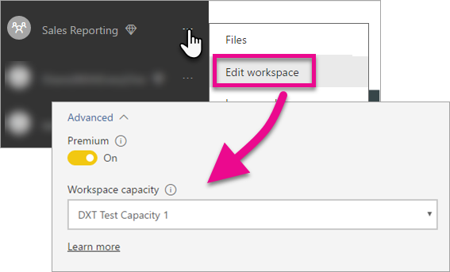

# How to migrate Power BI Workspace Collection content to Power BI Embedded

Learn how to migrate from Power BI Workspace Collections to Power BI Embedded. This article provides guidance for migrating from the Azure Power BI Workspace Collections to Power BI Embedded. We also look at what to expect for application changes.

The Power BI Workspace Collections resource continues to be available for a limited time after general availability of the Power BI Premium release. Customers under an Enterprise Agreement have access to their existing workspace collections through the expiration of their existing agreements. Customers that acquired Power BI Workspace Collections through Direct or CSP channels enjoy access for one year from General Availability of Power BI Premium.

> [!IMPORTANT]
> While the migration takes a dependency on the Power BI service, there is not a dependency on Power BI for the users of your application when using an **embed token**. They do not need to sign up for Power BI to view the embedded content in your application. You can use this embedding approach embed Power BI for your customers.

## Prepare for the migration

There are a few things you need to do to prepare for migrating from Power BI Workspace Collections service over to Power BI Embedded. You need a tenant available, along with a user that has a Power BI Pro license.

1. Make sure you have access to an Azure Active Directory (Azure AD) tenant.

    Which tenant to use?

    * Use your existing corporate Power BI tenant?
    * Use a separate tenant for your application?
    * Use a separate tenant for each customer?

    If you decide to create a new tenant for your application, or each customer, see one of the following:

    * [Create an Azure Active Directory tenant](https://powerbi.microsoft.com/documentation/powerbi-developer-create-an-azure-active-directory-tenant/)
    * [How to get an Azure Active Directory tenant](https://docs.microsoft.com/azure/active-directory/develop/active-directory-howto-tenant).

2. Create a user within this new tenant that acts as your application "master" account. That account needs to sign up for Power BI and needs to have a Power BI Pro license assigned to it.

## Accounts within Azure AD

The following accounts need to exist within your tenant.

> [!NOTE]
> These accounts need to have Power BI Pro licenses in order to use App workspaces.

1. A tenant admin user.

    It is recommended that the embedding app workspace has the tenant admin listed as a member.

2. Accounts for analysts that create content.

    These users should be assigned to app workspaces as needed.

3. An application *master* user account, or service account.

    The applications backend stores the credentials for this account. Use the *master* account for acquiring an Azure AD token for use with the Power BI REST APIs. This account is used to generate the embed token for the application. The *master* account needs to be an admin of the app workspaces created for embedding.

    **This account is just a regular user account in your organization that is used for the purposes of embedding.**

## App registration and permissions

To make REST API calls, register an application with Azure AD. Addition configuration is applied within the Microsoft Azure portal in addition to the Power BI app registration page. For more information, see [Register an Azure AD app to embed Power BI content](https://powerbi.microsoft.com/documentation/powerbi-developer-register-app/).

The recommendation is to register the application using the application **master** account.

## Create app workspaces (Required)

If your application is servicing multiple customers, you can take advantage of app workspaces to provide better isolation. Dashboards and reports would be isolated between your customers. You could then use a Power BI account per app workspace to further isolate application experiences between your customers, but you can just use one account to keep it simple.

> [!IMPORTANT]
> You cannot use a personal workspace (a "My workspace") to take advantage of embedding to your customers.

You need a user that has a Pro license in order to create an app workspace within Power BI. The Power BI user that creates the App workspace is an admin of that workspace by default. **The application *master* account needs to be an admin of the workspace.**

## Content migration

Migrating your content from your workspace collections to Power BI Embedded can be done in parallel to your current solution and doesn’t require any downtime.

A **migration tool** is available for you to use in order to assist with copying content from Power BI Workspace Collections to Power BI Embedded. Especially if you have many reports. For more information, see [Power BI Embedded migration tool](migrate-tool.md).

Content migration relies mainly on two APIs.

1. Download PBIX - this API can download PBIX files that were uploaded to Power BI after October 2016.
2. Import PBIX - this API uploads any PBIX to Power BI.

For some related code snippets, see [Code snippets for migrating content from Power BI Embedded](migrate-code-snippets.md).

### Report types

There are several types of reports, each requiring a different migration flow.

#### Cached dataset and report

Cached datasets refer to PBIX files that had imported data as opposed to a live connection or DirectQuery connection.

**Flow**

1. Call Download PBIX API from your Power BI Workspace Collection workspace.
2. Save PBIX.
3. Call Import PBIX for your Power BI Embedded workspace.

#### DirectQuery dataset and report

**Flow**

1. Call GET `https://api.powerbi.com/v1.0/collections/{collection_id}/workspaces/{wid}/datasets/{dataset_id}/Default.GetBoundGatewayDataSources` and save connection string received.
2. Call Download PBIX API from your Power BI Workspace Collection workspace.
3. Save PBIX.
4. Call Import PBIX for your Power BI Embedded workspace.
5. Update connection string by calling - POST  `https://api.powerbi.com/v1.0/myorg/datasets/{dataset_id}/Default.SetAllConnections`
6. Get GW ID and datasource ID by calling - GET `https://api.powerbi.com/v1.0/myorg/datasets/{dataset_id}/Default.GetBoundGatewayDataSources`
7. Update user's credentials by calling - PATCH `https://api.powerbi.com/v1.0/myorg/gateways/{gateway_id}/datasources/{datasource_id}`

#### Old dataset and reports

Reports uploaded before October 2016 don't support the Download PBIX feature. 

**Flow**

1. Get PBIX from your development environment (your internal source control).
2. Call Import PBIX for your Power BI Embedded workspace.

#### Push Dataset and report

Download PBIX doesn't support *Push API* datasets. Push API dataset data can't be ported from Power BI Workspace Collections to Power BI Embedded.

**Flow**

1. Call "Create dataset" API with dataset Json to create dataset for your Power BI Embedded workspace.
2. Rebuild report for the created dataset*.

It is possible using some workarounds to migrate the push api report from Power BI Workspace Collections to Power BI Embedded by trying the following:

1. Uploading some dummy PBIX to your Power BI Workspace Collection workspace.
2. Clone the push api report and bind it to the dummy PBIX from step 1.
3. Download push API report with the dummy PBIX.
4. Upload dummy PBIX to your Power BI Embedded workspace.
5. Create push dataset in your Power BI Embedded workspace.
6. Rebind report to push api dataset.

## Create and upload new reports

In addition to the content you migrated from Power BI Workspace Collections, you can create your reports and datasets using Power BI Desktop and then publish those reports to an app workspace. The end user publishing the reports need to have a Power BI Pro license in order to publish to an app workspace.

## Rebuild your application

1. Modify your application to use the Power BI REST APIs and the report location inside powerbi.com.

2. Rebuild your AuthN/AuthZ authentication using the *master* account for your application. You can take advantage of using an [embed token](https://msdn.microsoft.com/library/mt784614.aspx) to allow this user to act on behalf of other users.

3. Embed your reports from Power BI Embedded into your application. For more information, see [How to embed your Power BI dashboards, reports and tiles](https://powerbi.microsoft.com/documentation/powerbi-developer-embedding-content/).

## Map your users to a Power BI user

Within your application, you map users that you manage within the application to a *master* Power BI credential for the purposes of your application. The credentials for this Power BI *master* account are stored within your application and be used to creating embed tokens.

## What to do when you are ready for production

When you are ready to move to production, you need to do the following:

- If you are using a separate tenant for development, then you need to make sure your app workspaces, along with dashboards and reports, are available in your production environment. Make sure that you created the application in Azure AD for your production tenant and assigned the proper app permissions as indicated in Step 1.

- Purchase a capacity that fits your needs. You can use the [Embedded analytics capacity planning whitepaper](https://aka.ms/pbiewhitepaper) to help understand what you may need. When you are ready to purchase, you can purchase a Power BI Embedded resource within the Azure portal.

- Edit the App workspace and assign it to a capacity under advanced.

    

- Deploy your updated application to production and begin embedding reports from Power BI Embedded.

## After migration

Some cleanup is needed within Power BI Workspace Collections.

- Remove all workspaces off of the deployed solution within the Azure service of Power BI Workspace Collections.
- Delete any Workspace Collections that exist within Azure.

## Next steps

Congratulations. Your application is now migrated to Power BI Embedded. For information about how to embed your Power BI dashboards, reports and datasets, see [How to embed your Power BI dashboards, reports and tiles](https://powerbi.microsoft.com/documentation/powerbi-developer-embedding-content/).

More questions? [Try asking the Power BI Community](http://community.powerbi.com/)