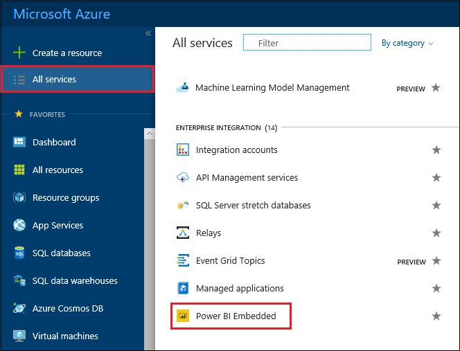
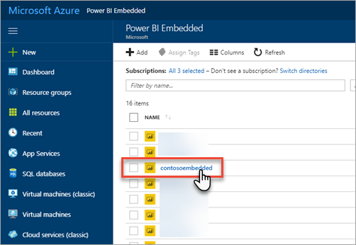
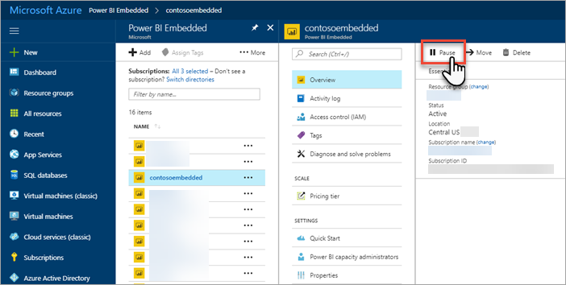
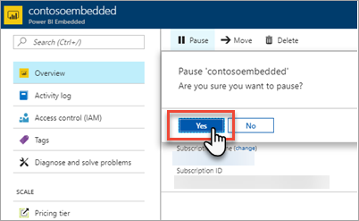
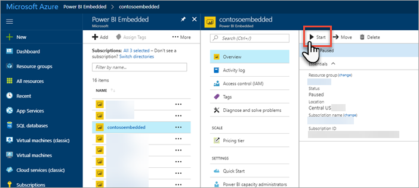
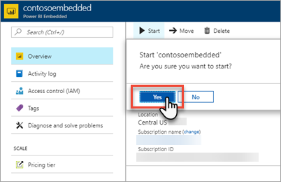

# Pause and start your Power BI Embedded capacity in the Azure portal

This article walks through how to pause and start a Power BI Embedded capacity in Microsoft Azure. This assumes you have created a Power BI Embedded capacity. If you have not, see [Create Power BI Embedded capacity in the Azure portal](create-capacity.md) to get started.

If you don't have an Azure subscription, create a [free account](https://azure.microsoft.com/free/) before you begin.

## Pause your capacity

Pausing your capacity prevents you from being billed. Pausing your capacity is great if you do not need to use the capacity for a period of time. Use the following steps to pause your capacity.

> [!NOTE]
> Pausing a capacity may prevent content from being available within Power BI. Make sure to unassign workspaces from your capacity before pausing to prevent interruption.

1. Sign into the [Azure portal](https://portal.azure.com/).

2. Select **More services** > **Power BI Embedded** to see your capacities.

    

3. Select the capacity you want to pause.

    

4. Select **Pause** within the capacity details.

    

5. Select **Yes**, which confirms you want to pause the capacity.

    

## Start your capacity

Resume usage by starting your capacity. Starting your capacity also resumes billing.

1. Sign into the [Azure portal](https://portal.azure.com/).

2. Select **More services** > **Power BI Embedded** to see your capacities.

    

3. Select the capacity you want to start.

    

4. Select **Start** within the capacity details.

    

5. Select **Yes**, which confirms you want to start the capacity.

    

If any content is assigned to this capacity, it is available once started.

## Next steps

If you want to scale your capacity up or down, see [Scale your Power BI Embedded capacity](scale-capacity.md).

To begin embedding Power BI content within your application, see [How to embed your Power BI dashboards, reports and tiles](https://powerbi.microsoft.com/documentation/powerbi-developer-embedding-content/).

More questions? [Try asking the Power BI Community](http://community.powerbi.com/)