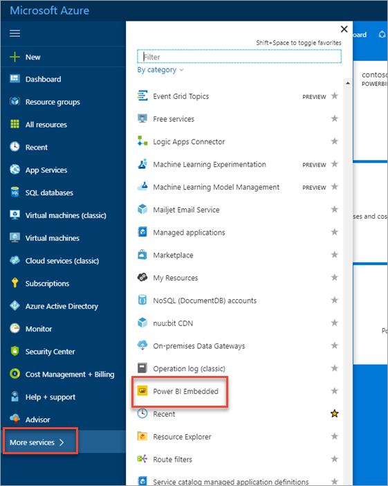
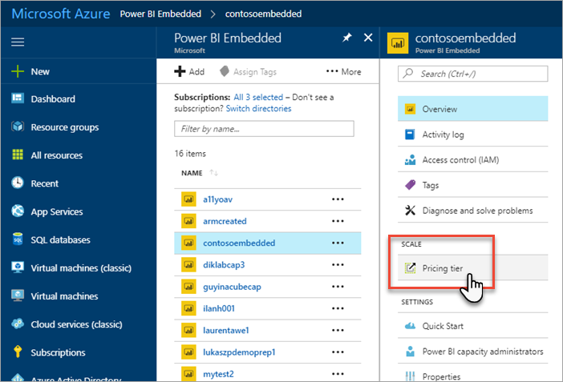
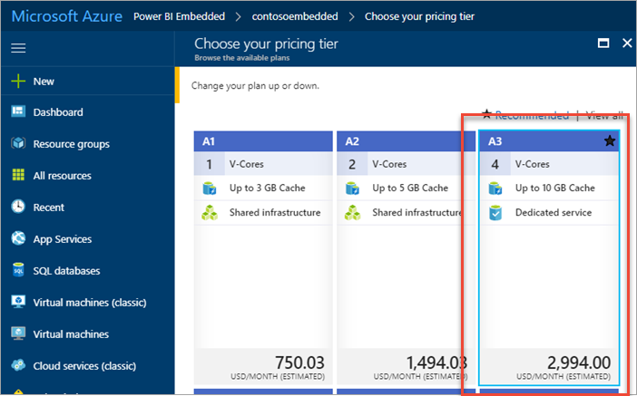
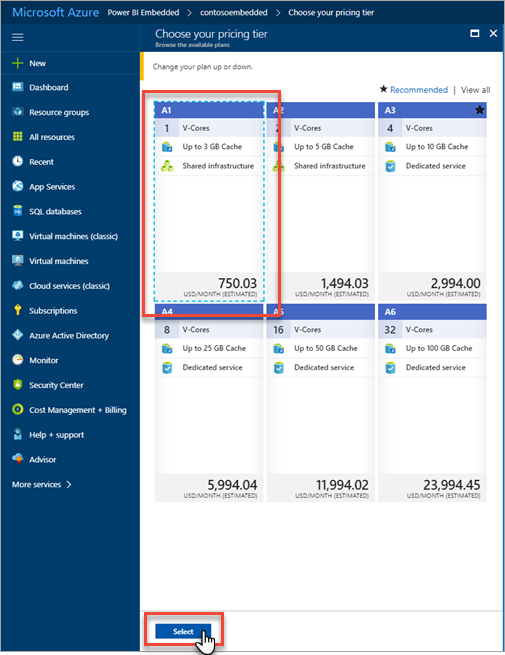
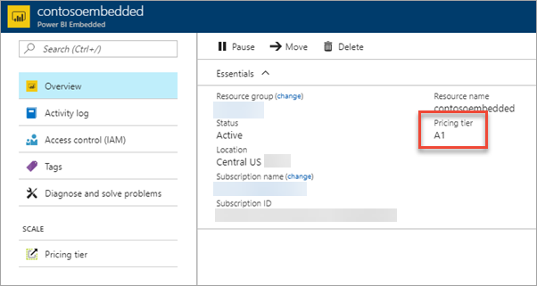

# Scale your Power BI Embedded capacity

This article walks through how to scale a Power BI Embedded capacity in Microsoft Azure. Scaling allows you to increase or decrease the size of your capacity.

This assumes you have created a Power BI Embedded capacity. If you have not, see [Create Power BI Embedded capacity in the Azure portal](create-capacity.md) to get started.

If you don't have an Azure subscription, create a [free account](https://azure.microsoft.com/free/) before you begin.

## Scale a capacity

1. Sign into the [Azure portal](https://portal.azure.com/).

2. Select **More services** > **Power BI Embedded** to see your capacities.

    

3. Select the capacity you want to scale.

    

4. Select **Pricing tier** under **Scale** within your capacity.

    

    Your current pricing tier is outlined in blue.

    

5. To scale up or down, select the new tier to move to. Selecting a new tier places a dashed blue outline around the selection. Select **Select** to scale to the new tier.

    

    Scaling your capacity may take a minute or two to complete.

6. Confirm your tier by viewing the overview tab. The current pricing tier is listed.

    

## Next steps

To pause or start your capacity, see [Pause and start your Power BI Embedded capacity in the Azure portal](pause-start.md).

To begin embedding Power BI content within your application, see [How to embed your Power BI dashboards, reports, and tiles](https://powerbi.microsoft.com/documentation/powerbi-developer-embedding-content/).

More questions? [Try asking the Power BI Community](http://community.powerbi.com/)