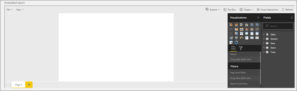

# Create a new report from a dataset in Power BI Workspace Collections

Power BI Workspace Collection reports can now be created from a dataset in your own application.

> [!IMPORTANT]
> Power BI Workspace Collections is deprecated and is available until June 2018 or when your contract indicates. You are encouraged to plan your migration to Power BI Embedded to avoid interruption in your application. For information on how to migrate your data to Power BI Embedded, see [How to migrate Power BI Workspace Collections content to Power BI Embedded](https://powerbi.microsoft.com/documentation/powerbi-developer-migrate-from-powerbi-embedded/).

The authentication method is similar to that of embedding a report. It is based on access tokens that are specific to a dataset. Tokens used for PowerBI.com are issued by Azure Active Directory (AAD). Power BI Workspace Collection tokens are issued by your own application.

When creating an Embedded report, the tokens issued are for a specific dataset. Tokens should be associated with the embed URL on the same element to ensure each has a unique token. In order to create an Embedded report, *Dataset.Read and Workspace.Report.Create* scopes must be provided in the access token.

## Create access token needed to create new report

Power BI Workspace Collections use an embed token, which is HMAC signed JSON Web Tokens. The tokens are signed with the access key from your Power BI Workspace Collection. Embed tokens, by default, are used to provide read-only access to a report to embed into an application. Embed tokens are issued for a specific report and should be associated with an embed URL.

Access tokens should be created on the server as the access keys are used to sign/encrypt the tokens. For information on how to create an access token, see [Authenticating and authorizing with Power BI Workspace Collections](app-token-flow.md). You can also review the [CreateReportEmbedToken](https://docs.microsoft.com/dotnet/api/microsoft.powerbi.security.powerbitoken?redirectedfrom=MSDN) method. Here is an example of what this would look like using the .NET SDK for Power BI.

In this example, we have our dataset ID that we want to create the new report on. We also need to add the scopes for *Dataset.Read and Workspace.Report.Create*.

The *PowerBIToken class* requires that you install the [Power BI Core NuGut Package](https://www.nuget.org/packages/Microsoft.PowerBI.Core/).

**NuGet package install**

```powershell
Install-Package Microsoft.PowerBI.Core
```

**C# code**

```csharp
using Microsoft.PowerBI.Security;

// rlsUsername and roles are optional
string scopes = "Dataset.Read Workspace.Report.Create";
PowerBIToken embedToken = PowerBIToken.CreateReportEmbedTokenForCreation(workspaceCollectionName, workspaceId, datasetId, null, null, scopes);

var token = embedToken.Generate("{access key}");
```

## Create a new blank report

In order to create a new report, the create configuration should be provided. This should include the access token, the embedURL and the datasetID that we want to create the report against. This requires that you install the nuget [Power BI JavaScript package](https://www.nuget.org/packages/Microsoft.PowerBI.JavaScript/). The embedUrl will just be https://embedded.powerbi.com/appTokenReportEmbed.

> [!NOTE]
> You can use the [JavaScript Report Embed Sample](https://microsoft.github.io/PowerBI-JavaScript/demo/) to test functionality. It also gives code examples for the different operations that are available.

**NuGet package install**

```powershell
Install-Package Microsoft.PowerBI.JavaScript
```

**JavaScript code**

```html
<div id="reportContainer"></div>

<script>
var embedCreateConfiguration = {
        accessToken: 'eyJ0eXAiO...Qron7qYpY9MI',
        embedUrl: 'https://embedded.powerbi.com/appTokenReportEmbed',
        datasetId: '5dac7a4a-4452-46b3-99f6-a25915e0fe55',
    };
    
    // Grab the reference to the div HTML element that will host the report
    var reportContainer = $('#reportContainer')[0];

    // Create report
    var report = powerbi.createReport(reportContainer, embedCreateConfiguration);
</script>
```

Calling *powerbi.createReport()* makes a blank canvas in edit mode appear within the *div* element.



## Save new reports

The report is not created until you call the **save as** operation. This can be done from file menu or from JavaScript.

```javascript
 // Get a reference to the embedded report.
    report = powerbi.get(reportContainer);
    
    var saveAsParameters = {
        name: "newReport"
    };

    // SaveAs report
    report.saveAs(saveAsParameters);
```

> [!IMPORTANT]
> A new report is created only after **save as** is called. After you save, the canvas will still show the dataset in edit mode and not the report. You need to reload the new report like you would any other report.


## Load the new report

In order to interact with the new report you need to embed it in the same way the application embeds a regular report, meaning, a new token must be issued specifically for the new report and then call the embed method.

```html
<div id="reportContainer"></div>
<script>
var embedConfiguration = {
        accessToken: 'eyJ0eXAiO...Qron7qYpY9MJ',
        embedUrl: 'https://embedded.powerbi.com/appTokenReportEmbed',
        reportId: '5dac7a4a-4452-46b3-99f6-a25915e0fe54',
    };
    
    // Grab the reference to the div HTML element that will host the report
    var reportContainer = $('#reportContainer')[0];

    // Embed report
    var report = powerbi.embed(reportContainer, embedConfiguration);
</script>
```

## Automate save and load of a new report using the "saved" event

In order to automate the process of "save as" and then loading the new report, you can make use of the "saved" Event. This event is fired when the save operation is complete and it returns a Json object containing the new reportId, report name, the old reportId (if there was one) and if the operation was saveAs or save.

```json
{
  "reportObjectId": "5dac7a4a-4452-46b3-99f6-a25915e0fe54",
  "reportName": "newReport",
  "saveAs": true,
  "originalReportObjectId": null
}
```

To Automate the process you can listen on the "saved" event, take the new reportId, create the new token, and embed the new report with it.

```html
<div id="reportContainer"></div>
<script>
var embedCreateConfiguration = {
        accessToken: 'eyJ0eXAiO...Qron7qYpY9MI',
        embedUrl: 'https://embedded.powerbi.com/appTokenReportEmbed',
        datasetId: '5dac7a4a-4452-46b3-99f6-a25915e0fe55',
    };
    
    // Grab the reference to the div HTML element that will host the report
    var reportContainer = $('#reportContainer')[0];

    // Create report
    var report = powerbi.createReport(reportContainer, embedCreateConfiguration);


   var saveAsParameters = {
        name: "newReport"
    };

    // SaveAs report
    report.saveAs(saveAsParameters);

    // report.on will add an event handler which prints to Log window.
    report.on("saved", function(event) {
        
         // get new Token
         var newReportId =  event.detail.reportObjectId;

        // create new Token. This is a function that the application should provide
        var newToken = createAccessToken(newReportId,scopes /*provide the wanted scopes*/);
        
        
    var embedConfiguration = {
        accessToken: newToken ,
        embedUrl: 'https://embedded.powerbi.com/appTokenReportEmbed',
        reportId: newReportId,
    };

    // Embed report
    var report = powerbi.embed(reportContainer, embedConfiguration);
       
   // report.off removes a given event handler if it exists.
   report.off("saved");
    });
</script>
```

## See also

[Get started with sample](get-started-sample.md)  
[Save reports](save-reports.md)  
[Embed a report](embed-report.md)  
[Authenticating and authorizing in Power BI Workspace Collections](app-token-flow.md)  
[Power BI Desktop](https://powerbi.microsoft.com/documentation/powerbi-desktop-get-the-desktop/)  
[JavaScript Embed Sample](https://microsoft.github.io/PowerBI-JavaScript/demo/)  
[Power BI Core NuGut Package](https://www.nuget.org/packages/Microsoft.PowerBI.Core/)  
[Power BI JavaScript package](https://www.nuget.org/packages/Microsoft.PowerBI.JavaScript/)  

More questions? [Try the Power BI Community](https://community.powerbi.com/)
