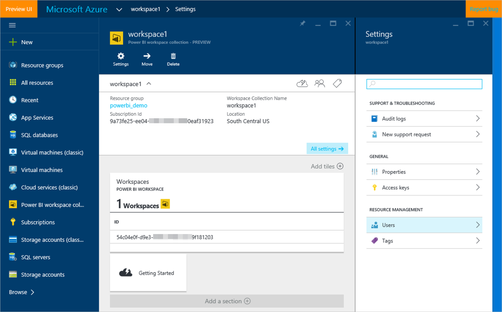
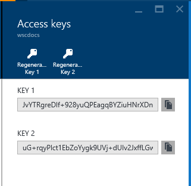

# Get started with Microsoft Power BI Workspace Collections

**Power BI Workspace Collections** are an Azure service that enables application developers to add interactive Power BI reports into their own applications. **Power BI Workspace Collections** work with existing applications without needing redesign or changing the way users sign in.

> [!IMPORTANT]
> Power BI Workspace Collections is deprecated and is available until June 2018 or when your contract indicates. You are encouraged to plan your migration to Power BI Embedded to avoid interruption in your application. For information on how to migrate your data to Power BI Embedded, see [How to migrate Power BI Workspace Collections content to Power BI Embedded](https://powerbi.microsoft.com/documentation/powerbi-developer-migrate-from-powerbi-embedded/).

Resources for **Microsoft Power BI Workspace Collections** are provisioned through the [Azure Resource Manager APIs](https://msdn.microsoft.com/library/mt712306.aspx). In this case, the resource provisioned is a **Power BI Workspace Collection**.

## Create a workspace collection

A **Workspace Collection** is the top-level Azure resource and a container for the content that will be embedded in your application. A **Workspace Collection** can be created in two ways:

* Manually using the Azure portal
* Programmatically using the Azure Resource Manager APIs

Let's walk through the steps to build a **Workspace Collection** using the Azure portal.

1. Open and sign into **Azure portal**: [https://portal.azure.com](https://portal.azure.com).
2. Select **+ New** on the top panel.
   
   
3. Under **Data + Analytics**, select **Power BI Workspace Collection**.
4. Within the get started message, if you already have an existing Power BI Workspace Collection subscription, select **Create a workspace collection** at the bottom.

5. On **Workspace Collection**, enter the required information.
   
   
1. Select **Create**.

The **Workspace Collection** takes a few moments to provision. When completed, you are taken to **Workspace Collection**.

   

The **Creation** results contain the information you need to call the APIs that create workspaces and deploy content to them.

<a name="view-access-keys"/>

## View Power BI API access keys

One of the most important pieces of information needed to call the Power BI REST APIs are the **Access Keys**. These are used to generate the **app tokens** that are used to authenticate your API requests. To view your **Access Keys**, click **Access Keys** on **Settings**. For more about **app tokens**, see [Authenticating and authorizing with Power BI Workspace Collections](app-token-flow.md).

   

You'll notice that you have two keys.

   

Copy these keys and store them securely in your application. It's important that you treat these keys as you would a password, because they provide access to all the content in your **Workspace Collection**.

While two keys are listed, only one key is needed at a particular time. The second key is provided so you can periodically regenerate keys without interrupting access to the service.

Now that you have an instance of Power BI for your application, and **Access Keys**, you can import a report into your own app. Before you learn how to import a report, the next section describes creating Power BI datasets and reports to embed into an app.

## Working with workspaces

After you have created your workspace collection, you will need to create a workspace that will house your reports and datasets. To create a workspace, you need to use the [Post Workspace REST API](https://msdn.microsoft.com/library/azure/mt711503.aspx).

## Create Power BI datasets and reports to embed into an app using Power BI Desktop

Now that you have created an instance of Power BI for your application, and have **Access Keys**, you need to create the Power BI datasets and reports that you want to embed. Datasets and reports can be created by using **Power BI Desktop**. You can download [Power BI Desktop for free](https://go.microsoft.com/fwlink/?LinkId=521662). Or, to quickly get started, you can download the [Retail Analysis Sample PBIX](https://go.microsoft.com/fwlink/?LinkID=780547).

> [!NOTE]
> To learn more about how to use **Power BI Desktop**, see [Getting Started with Power BI Desktop](https://powerbi.microsoft.com/guided-learning/powerbi-learning-0-2-get-started-power-bi-desktop).

With **Power BI Desktop**, you connect to your data source by importing a copy of the data into **Power BI Desktop** or connecting directly to the data source using **DirectQuery**.

Here are the differences between using **Import** and **DirectQuery**.

| Import | DirectQuery |
| --- | --- |
| Tables, columns, *and data* are imported or copied into **Power BI Desktop**. As you work with visualizations, **Power BI Desktop** queries a copy of the data. To see any changes that occurred to the underlying data, you must refresh, or import, a complete, current dataset again. |Only *tables and columns* are imported or copied into **Power BI Desktop**. As you work with visualizations, **Power BI Desktop** queries the underlying data source, which means you're always viewing current data. |

For more about connecting to a data source, see [Connect to a data source](connect-datasource.md).

After you save your work in **Power BI Desktop**, a PBIX file is created. This file contains your report. In addition, if you import data the PBIX contains the complete dataset, or if you use **DirectQuery**, the PBIX contains just a dataset schema. You programmatically deploy the PBIX into your workspace using the [Power BI Import API](https://msdn.microsoft.com/library/mt711504.aspx).

> [!NOTE]
> **Power BI Workspace Collections** have additional APIs to change the server and database that your dataset is pointing to and set a service account credential that the dataset will use to connect to your database. See [Post SetAllConnections](https://msdn.microsoft.com/library/mt711505.aspx) and [Patch Gateway Datasource](https://msdn.microsoft.com/library/mt711498.aspx).

## Create Power BI datasets and reports using APIs

### Datasets

You can create datasets within Power BI Workspace Collections using the REST API. You can then push data into your dataset. This allows you to work with data without the need of Power BI Desktop. For more information, see [Post Datasets](https://msdn.microsoft.com/library/azure/mt778875.aspx).

### Reports

You can create a report from a dataset directly in your application using the JavaScript API. For more information, see [Create a new report from a dataset in Power BI Workspace Collections](create-report-from-dataset.md).

## See Also

[Get started with sample](get-started-sample.md)  
[Authenticating and authorizing in Power BI Workspace Collections](app-token-flow.md)  
[Embed a report](embed-report.md)  
[Create a new report from a dataset in Power BI Workspace Collections](create-report-from-dataset.md)
[Save reports](save-reports.md)  
[Power BI Desktop](https://powerbi.microsoft.com/documentation/powerbi-desktop-get-the-desktop/)  
[JavaScript Embed Sample](https://microsoft.github.io/PowerBI-JavaScript/demo/)  

More questions? [Try the Power BI Community](https://community.powerbi.com/)

