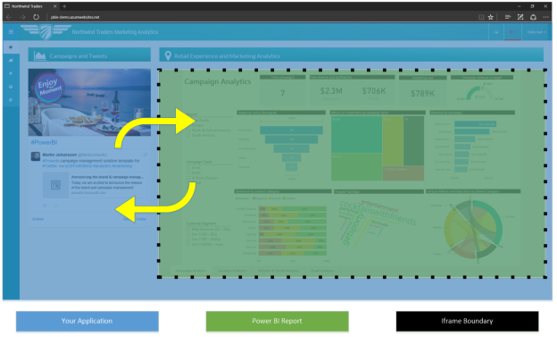
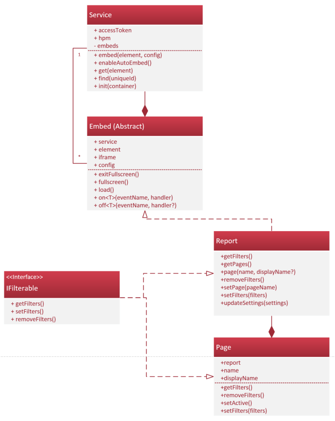

# Interact with Power BI reports using the JavaScript API

The Power BI JavaScript API enables you to easily embed Power BI reports into your applications. With the API, your applications can programmatically interact with different report elements like pages and filters. This interactivity makes Power BI reports a more integrated part of your application.

> [!IMPORTANT]
> Power BI Workspace Collections is deprecated and is available until June 2018 or when your contract indicates. You are encouraged to plan your migration to Power BI Embedded to avoid interruption in your application. For information on how to migrate your data to Power BI Embedded, see [How to migrate Power BI Workspace Collections content to Power BI Embedded](https://powerbi.microsoft.com/documentation/powerbi-developer-migrate-from-powerbi-embedded/).

You embed a Power BI report in your application by using an iframe that is hosted as part of the application. The iframe acts as a boundary between your application and the report, as you can see in the following image:


The iframe makes the embedding process a lot easier, but without the JavaScript API the report and your application can't interact with each other. This lack of interaction can make it feel like the report is not really part of the application. The report and application really need to communicate back and forth, as in the following image:



The Power BI JavaScript API enables you to write code that can securely pass through the iframe boundary. This enables your application to programmatically perform an action in a report, and to listen for events from actions that users make within the report.

## What can you do with the Power BI JavaScript API?

With the JavaScript API you can manage reports, navigate to pages in a report, filter a report, and handle embedding events. The following diagram shows the structure of the API.



### Manage reports
The Javascript API enables you to manage behavior at the report and page level:

* Embed a specific Power BI Report securely in your application - try the [embed demo application](http://azure-samples.github.io/powerbi-angular-client/#/scenario1)
  * Set access token
* Configure the report
  * Enable and disable the filter pane and page navigation pane - try the [update settings demo application](http://azure-samples.github.io/powerbi-angular-client/#/scenario6)
  * Set defaults for pages and filters - try the [set defaults demo](http://azure-samples.github.io/powerbi-angular-client/#/scenario5)
* Enter and exit full screen mode

[Learn more about embedding a report](https://github.com/Microsoft/PowerBI-JavaScript/wiki/Embedding-Basics)

### Navigate to pages in a report
The JavaScript API enables you to discover all pages in a report and to set the current page. Try the [navigation demo application](http://azure-samples.github.io/powerbi-angular-client/#/scenario3).

[Learn more about page navigation](https://github.com/Microsoft/PowerBI-JavaScript/wiki/Page-Navigation)

### Filter a report
The JavaScript API provides basic and advanced filtering capabilities for embedded reports and report pages. Try the [filtering demo application](http://azure-samples.github.io/powerbi-angular-client/#/scenario4), and review some introductory code here.

#### Basic filters
A basic filter is placed on a column or hierarchy level and contains a list of values to include or exclude.

```
const basicFilter: pbi.models.IBasicFilter = {
  $schema: "http://powerbi.com/product/schema#basic",
  target: {
    table: "Store",
    column: "Count"
  },
  operator: "In",
  values: [1,2,3,4]
}
```

#### Advanced filters
Advanced filters use the logical operator AND or OR, and accept one or two conditions, each with their own operator and value. Supported conditions are:

* None
* LessThan
* LessThanOrEqual
* GreaterThan
* GreaterThanOrEqual
* Contains
* DoesNotContain
* StartsWith
* DoesNotStartWith
* Is
* IsNot
* IsBlank
* IsNotBlank

```
const advancedFilter: pbi.models.IAdvancedFilter = {
  $schema: "http://powerbi.com/product/schema#advanced",
  target: {
    table: "Store",
    column: "Name"
  },
  logicalOperator: "Or",
  conditions: [
    {
      operator: "Contains",
      value: "Wash"
    },
    {
      operator: "Contains",
      value: "Park"
    }
  ]
}
```

[Learn more about filtering](https://github.com/Microsoft/PowerBI-JavaScript/wiki/Filters)

### Handling events

In addition to sending information into the iframe, your application can also receive information on the following events coming from the iframe:

* Embed
  * loaded
  * error
* Reports
  * pageChanged
  * dataSelected (coming soon)

[Learn more about handling events](https://github.com/Microsoft/PowerBI-JavaScript/wiki/Handling-Events)

## Next steps

For more information about the Power BI JavaScript API, check out the following links:

* [JavaScript API Wiki](https://github.com/Microsoft/PowerBI-JavaScript/wiki)
* [Object model reference](https://microsoft.github.io/powerbi-models/modules/_models_.html)
* [Live demo](https://microsoft.github.io/PowerBI-JavaScript/demo/)