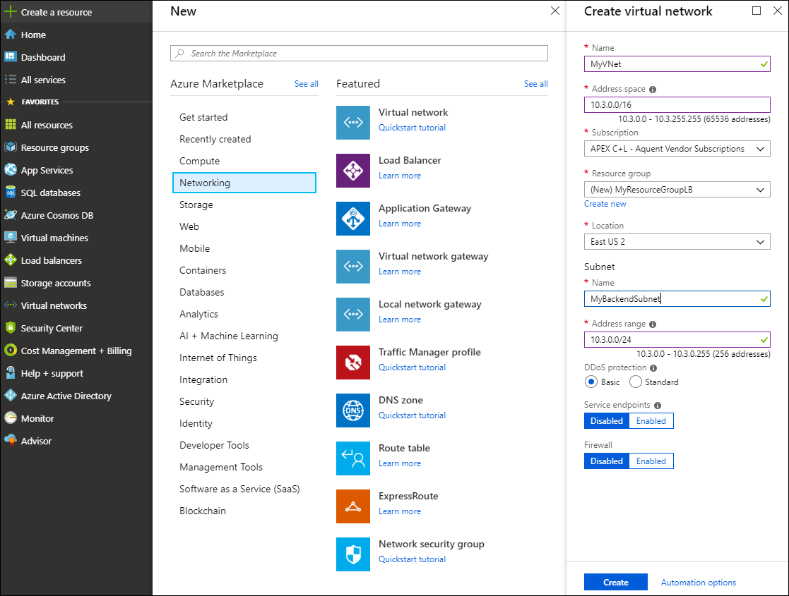

---

title: 'Quickstart - Create an Azure Private Link service by using the Azure portal'
titlesuffix: Azure Private Link
description: Learn how to create an Azure Private Link service using the Azure portal in this Quickstart
services: private-link
author: malopMSFT
# Customer intent: As someone with a basic network background who is new to Azure, I want to create an Azure Private Link service using the Azure portal
ms.service: private-link
ms.topic: quickstart
ms.date: 02/03/2020
ms.author: allensu

---

# Quickstart: Create an Azure Private Link service using the Azure portal

An Azure Private Link service is the reference to your own service that is managed by  Private Link. You can enable for Private Link access the service or resource that operates behind Azure Load Balancer. Consumers of your service can access the service privately from their own virtual networks. In this quickstart, you learn how to create a Private Link service using the Azure portal.

If you don't have an Azure subscription, create a [free account](https://azure.microsoft.com/free/?WT.mc_id=A261C142F) before you begin.

## Sign in to the Azure portal

Sign in to the Azure portal at https://portal.azure.com.

## Create an internal load balancer

First, create a virtual network. Next, create an internal load balancer to use with the Azure Private Link service.

### Create the virtual network

In this section, you create a virtual network. You next create the subnet to host the load balancer that is used to access your Private Link service.

1. In the upper-left side of the portal, select **Create a resource** > **Networking** > **Virtual network**.

1. In the **Create virtual network** pane, enter or select these values:

   - **Name**: Enter **MyVNet**.
   - **ResourceGroup**: Select **Create new**, enter **MyResourceGroupLB**, and select **OK**.
   - **Subnet** > **Name**: Enter **MyBackendSubnet**.

1. Select **Create**.

   

### Create a standard load balancer

Create a standard internal load balancer by using the portal. The name and IP address you create are automatically configured as the load balancer's front end.

1. In the upper-left side of the portal, select **Create a resource** > **Networking** > **Load Balancer**.

1. On the **Basics** tab of the **Create load balancer** page, enter or select the following information:

    | Setting                 | Value                                              |
    | ---                     | ---                                                |
    | **Subscription**               | Select your subscription.    |
    | **Resource group**         | Select **MyResourceGroupLB** from the box.|
    | **Name**                   | Enter **myLoadBalancer**                                   |
    | **Region**         | Select **East US 2**.                                        |
    | **Type**          | Select **Internal**.                                        |
    | **SKU**           | Select **Standard**.                          |
    | **Virtual network**           | Select **MyVNet**.                          |
    | **IP address assignment**              | Select **Static**.   |
    | **Private IP address**|Enter an address that is in the address space of your virtual network and subnet. The address 10.3.0.7 is an example.  |

1. Accept the defaults for the remaining settings, and then select **Review + create**

1. On the **Review + create** tab, select **Create**.

### Create standard load balancer resources

In this section, you configure load balancer settings for a back-end address pool and a health probe. You also specify load balancer rules.

#### Create a back-end pool

To distribute traffic to your resources, a back-end address pool contains the IP addresses of the virtual network interface controllers (NICs) connected to the load balancer. Create the back-end address pool named **myBackendPool** to include resources for load balancing traffic.

1. On the leftmost menu, select **All services**.
1. Select **All resources**, and then select **myLoadBalancer** from the resources list.
1. Under **Settings**, select **Backend pools**, then select **Add**.
1. On the **Add a backend pool** page, enter **myBackendPool** as the name for your back-end pool, and then select **Add**.

#### Create a health probe

Use a health probe to let the load balancer monitor resource status. The health probe dynamically adds or removes resources from the load balancer rotation based on their response to health checks.

**To create a health probe to monitor the health of the resources:**

1. Select **All resources** on the leftmost menu, and then select **MyLoadBalancer** from the resource list.

1. Under **Settings**, select **Health probes**, and then select **Add**.

1. On the **Add a health probe** page, enter or select the following values:

   - **Name**: Enter **MyHealthProbe**.
   - **Protocol**: Select **TCP**.
   - **Port**: Enter **80**.
   - **Interval**: Enter **15**. This value is the number of seconds between probe attempts.
   - **Unhealthy threshold**: Enter **2**. This value is the number of consecutive probe failures that occur before a virtual machine is considered unhealthy.

1. Select **OK**.

#### Create a load balancer rule

A load balancer rule defines how traffic is distributed to resources. The rule defines:

- The front-end IP configuration for incoming traffic.
- The back-end IP pool to receive the traffic.
- The required source and destination ports.

The load balancer rule named **MyLoadBalancerRule** listens to port 80 in the front-end **LoadBalancerFrontEnd**. The rule sends network traffic to the back-end address pool **MyBackendPool**, also on port 80. 

**To create the load balancer rule:**

1. Select **All resources** on the left menu, and then select **MyLoadBalancer** from the resource list.
   
1. Under **Settings**, select **Load-balancing rules**, and then select **Add**.
   
1. On the **Add load-balancing rule** page, type or select the following values, if not already present:
   
   - **Name**: Type **MyLoadBalancerRule**.
   - **Frontend IP address:** Type **LoadBalancerFrontEnd** if not present.
   - **Protocol**: Select **TCP**.
   - **Port**: Type **80**.
   - **Backend port**: Type **80**.
   - **Backend pool**: Select **MyBackendPool**.
   - **Health probe**: Select **MyHealthProbe**. 
   
1. Select **OK**.
   
## Create a private link service

In this section, you will create a private link service behind a standard load balancer.

1. On the upper-left side of the screen in the Azure portal, select **Create a resource** > **Networking** > **Private Link Center (Preview)**. You can also search Private Link through portal search.

2. In **Private Link Center - Overview**, on the option to **"Expose your own service so others can connect"** select Start.

3. In **Create a private link service - Basics**, enter or select this information:

    | Setting           | Value                                                                        |
    |-------------------|------------------------------------------------------------------------------|
    | **Project details:**  |                                                                              |
    | Subscription      | Select your subscription                                                     |
    | Resource Group    | Select *MyResourceGroupLB*                                                     |
    | **INSTANCE DETAILS:** |                                                                              |
    | Name              | Enter *myPrivateLinkService* |
    | Region            | Select *East US 2*                                                         |

4. Select **Next: Outbound settings**.

5. In **Create a private link service - Outbound settings**, enter or select this information:

    | Setting                           | Value                                                                           |
    |-----------------------------------|---------------------------------------------------------------------------------|
    | Load Balancer                     | Select *MyLoadBalancer*                                                           |
    | Load Balancer frontend IP address | Select the frontend IP address of MyLoadBalancer                                |
    | Source NAT Virtual network        | Select *myVNET*                                                                   |
    | Source NAT subnet                 | Select *myBackendSubnet*                                                          |
    | Enable TCP proxy v2               | Select YES/NO depending on if your application is expecting TCP proxy v2 header |
    | Private IP address settings       | Configure the allocation method and IP address for each NAT IP                  |

6. Select **Next: Access security**.

7. In **Create a private link service - Access security**, enter or select this information:

    | Setting                                     | Value                                                             |
    |---------------------------------------------|-------------------------------------------------------------------|
    | Visibility                                  | Choose *Role-Based access control only*         |
  
8. Select **Next: Tags**, then **Review + create** or choose the **Review + create tab** at the top of the page.

9. Review your information and select **Create**.

## Clean up resources 
When you're done using the private link service, delete the resource group to clean up the resources used in this quickstart:

1. Enter *myResourceGroupLB* in the **Search** box at the top of the portal and select *myResourceGroupLB* from the search results. 
2. Select **Delete resource group**. 
3. Enter myResourceGroup for **TYPE THE RESOURCE GROUP NAME** and select **Delete**.

## Next steps

In this quickstart, you created an internal Azure load balancer and a private link service. To learn more about how to create private endpoints, see [Create Private Endpoints using Azure portal](https://docs.microsoft.com/azure/private-link/create-private-endpoint-portal).
