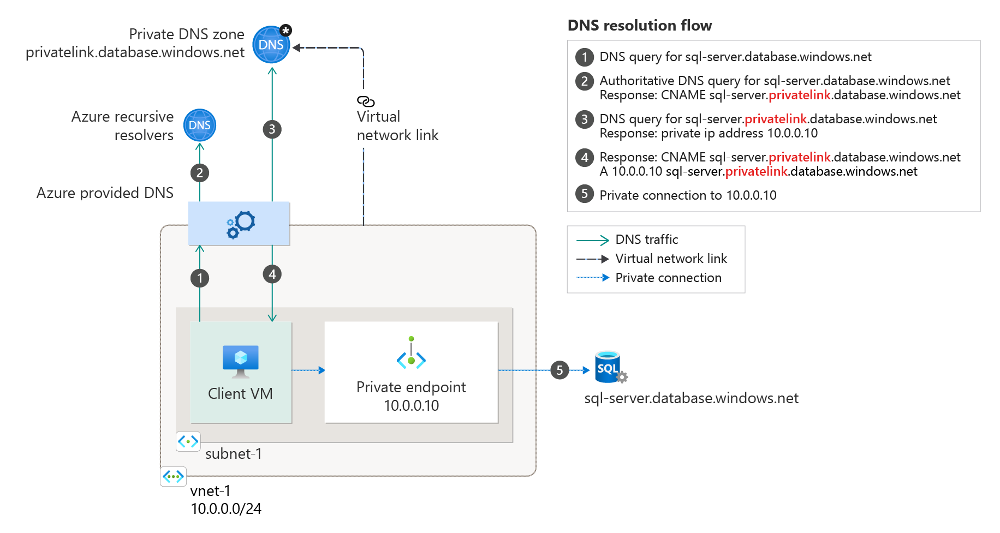

# Azure Private Endpoint DNS Configuration

## DNS configuration 
When connecting to a private link resource using a fully qualified domain name (FQDN) as part of the connection string, it's important to correctly configure your DNS settings to resolve to the allocated private IP address. Existing Azure services might already have a DNS configuration to use when connecting over a public endpoint. This needs to be overridden to connect using your private endpoint. 
 
The network interface associated with the private endpoint contains the complete set of information required to configure your DNS, including FQDN and private IP addresses allocated for a given private link resource. 
 
You can use the following options to configure your DNS settings for private endpoints: 
- **Use the Host file (only recommended for testing)**. You can use the host file on a virtual machine to override the DNS.  
- **Use a private DNS zone**. You can use private DNS zones to override the DNS resolution for a given private endpoint. A private DNS zone can be linked to your virtual network to resolve specific domains.
- **Use your custom DNS server**. You can use your own DNS server to override the DNS resolution for a given private link resource. If your [DNS server](../virtual-network/virtual-networks-name-resolution-for-vms-and-role-instances.md#name-resolution-that-uses-your-own-dns-server) is hosted on a virtual network, you can create a DNS forwarding rule to use a private DNS zone to simplify the configuration for all private link resources.
 
> [!IMPORTANT]
> It's not recommended to override a zone that is actively in use to resolve public endpoints. Connections to resources won't be able to resolve correctly without DNS forwarding to the public DNS. To avoid issues, create a different domain name or follow the suggested name for each service below. 
 
For Azure services, use the recommended zone names as described in the following table:

|Private Link resource type   |Subresource  |Zone name  |
|---------|---------|---------|
|SQL DB (Microsoft.Sql/servers)    |  Sql Server (sqlServer)        |   privatelink.database.windows.net       |
|Azure Synapse Analytics (Microsoft.Sql/servers)    |  Sql Server (sqlServer)        | privatelink.database.windows.net |
|Storage Account (Microsoft.Storage/storageAccounts)    |  Blob (blob, blob_secondary)        |    privatelink.blob.core.windows.net      |
|Storage Account (Microsoft.Storage/storageAccounts)    |    Table (table, table_secondary)      |   privatelink.table.core.windows.net       |
|Storage Account (Microsoft.Storage/storageAccounts)    |    Queue (queue, queue_secondary)     |   privatelink.queue.core.windows.net       |
|Storage Account (Microsoft.Storage/storageAccounts)   |    File (file, file_secondary)      |    privatelink.file.core.windows.net      |
|Storage Account (Microsoft.Storage/storageAccounts)     |  Web (web, web_secondary)        |    privatelink.web.core.windows.net      |
|Data Lake File System Gen2 (Microsoft.Storage/storageAccounts)  |  Data Lake File System Gen2 (dfs, dfs_secondary)        |     privatelink.dfs.core.windows.net     |
|Azure Cosmos DB (Microsoft.AzureCosmosDB/databaseAccounts)|SQL    |privatelink.documents.azure.com|
|Azure Cosmos DB (Microsoft.AzureCosmosDB/databaseAccounts)|MongoDB    |privatelink.mongo.cosmos.azure.com|
|Azure Cosmos DB (Microsoft.AzureCosmosDB/databaseAccounts)|Cassandra|privatelink.cassandra.cosmos.azure.com|
|Azure Cosmos DB (Microsoft.AzureCosmosDB/databaseAccounts)|Gremlin    |privatelink.gremlin.cosmos.azure.com|
|Azure Cosmos DB (Microsoft.AzureCosmosDB/databaseAccounts)|Table|privatelink.table.cosmos.azure.com|
|Azure Database for PostgreSQL - Single server (Microsoft.DBforPostgreSQL/servers)|postgresqlServer|privatelink.postgres.database.azure.com|
|Azure Database for MySQL (Microsoft.DBforMySQL/servers)|mysqlServer|privatelink.mysql.database.azure.com|
|Azure Database for MariaDB (Microsoft.DBforMariaDB/servers)|mariadbServer|privatelink.mariadb.database.azure.com|
|Azure Key Vault (Microsoft.KeyVault/vaults)|vault|privatelink.vaultcore.azure.net|
|Azure Kubernetes Service - Kubernetes API (Microsoft.ContainerService/managedClusters)    | managedCluster | {guid}.privatelink.<region>.azmk8s.io|
|Azure Search (Microsoft.Search/searchServices)|searchService|privatelink.search.windows.net|   
|Azure Container Registry (Microsoft.ContainerRegistry/registries) | registry | privatelink.azurecr.io |
|Azure App Configuration (Microsoft.Appconfiguration/configurationStores)| configurationStore | privatelink.azconfig.io|
|Azure Backup (Microsoft.RecoveryServices/vaults)| vault |privatelink.{region}.backup.windowsazure.com|
|Azure Event Hub (Microsoft.EventHub/namespaces)| namespace |privatelink.servicebus.windows.net|
|Azure Service Bus (Microsoft.ServiceBus/namespaces) | namespace |privatelink.servicebus.windows.net|
|Azure Relay (Microsoft.Relay/namespaces) | namespace |privatelink.servicebus.windows.net|
|Azure Event Grid (Microsoft.EventGrid/topics)     | topic | topic.{region}.privatelink.eventgrid.azure.net|
|Azure Event Grid (Microsoft.EventGrid/domains) | domain | domain.{region}.privatelink.eventgrid.azure.net |
|Azure WebApps (Microsoft.Web/sites)    | site | privatelink.azurewebsites.net |
|Azure Machine Learning(Microsoft.MachineLearningServices/workspaces)    | workspace | privatelink.api.azureml.ms |
 
Azure will create a canonical name DNS record (CNAME) on the public DNS to redirect the resolution to the suggested domain names. You'll be able to override the resolution with the private IP address of your private endpoints. 
 
Your applications don't need to change the connection URL. When attempting to resolve using a public DNS, the DNS server will now resolve to your private endpoints. The process does not impact your applications. 

## DNS integration scenarios

DNS is a critical component to make private endpoints work correctly within a solution.
These scenarios are oriented to guide you on how to get the dns resolution integrated based where the clients are located 

### cloud only scenarios
 > [!NOTE]
> These scenarios use Azure SQL database as the integrated private endpoint, still the guidance applies to any other Azure service that has an integrated the private endpoint.

- Single VNET and Azure Provided DNS

This an Azure only scenario where the client queries for the private endpoint IP to Azure provided DNS [168.63.129.16](https://docs.microsoft.com/azure/virtual-network/what-is-ip-address-168-63-129-16) that makes the authoritative resolution and then queries the azure private dns zone for the required record.

- Hub and Spoke with Azure provided DNS

In this scenario there's a [hub & spoke](https://docs.microsoft.com/azure/architecture/reference-architectures/hybrid-networking/hub-spoke) networking topology with the spoke networks sharing a common private endpoint and all the spoke VNET are linked to the same private dns zone. 

### on premise scenario

 > [!NOTE]
> This scenario use Azure SQL database as the integrated private endpoint, still the guidance applies to any other Azure service that has an integrated the private endpoint.

- on premise forwarding to Azure

This scenario corresponds to an on premise network that has its internal dns solution (10.0.0.254) that forwards dns traffic via a conditional forwarder for the general zone database.windows.net and chains up the dns resolution to the custom dns (10.5.0.254) deployed in Azure.

 > [!NOTE]
> The internal DNS (10.0.0.254) is applicable only if there is an existing dns solution in place , or else the clients can use directly the custom DNS deployed in Azure (10.5.0.254)

> [!IMPORTANT]
> The conditional forwarding must be made to the original zone Ex: database.windows.net , NOT **privatelink**.database.windows.net

### hybrid scenario
 > [!NOTE]
> This scenario use Azure SQL database as the integrated private endpoint, still the guidance applies to any other Azure service that has an integrated the private endpoint.

This scenario shows:

- on-premise network that has its internal dns solution (10.0.0.254) that forwards dns traffic via a conditional forwarder for the general zone database.windows.net and chains up the dns resolution to the custom dns (10.5.0.254) deployed in Azure.

- spoke vnet (vnet-spoke-eastus-001) sharing a private link endpoint and private dns zone

> [!NOTE]
> The internal DNS (10.0.0.254) is applicable only if there is an existing dns solution in place , or else the clients can use directly the custom DNS deployed in Azure (10.5.0.254)

> [!IMPORTANT]
> The conditional forwarding must be made to the original zone Ex: database.windows.net , NOT **privatelink**.database.windows.net

