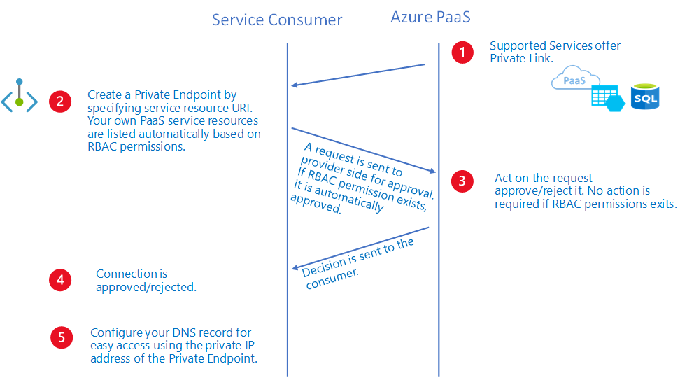

# What is a private endpoint?

A private endpoint is a network interface that uses a private IP address from your virtual network. This network interface connects you privately and securely to a service that's powered by Azure Private Link. By enabling a private endpoint, you're bringing the service into your virtual network.

The service could be an Azure service such as:

* Azure Storage
* Azure Cosmos DB
* Azure SQL Database
* Your own service, using [Private Link service](private-link-service-overview.md).
  
## Private endpoint properties 

A private endpoint specifies the following properties: 

|Property  |Description |
|---------|---------|
|Name    |    A unique name within the resource group.      |
|Subnet    |  The subnet to deploy, where the private IP address is assigned. For subnet requirements, see the [Limitations](#limitations) section later in this article.         |
|Private-link resource    |   The private-link resource to connect by using a resource ID or alias, from the list of available types. A unique network identifier is generated for all traffic that's sent to this resource.       |
|Target subresource   |      The subresource to connect. Each private-link resource type has various options to select based on preference.    |
|Connection approval method    |  Automatic or manual. Depending on the Azure role-based access control permissions, your private endpoint can be approved automatically. If you're connecting to a private-link resource without Azure role based permissions, use the manual method to allow the owner of the resource to approve the connection.        |
|Request message     |  You can specify a message for requested connections to be approved manually. This message can be used to identify a specific request.        |
|Connection status   |   A read-only property that specifies whether the private endpoint is active. Only private endpoints in an approved state can be used to send traffic. More available states: <li>*Approved*: The connection was automatically or manually approved and is ready to be used.<li>*Pending*: The connection was created manually and is pending approval by the private-link resource owner.<li>*Rejected*: The connection was rejected by the private-link resource owner.<li>*Disconnected*: The connection was removed by the private-link resource owner. The private endpoint becomes informative and should be deleted for cleanup.  |

As you're creating private endpoints, consider the following: 

- Private endpoints enable connectivity between the customers from the same:
    
    - Virtual network
    - Regionally peered virtual networks
    - Globally peered virtual networks
    - On-premises environments that use [VPN](https://azure.microsoft.com/services/vpn-gateway/) or [Express Route](https://azure.microsoft.com/services/expressroute/)
    - Services that are powered by Private Link
 
- Network connections can be initiated only by clients that are connecting to the private endpoint. Service providers don't have a routing configuration to create connections into service customers. Connections can be established in a single direction only.

- A read-only network interface is *automatically created* for the lifecycle of the private endpoint. The interface is assigned a dynamic private IP address from the subnet that maps to the private-link resource. The value of the private IP address remains unchanged for the entire lifecycle of the private endpoint.
 
- The private endpoint must be deployed in the same region and subscription as the virtual network. 
 
- The private-link resource can be deployed in a different region than the one for the virtual network and private endpoint.
 
- Multiple private endpoints can be created with the same private-link resource. For a single network using a common DNS server configuration, the recommended practice is to use a single private endpoint for a specified private-link resource. Use this practice to avoid duplicate entries or conflicts in DNS resolution. 
 
- Multiple private endpoints can be created on the same or different subnets within the same virtual network. There are limits to the number of private endpoints you can create in a subscription. For more information, see [Azure limits](../azure-resource-manager/management/azure-subscription-service-limits.md#networking-limits).

- The subscription that contains the private link resource must be registered with the Microsoft network resource provider. The subscription that contains the private endpoint must also be registered with the Microsoft network resource provider. For more information, see [Azure Resource Providers](../azure-resource-manager/management/resource-providers-and-types.md).
 
## Private-link resource 
A private-link resource is the destination target of a specified private endpoint. The following table lists the available resources that support a private endpoint: 
 
| Private-link resource name | Resource type | Sub-resources |
| ---------------------------| ------------- | ------------- |
| Application Gateway | Microsoft.Network/applicationgateways | application gateway |
| Azure AI services | Microsoft.CognitiveServices/accounts | account |
| Azure API for FHIR (Fast Healthcare Interoperability Resources) | Microsoft.HealthcareApis/services | fhir |
| Azure App Configuration | Microsoft.Appconfiguration/configurationStores | configurationStores |
| Azure App Service | Microsoft.Web/hostingEnvironments | hosting environment |
| Azure App Service | Microsoft.Web/sites | sites |
| Azure Automation | Microsoft.Automation/automationAccounts | Webhook, DSCAndHybridWorker |
| Azure Backup | Microsoft.RecoveryServices/vaults | AzureBackup, AzureSiteRecovery |
| Azure Batch | Microsoft.Batch/batchAccounts | batchAccount, nodeManagement |
| Azure Cache for Redis | Microsoft.Cache/Redis | redisCache |
| Azure Cache for Redis Enterprise | Microsoft.Cache/redisEnterprise | redisEnterprise |
| Azure Cognitive Search | Microsoft.Search/searchServices | searchService |
| Azure Container Registry | Microsoft.ContainerRegistry/registries | registry |
| Azure Cosmos DB | Microsoft.AzureCosmosDB/databaseAccounts | SQL, MongoDB, Cassandra, Gremlin, Table |
| Azure Cosmos DB for PostgreSQL | Microsoft.DBforPostgreSQL/serverGroupsv2 | coordinator |
| Azure Data Explorer | Microsoft.Kusto/clusters | cluster |
| Azure Data Factory | Microsoft.DataFactory/factories | dataFactory |
| Azure Database for MariaDB | Microsoft.DBforMariaDB/servers | mariadbServer |
| Azure Database for MySQL - Single Server | Microsoft.DBforMySQL/servers | mysqlServer |
| Azure Database for MySQL- Flexible Server | Microsoft.DBforMySQL/flexibleServers | mysqlServer |
| Azure Database for PostgreSQL - Single server | Microsoft.DBforPostgreSQL/servers | postgresqlServer |
| Azure Databricks | Microsoft.Databricks/workspaces | databricks_ui_api, browser_authentication |
| Azure Device Provisioning Service | Microsoft.Devices/provisioningServices | iotDps |
| Azure Digital Twins | Microsoft.DigitalTwins/digitalTwinsInstances | API |
| Azure Event Grid | Microsoft.EventGrid/domains | domain |
| Azure Event Grid | Microsoft.EventGrid/topics  | topic |
| Azure Event Hub | Microsoft.EventHub/namespaces | namespace |
| Azure File Sync | Microsoft.StorageSync/storageSyncServices | File Sync Service |
| Azure HDInsight | Microsoft.HDInsight/clusters | cluster |
| Azure IoT Central | Microsoft.IoTCentral/IoTApps | IoTApps |
| Azure IoT Hub | Microsoft.Devices/IotHubs | iotHub |
| Azure Key Vault | Microsoft.KeyVault/vaults | vault |
| Azure Key Vault HSM (hardware security module) | Microsoft.Keyvault/managedHSMs | HSM |
| Azure Kubernetes Service - Kubernetes API | Microsoft.ContainerService/managedClusters | management |
| Azure Machine Learning | Microsoft.MachineLearningServices/registries | amlregistry |
| Azure Machine Learning | Microsoft.MachineLearningServices/workspaces | amlworkspace |
| Azure Managed Disks | Microsoft.Compute/diskAccesses | managed disk |
| Azure Media Services | Microsoft.Media/mediaservices | keydelivery, liveevent, streamingendpoint |
| Azure Migrate | Microsoft.Migrate/assessmentProjects | project |
| Azure Monitor Private Link Scope | Microsoft.Insights/privatelinkscopes | azuremonitor |
| Azure Relay | Microsoft.Relay/namespaces | namespace |
| Azure Service Bus | Microsoft.ServiceBus/namespaces | namespace |
| Azure SignalR Service | Microsoft.SignalRService/SignalR | signalr |
| Azure SignalR Service | Microsoft.SignalRService/webPubSub | webpubsub |
| Azure SQL Database | Microsoft.Sql/servers | SQL Server (sqlServer) |
| Azure SQL Managed Instance | Microsoft.Sql/managedInstances | managedInstance |
| Azure Static Web Apps | Microsoft.Web/staticSites | staticSites |
| Azure Storage | Microsoft.Storage/storageAccounts | Blob (blob, blob_secondary)  Table (table, table_secondary)  Queue (queue, queue_secondary)  File (file, file_secondary)  Web (web, web_secondary)  Dfs (dfs, dfs_secondary) |
| Azure Synapse | Microsoft.Synapse/privateLinkHubs | web |
| Azure Synapse Analytics | Microsoft.Synapse/workspaces | Sql, SqlOnDemand, Dev |
| Azure Virtual Desktop - host pools | Microsoft.DesktopVirtualization/hostpools | connection |
| Azure Virtual Desktop - workspaces | Microsoft.DesktopVirtualization/workspaces | feed global |
| Microsoft Purview | Microsoft.Purview/accounts | account |
| Microsoft Purview | Microsoft.Purview/accounts | portal |
| Power BI | Microsoft.PowerBI/privateLinkServicesForPowerBI | Power BI |
| Private Link service (your own service) |  Microsoft.Network/privateLinkServices | empty |
| Resource Management Private Links | Microsoft.Authorization/resourceManagementPrivateLinks | ResourceManagement |

> [!NOTE]
> You can create private endpoints only on a General Purpose v2 (GPv2) storage account.
 
## Network security of private endpoints 

When you use private endpoints, traffic is secured to a private-link resource. The platform validates network connections, allowing only those that reach the specified private-link resource. To access more subresources within the same Azure service, more private endpoints with corresponding targets are required. In the case of Azure Storage, for instance, you would need separate private endpoints to access the _file_ and _blob_ subresources.

Private endpoints provide a privately accessible IP address for the Azure service, but do not necessarily restrict public network access to it. All other Azure services require additional [access controls](../event-hubs/event-hubs-ip-filtering.md), however. These controls provide an extra network security layer to your resources, providing protection that helps prevent access to the Azure service associated with the private-link resource.

Private endpoints support network policies. Network policies enable support for Network Security Groups (NSG), User Defined Routes (UDR), and Application Security Groups (ASG). For more information about enabling network policies for a private endpoint, see [Manage network policies for private endpoints](disable-private-endpoint-network-policy.md). To use an ASG with a private endpoint, see [Configure an application security group (ASG) with a private endpoint](configure-asg-private-endpoint.md).

## Access to a private-link resource using approval workflow 

You can connect to a private-link resource by using the following connection approval methods:

- **Automatically approve**: Use this method when you own or have permissions for the specific private-link resource. The required permissions are based on the private-link resource type in the following format: 

   `Microsoft.<Provider>/<resource_type>/privateEndpointConnectionsApproval/action`

- **Manually request**: Use this method when you don't have the required permissions and want to request access. An approval workflow is initiated. The private endpoint and later private-endpoint connections are created in a *Pending* state. The private-link resource owner is responsible to approve the connection. After it's approved, the private endpoint is enabled to send traffic normally, as shown in the following approval workflow diagram:  

 
Over a private-endpoint connection, a private-link resource owner can: 

- Review all private-endpoint connection details. 
- Approve a private-endpoint connection. The corresponding private endpoint is enabled to send traffic to the private-link resource. 
- Reject a private-endpoint connection. The corresponding private endpoint is updated to reflect the status.
- Delete a private-endpoint connection in any state. The corresponding private endpoint is updated with a disconnected state to reflect the action. The private-endpoint owner can delete only the resource at this point. 
 
> [!NOTE]
> Only private endpoints in an *Approved* state can send traffic to a specified private-link resource. 

### Connect by using an alias

An alias is a unique moniker that's generated when a service owner creates a private-link service behind a standard load balancer. Service owners can share this alias offline with consumers of your service. 

The consumers can request a connection to a private-link service by using either the resource URI or the alias. To connect by using the alias, create a private endpoint by using the manual connection approval method. To use the manual connection approval method, set the manual request parameter to *True* during the private-endpoint create flow. For more information, see [New-AzPrivateEndpoint](/powershell/module/az.network/new-azprivateendpoint) and [az network private-endpoint create](/cli/azure/network/private-endpoint#az-network-private-endpoint-create).
                                     
> [!NOTE]
> This manual request can be auto approved if the consumer's subscription is allow-listed on the provider side. To learn more, go to [controlling service access](./private-link-service-overview.md#control-service-access).                                     

## DNS configuration

The DNS settings that you use to connect to a private-link resource are important. Existing Azure services might already have a DNS configuration you can use when you're connecting over a public endpoint. To connect to the same service over private endpoint, separate DNS settings, often configured via private DNS zones, are required. Ensure that your DNS settings are correct when you use the fully qualified domain name (FQDN) for the connection. The settings must resolve to the private IP address of the private endpoint. 
 
The network interface associated with the private endpoint contains the information that's required to configure your DNS. The information includes the FQDN and private IP address for a private-link resource. 

For complete, detailed information about recommendations to configure DNS for private endpoints, see [Private endpoint DNS configuration](private-endpoint-dns.md).

## Limitations

The following information lists the known limitations to the use of private endpoints:

### Static IP address

| Limitation | Description |
| --------- | ------------ |
| Static IP address configuration currently unsupported. | **Azure Kubernetes Service (AKS)**   **Azure Application Gateway**   **HD Insight**. |

### Network security group

| Limitation | Description |
| --------- | ------------ |
| Effective routes and security rules unavailable for private endpoint network interface. | Effective routes and security rules won't be displayed for the private endpoint NIC in the Azure portal. |
| NSG flow logs unsupported. | NSG flow logs unavailable for inbound traffic destined for a private endpoint. |
| No more than 50 members in an Application Security Group. | Fifty is the number of IP Configurations that can be tied to each respective ASG that's coupled to the NSG on the private endpoint subnet. Connection failures may occur with more than 50 members. |
| Destination port ranges supported up to a factor of 250 K. | Destination port ranges are supported as a multiplication SourceAddressPrefixes, DestinationAddressPrefixes, and DestinationPortRanges.    Example inbound rule:   One source * one destination * 4K portRanges = 4K Valid    10 sources * 10 destinations * 10 portRanges = 1 K Valid   50 sources * 50 destinations * 50 portRanges = 125 K Valid   50 sources * 50 destinations * 100 portRanges = 250 K Valid   100 sources * 100 destinations * 100 portRanges = 1M Invalid, NSG has too many sources/destinations/ports. |
| Source port filtering is interpreted as * | Source port filtering isn't actively used as valid scenario of traffic filtering for traffic destined to a private endpoint. |
| Feature unavailable in select regions. | Currently unavailable in the following regions:   West India   Australia Central 2   South Africa West   Brazil Southeast   All Government Regions   All China Regions |

### NSG more considerations

- Outbound traffic denied from a private endpoint isn't a valid scenario, as the service provider can't originate traffic.

- The following services may require all destination ports to be open when using a private endpoint and adding NSG security filters:

    - Azure Cosmos DB - For more information, see [Service port ranges](../cosmos-db/sql/sql-sdk-connection-modes.md#service-port-ranges).

### UDR

| Limitation | Description |
| --------- | --------- | 
| SNAT is recommended always. | Due to the variable nature of the private endpoint data-plane, it's recommended to SNAT traffic destined to a private endpoint to ensure return traffic is honored. |
| Feature unavailable in select regions. | Currently unavailable in the following regions:   West India   Australia Central 2   South Africa West   Brazil Southeast | 

### Application security group

| Limitation | Description |
| --------- | --------- | 
| Feature unavailable in select regions. | Currently unavailable in the following regions:   West India   Australia Central 2   South Africa West   Brazil Southeast | 

## Next steps

- For more information about private endpoints and Private Link, see [What is Azure Private Link?](private-link-overview.md).

- To get started with creating a private endpoint for a web app, see [Quickstart: Create a private endpoint by using the Azure portal](create-private-endpoint-portal.md).
