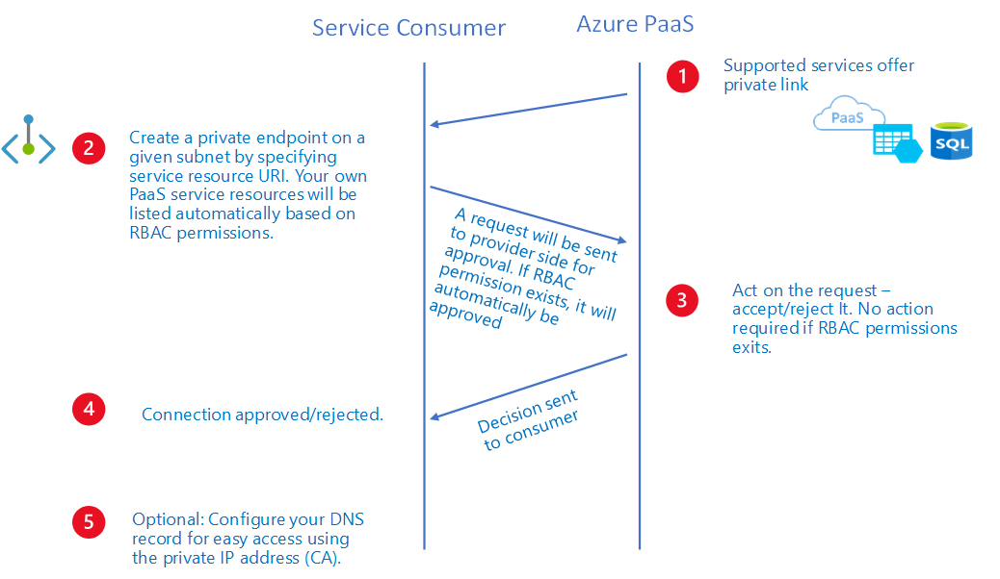

# What is Azure private endpoint?

You can connect secure and privately to an Azure service from your virtual network with a private endpoint. A private endpoint represents a unique network identifier to securely connect to Azure service, traffic from your VNet to a private link resource is secured by the platform from reaching other resources hosted on the same service. 
 
This article explains private endpoint concepts, to help you use them effectively. 
  
## Private endpoint properties 
 A private endpoint specifies the following properties: 

|Property  |Description |
|---------|---------|
|Name    |    A unique name within the resource group.      |
|Subnet    |  The subnet to deploy and allocate private IP addresses from a virtual network, for subnet requirements see the Limitations section in this article.         |
|Private Link Resource    |   The private link resource to connect, from the list of available types, a unique network identifier will be generated for all traffic sent to this resource.       |
|Target subresource   |      The subresource to connect, each private link resource type have different options to select based on preference.    |
|Connection approval method    |  Automatic or manual, based on RBAC permissions, your private endpoint can be approved automatically, if you are trying to connect to a private link resource without RBAC, use manual method to allow the owner of the resource to approve the connection.        |
|Request Message     |  You can specify a message for connections requested to be approved manually, this message can be used to identify a specific request.        |
|Connection status   |   A read-only property that specifies if the private endpoint is active, only private endpoints in approved state can be used to send traffic. Additional states available:  -**Approved**: Connection was automatically or manually approved and is ready to be used.  -**Pending**: Connection is created manually and pending for approval by the private link resource owner.  -**Rejected**: Connection was rejected by the private link resource owner.  -**Disconnected**: Connection was removed by the private link resource owner, the private endpoint becomes informative and should be deleted for cleanup.  |

Here are some key details about private endpoints: 
- An approved private endpoint allows connectivity from the same VNet, regionally peered VNets, globally peered VNets and on premises using [VPN](https://azure.microsoft.com/services/vpn-gateway/) or [Express Route](https://azure.microsoft.com/services/expressroute/) connections private. 
 
- When creating a private endpoint, a network interface will also be created for the life cycle of the resource, multiple private IP addresses can be allocated to a selected private link resource.  
 
- The private endpoint must be deployed in the same region as the virtual network. 
 
- The private link resource can be deployed on a different region than the Virtual Network and private endpoint location. 
 
- Multiple private endpoints can be created using the same private link resource, for a single network using a common DNS server configuration, the recommended practice is to use a single private endpoint for a given private link resource to avoid duplicate or conflict in DNS resolution. 
 
- Multiple private endpoints can be created on the same or different subnets within the same virtual network. There are limits to the number of private endpoints you can create in a subscription. For details, see [Azure limits](https://docs.microsoft.com/azure/azure-subscription-service-limits.md#networking-limits).

 
## Private link resource 
A private link resource is the destination target of a given private endpoint. The following is a list of available private link resource types and regions for Preview: 
 
- **Private link service**: Your own private link service or shared service, available in selected Azure regions. 
- **Azure storage**: Storage accounts with multiple target subresources available, Available in all Azure regions. 
- **Azure Data Lake Service gen2**: ADLS gen2 is available using Storage accounts with blob subresource, Available in selected Azure regions. 
- **Azure SQL Database**: Generally available in all Azure regions. 
- **Azure SQL Data Warehouse**: Generally available in all Azure regions. 
 
## Network security of private endpoints 
When using private endpoints for Azure Services, traffic is secured to a specific private link resource, the platform performs an access control to validate network connections reaching only the specified private link resource. To access additional resources within the same Azure Service, additional private endpoints are required. 
 
You can completely lock down your workloads from accessing to public endpoints to connect to a supported Azure Service. This control provides an additional network security layer to your resources by providing a build-in exfiltration protection that prevents access to other resources hosted on the same Azure Service. 
 
## Access to a private link resource using approval workflow 
You can connect to a private link resource without permissions by using an approval workflow, the private endpoint needs to be created manually and a subsequent private endpoint connection will be created in "Pending" state, the private link resource owner is responsible to approve the connection, once approved, the private endpoint will be enabled to send traffic normally (see approval workflow diagram below). 
 

 
The private link resource owner can perform the following actions over a private endpoint connection: 
- Review all private endpoint connections details. 
- Approve a private endpoint connection, the corresponding private endpoint will be enabled to send traffic to the private link resource. 
- Reject a private endpoint connection, the corresponding private endpoint will be updated to reflect the status 
- Delete a private endpoint connection in any state, the corresponding private endpoint will be updated with a disconnected state to reflect the action, the private endpoint owner can only delete the resource at this point. 
 
> [!NOTE]
> Only a private endpoint in approved state is valid to send traffic on to a given private link resource. 
 
## DNS configuration 
When connecting to a private link resource using a fully qualified domain name (FQDN) as part of the connection string, it's important to configure properly your DNS settings to resolve into the allocated private IP addresses, existing Azure services might already have a DNS configuration to use when connecting over a public endpoint. This needs to be overridden to connect using your private endpoint. 
 
The network interface associated with the private endpoint contains the complete set of information required to configure your DNS including fully qualified domain name (FQDN) and private IP addresses allocated for a given private link resource. 
 
A given network interface can contain multiple private IP addresses (IPConfigurations), each as a corresponding private IP address and an array of FQDNs that must resolve into the same private IP address. 
 
The following options can be used to configure your DNS settings for private endpoints: 
- Using the Host file (only recommended for testing): You can use the host file on a test virtual machine to override the DNS.  
- Using a private DNS zone: You can use private DNS zones to override the DNS resolution for a given private endpoint, a private DNS zone can be linked to your virtual networks to resolve specific domains
- Using your custom DNS server: You can use your own DNS server to override the DNS resolution for a given private link resource, if your DNS server is hosted on a virtual network, you can create a DNS forwarding rule to use private DNS zone to simplify the configuration for all private link resources 
 
> [!IMPORTANT]
> It's not recommended to override a zone that it's actively in use to resolve public endpoints, connections to resources won't be able to resolve properly without a DNS forwarding to the public DNS, to avoid issues, create a different domain name or follow the suggested name for each service below. 
 
For Azure Services, use the recommended zone names as described in the following table:

|Private Link Resource Type   |Sub-Resource  |Zone name  |
|---------|---------|---------|
|SQL DB/DW (Microsoft.Sql/servers)    |  Sql Server (sqlServer)        |   privatelink.database.windows.net       |
|Storage Account (Microsoft.Storage/storageAccounts)    |  Blob (blob, blob_secondary)        |    privatelink.blob.core.windows.net      |
|Storage Account (Microsoft.Storage/storageAccounts)    |    Table (table, table_secondary)      |   privatelink.table.core.windows.net       |
|Storage Account (Microsoft.Storage/storageAccounts)    |    Queue (queue, queue_secondary)     |   privatelink.queue.core.windows.net       |
|Storage Account (Microsoft.Storage/storageAccounts)   |    File (file, file_secondary)      |    privatelink.file.core.windows.net      |
|Storage Account (Microsoft.Storage/storageAccounts)     |  Web (web, web_secondary)        |    privatelink.web.core.windows.net      |
|Data Lake File System gen2 (Microsoft.Storage/storageAccounts)  |  Data Lake File System gen2 (dfs, dfs_secondary)        |     privatelink.dfs.core.windows.net     |
||||
 

The Azure Service provider will create a canonical name DNS record (CNAME) on the public DNS to redirect the resolution to the suggested domain names, you'll be able to override the resolution with the private IP address of your private endpoints. 
 
Your applications don't need to change the connection URL, when attempting to resolve using a public DNS, the DNS server will now resolve to your private endpoints, the process does not impact your applications. 
 
For more details, please check the tutorial how to configure the DNS settings for my private endpoints.

## Limitations
 
The following table includes a list of known limitation when using private endpoints: 

|Limitation |Description |Mitigation  |
|---------|---------|---------|
|Restrict traffic to selected sources within my virtual network    |  Network security group is not supported on private endpoints.  Subnets must have network policies enforcement disabled in order to deploy private endpoints with NSG disabled.        | Controlling the traffic by using security rules for outbound traffic on source clients.         |
|Deploy private endpoints on subnets with service endpoints or specialized workloads     |  Private endpoints cannot be deployed on subnets with service endpoints enabled or subnets delegated to specialized workloads.        |  Creating a separate subnet to deploy the private endpoints.        |
|Create a private endpoint to a private link service (your own) from a different region    |   Connecting to a private link service (your own) from a different region is not supported       |  During Preview, you must deploy your Private Link service in the same region.        |
|Specialized workloads cannot access private endpoints    |   The following services deployed into your virtual network cannot access any private link resource using private endpoints: -App Service Plan.  Azure Container Instance.        |   No mitigation during preview.       |
|    |         |         |

## Next steps
- [Create a private endpoint using the Azure portal](create-private-endpoint-portal.md)
 
