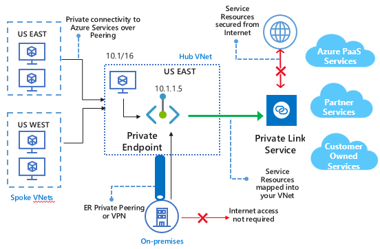

# What is Azure Private Link? (Preview)

Azure Private Link provides private connectivity between applications running in different Virtual Networks and to Azure PaaS services (such as Storage, SQL, Cosmos DB etc.)  using the Microsoft network. Azure Private Link simplifies the network architecture and secures the connection between endpoints in Azure by eliminating the data exposure to public internet. Azure Private Link also extends this ability to customer owned services as well as shared market place services run by the partners. The setup and consumption experience using Private Link is consistent across Azure PaaS, customer owned services and shared partner services.  The technology works on a provider and consumer model where the provider renders the service and consumer consumes the service.  Connection is established between provider and consumer based on an approval call flow and once established all data that flows between the service provider and service consumer is isolated from internet and stays on the Microsoft backend.  Both provider and consumer need to be on Azure to use Private Link. There is no need for any sort of gateways, NAT devices, ExpressRoute, or VPN connections, public IP addresses to communicate with the service.   

> [!IMPORTANT]
> This public preview is provided without a service level agreement and should not be used for production workloads. Certain features may not be supported, may have constrained capabilities, or may not be available in all Azure locations. See the [Supplemental Terms of Use for Microsoft Azure Previews](https://azure.microsoft.com/support/legal/preview-supplemental-terms/) for details.
>

## Why use Private Link?
Prior to using Azure Private Link,  Azure Shared PaaS was accessed over either 1) Public endpoints (internet routable public IPs exposed by service) or 2) VNet Service Endpoints. In both cases, Azure customers have to configure their Network Security Groups to allow access to internet routable service public IPs to access the Service. Accessing Service over Public IPs poses a security risk. Moreover, there is a risk of Data exfiltration with both above access methods.  
 
Similarly, Shared Services offered by Microsoft Partners and customer's own services residing in one VNet were accessed over either 1) Public endpoints or 2) VNet Peering. In first method, Network Security group needs to allow access to Internet routable address space that poses security risk. In second method, VNet peering imposes restrictions in terms of non-overlapping IP address space requirements.  
 
Azure Private Link addresses above issues and allows setting up TCP connectivity between applications running in different Virtual Networks and to Azure PaaS services in a simple, secure, and scalable manner. 

## Key benefits
Azure Private Link provides following benefits:  
- **Privately access services on Azure platform**: With Azure Private Link, you can connect your VNets to services delivered on Azure platform  in a secure and scalable manner. Service Providers can render their services privately in Consumer’s VNets and service consumers can consume services privately in their VNets on Azure Platform. 
 
- **Works with on-premises and peered networks**: With Azure Private Link, customer can access private endpoints over private peering/VPN tunnels (from on-prem) and also from peered virtual networks. Traffic from private endpoint to service will be route optimized and will be carried over Microsoft backbone. There is no need to set up public peering or traverse internet to reach the service. This ability provides flexibility for customers to migrate their workloads to cloud.  
 
- **Data Exfil protection**: With Azure Private Link, you get implicit Data Exfil protection when connecting to Azure PaaS. Individual Azure PaaS resources are mapped to the private endpoints instead of Azure Service. Hence a malicious insider can only access the mapped account and no other account thus eliminating the data exfil threat. 
 
- **Meet compliance needs**: With Azure Private Link, customer information is shared with services on Azure Platform over a secured Microsoft backbone and doesn’t traverse the internet. It helps with information not getting compromised and maintain compliance with regulation authorities such as HIPAA or PCI.  
 
- **Global reach**: With Azure Private Link, you can connect privately to service running in other regions that is, consumer VNet and Service can be in different regions. Azure private link is global in nature and there are no regional restrictions.      
 
- **Extend to your own services**: With Azure Private Link, you can leverage the same experience and functionality to render your own service privately in your customer VNets or your own VNets on Azure platform. Azure private link works across AD tenants and works on provider consumer model with approval call flow. Moreover, there is no requirement of non-overlapping address space as in VNet Peering.

### What is Private Link service?
Private Link Service is a virtual networking resource, modeled as Network Interface card, in Service Provider's Virtual Network. This resource is applicable mainly in Microsoft partner Service and Customer own service scenarios. Service Provider needs to create this resource to let consumers consume the service privately over Azure Private Link.  The resource is tied to front-end IP configuration of a Standard Load Balancer. Private Link Service serves as a front end for the Service Provider's applications that are running behind the standard load balancer. Service consumers connect to private link service over Azure Private Link through private endpoints in consumer's virtual networks.

## What is Private Endpoint?
Private Endpoint is a virtual networking resource, modeled as Network Interface card, in Service consumer's Virtual Network. Private Endpoints  get assigned a private IP from customer's VNet. Private Endpoint enables Azure customers to privately connect to supported Azure services through Azure Private Link. These services can include Azure PaaS, Microsoft Partner Services and customer owned Services. Supported Azure Services are mapped inside the customer's VNet as Private Endpoint. Private Endpoint is the entry point for service traffic over Private Link from Azure VNet resources. The traffic never leaves Microsoft Backbone. These are highly available instances and don’t impose any bandwidth restrictions on the Service traffic.
 

## Availability 
 The following table lists the services/regions that the Azure Private Link service is available:

|Scenario  |Supported services   |Availability regions |Time of availability   |
|---------|---------|---------|---------|
|Private Link for customer-owned services|Private Link Services behind Standard Load Balancer |Azure Public Cloud Regions  |  Preview  |
|Private Link for Azure PaaS Services   | Azure Storage        |  Azure Public Cloud Regions       | Preview         |
|  |  Azure SQL DB         | Azure Public Cloud Regions         |   Preview      |
|  |    Azure Cosmos DB     |  Azure Public Cloud Regions        | Preview        |
Private Link for Management Plane traffic     |  Azure Kubernetes Service (AKS)       |   Azure Public Cloud Regions       |         |

For the most up-to-date notifications, check the [Azure Virtual Network updates page](https://azure.microsoft.com/updates/?product=virtual-network). 

## Logging and monitoring

Azure Private Link is fully integrated with Azure Monitor.  All events are integrated with Azure Monitor, allowing you to archive logs to a storage account, stream events to your Event Hub, or send them to Azure Monitor logs. You can access following info on Azure Monitor: 
- **Private Endpoint**: Data processed by Private Endpoint  (IN/OUT)
 
- **Private Link Service:
    - Data processed by Private Link Service (IN/OUT)
    - NAT port availability  
 
##Pricing   
For pricing details, see Azure Private Link Pricing 
 
## FAQs  
For FAQs, see Azure Private Link FAQs.
 
## Limits  
For limits, see Azure Private Link limits.

## Next steps
- [Create a Private Link service using Azure PowerShell](create-private-link-service-powershell.md)
 
