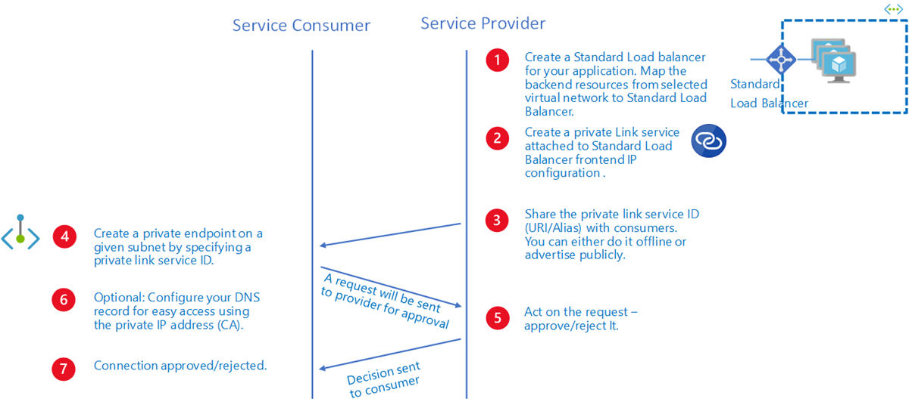

# What is Azure Private Link Service?

Azure Private Link service is a service you can create in your virtual network (VNet) and deliver it privately to your customers. Your customers can access this service by mapping it to private endpoint inside thier VNets. This article explains Private Link service concepts to help you use them effectively. 

## Workflow

### Create your Private Link Service
- Choose a name, location, virtual network for your service.  
- Create either an internal load balancer (ILB) or a public load balancer. 
    > [!NOTE]
    > Azure Private Link service is only supported on Standard Load Balancer. 
- Map the backend resources from selected VNet to the load balancer. It is advisable to have at least one backend resource behind the load balancer.  
- Create a Private Link Service using the load balancer. In the load balancer selection process, choose frontend IP configuration where you want to receive the traffic. Choose a subnet for NAT IPs for Private Link Service. It is recommended to have at least eight NAT IPs available in the subnet.  All consumer traffic will appear to originate from this pool of private IP to the service provider. Choose appropriate properties/settings for the Private Link Service.    
 
### Share your service 
Once you create a Private Link Service, Azure infrastructure will generate a globally unique "alias" based on the name you provide for your service.  You can share the alias with your customers offline or advertise it publicly. Consumers can start private link connection using this alias.  
 
### Manage your connection requests 
Once consumer initiates a connection, service provider can accept or reject the connection request. All connection requests will be listed under **privateendpointconnections** property on the Private Link Service.
 
### Delete your service 
If the Private Link Service is no longer in use, you can delete the Private Link Service. However, before your delete your service, ensure that there are no private endpoint connections associated to it. You can reject all connections and delete the service.

## Properties
A Private Link Service specifies the following properties: 

|Property |Explanation  |
|---------|---------|
|Provisioning State (provisioningState)  |A read-only property listing the current provisioning state for Private Link Service. Applicable provisioning states are: "Deleting; Failed; Succeeded; Updating". When the provisioning state is "Succeeded", you have successfully provisioned your Private Link Service         |
|Alias (alias)     | Alias is a globally unique read-only string for your service. It helps you mask the customer data for your service and at the same time create an easy to share name for your service. When you create a Private Link Service, Azure will generate the alias for your service that you can share with your customers. Your customers can use this alias to request a connection to your service.          |
|Visibility (visibility)     | Visibility is the property that controls the exposure settings for your Private Link Service. Service providers can choose to limit the exposure to their service to subscriptions with RBAC permissions, restricted set of subscriptions, or all Azure subscriptions.          |
|Auto Approval (autoApproval)    |   Auto-approval controls the automated access to the Private Link Service. The subscriptions specified in auto-approval list will be approved automatically when connection is requested from private endpoints in those subscriptions.          |
|FQDN (fqdns)    |   FQDN stands for Fully Qualified Domain Name. Service provider can share service’s FQDNs at the time of creation. These will be propagated to consumers at time of connection. Consumers can use these FQDNs to configure their DNS to resolve to private endpoint on their side. The alias is used for connection request, not FQDN. FQDNs are for DNS configurations.      |
|Load Balancer Frontend IP Configuration (loadBalancerFrontendIpConfigurations)    |    Private link service is tied to frontend IP of a Standard Load Balancer.  All traffic destined for Service will reach the frontend of SLB. You can configure SLB rules to direct this traffic to appropriate backend pools where your applications are running. Load balancer frontend IP configurations are different than NAT IP configurations.      |
|NAT IP Configuration (ipConfigurations)    |    This property refers to the NAT (Network Address Translation) IP configuration for the Private Link Service. The NAT IP can be chosen from any subnet in service provider's virtual network. Private link service performs destination side NAT-ing on the private link traffic. This ensures that there is no IP conflict between source (consumer side) and destination (service provider) address space. On the destination side (service provider side), NAT IP will show up as Source IP for all packets received by your service and destination IP for all packets send by your service.       |
|Network Interfaces (networkInterfaces)     |  A read-only property referencing to the network interfaces created for the Private Link Service. You can't manage the networkInterfaces.       |
|Private endpoint connections (privateEndpointConnections)     |  This property lists the private endpoints connecting to Private link service. Multiple private endpoints can connect to same Private link service and Service provider can control state for individual private endpoints.        |
|||

### Details
- Private link service can be accessed from approved private endpoints in the same region. The private endpoint can though be reached from  the same Virtual Network, regionally peered VNets, globally peered VNets and on premises using VPN or Express Route connections private. 
 
- When creating a Private Link Service, a network interface will also be created for the lifecycle of the resource, this interface is not manageable by the customer  
 
- The Private Link Service must be deployed in the same region as the Virtual Network and the Standard Load Balancer.  
 
- A single Private Link Service can be accessed from multiple Private Endpoints belonging to different VNets, Subscriptions and/or AD Tenants. The connection is established through a connection workflow.   
 
- Multiple Private Link Services can be created on the same standard load balancer using different front-end IP configurations. There are limits to the number of Private Link services you can create per standard load balancer and per subscription. For details, see Azure limits. 
 
- Private Link Service can have more than one NAT IP configurations linked to it. Choosing more than one NAT IP configurations can help service providers to scale. Today, service providers can assign up to eight NAT IPs per private link service. With each NAT IP, you can assign more ports for your TCP connections and thus scale out. Once you add multiple NAT IP to Private Link Service, you can't delete the NAT IPs. This is done to ensure that active connections are not impacted while deleting the NAT IPs.

## Alias
**Alias** is a globally unique name for your Service. It helps you mask the customer data for your service and at the same time create an easy to share name for your service. When you create a private link service, Azure will generate an alias for your service that you can share with your customers. Your customers can use this alias to request a connection to your service.  
Alias is composed of three parts: *Prefix*.*GUID*.*Suffix* 
- Prefix is the Service Name. You can pick you own prefix. Once "Alias" is created, you can't change it, so select your prefix appropriately.  
- GUID will be provided by platform. This will help make name globally unique. 
- Suffix will be appended by Azure: *region*.azure.privatelinkservice 
Complete alias:  *Prefix*. {GUID}.*region*.azure.privatelinkservice  

## Control service exposure 
Private Link service provides you rich set of options for controlling the exposure of your service using the "Visibility" settings.  You can make the service private for consumption from different VNets using you own (RBAC permissions only), restrict the exposure to limited set of subscriptions that you trust or make it public so that all Azure subscriptions can request connections on the private link service.  Only consumers that you expose your service to can request a connection through different Azure clients. Having access to Alias info doesn’t provide the ability to request connection. Your visibility settings decide whether a consumer can request a connection to your service or not. If the consumer's subscription falls within your visibility scope settings and has the correct alias, the consumer can request a connection. Following options are provided for your visibility settings:   
- Visibility: Role Base Access Control Only: 
    - Intake parameter: {}. 
    - Your service is not exposed from consumer side. 
    - Only exposed to customers with RBAC permissions.
- Visibility: Anyone with Alias: 
    - Intake parameter: {*}. 
    - Exposed to all Azure customers. All Azure subscriptions can find your service. 
    - Customers will need your alias for finding your service. You need to share the alias offline.  
- Visibility: Restricted by subscriptions: 
    - Intake parameter:  {sub1, sub2, sub3}.  
    - Exposed to customer with RBAC permissions and to user subscriptions in your selected list. 
    - Costumers not in visibility list will not be able to find the service even with alias information.
## Control service access 
 
Consumers having exposure (controlled by visibility setting) to your private link service can create a private endpoint in their VNets and request a connection to your private link service. The private endpoint connection will be created in "Pending" state on the private link service object. The service provider is responsible for acting on the connection request. You can either approve the connection, reject the connection, or delete the connection. Only connections that are approved can send traffic to private link service.  
The action of approving the connections can be automated by using auto-approval property on the private link service. Auto-Approval is an ability for Service Providers to pre-approve set of subscriptions for automated access to their service. Customers will need to share their subscriptions offline for Service providers to add to auto-approval list. Auto-approval is a subset of visibility array.  Visibility controls the exposure settings whereas auto-approval controls the approval settings for your service. If a customer requests a connection from a subscription in auto-approval list, the connection will be automatically approved and connection will be established. Service providers don’t need to manually approve the request anymore. On the other hand, if a customer requests a connection from a subscription in visibility array and not in auto-approval array, the request will reach service provider but service provider has to manually approve the connections.

## Limitations

The following table lists known limitations when using private link service:

|Limitation |Description |Mitigation |
|---------|---------|---------|
|Support only for IPv4    | Private link service doesn’t support IPv6 traffic.         |  Use Private Link Service for IPv4 traffic only        |
|Support only for TCP-traffic     | Private link service doesn’t support non-TCP  traffic.         |Use Private Link Service for IPv4 traffic only          |
|Support only for Azure Resource Manager virtual networks      |   Private link service can be created only in Azure Resource Manager VNets.      |    Use Azure Resource Manager VNets for private link.      |
|Support for deploying private link service using Standard Load Balancer.       |    Private link service can't be associated with the basic load balancer.       |     Use Standard Load Balancer for creating your private link service.     |
|Support for same region scenarios for private link service    |   Connecting to a private link service (your own) from a private endpoint in different region is not supported.      |    Private link service and private endpoint need to be in the same region during Preview.      |
|Supports a single Standard Load Balancer running same private link service     |  Private link service is tied to a single load balancer. You can't have multiple load balancers running same private link service.        |    No mitigation during Preview.      |
|Supports a single private link service using same backend pool    |   Multiple private link services can't use the same backend pool.        | Each private link service should have a dedicated backend pool.          |
|    |         |         |

## Next steps
- [Create a private link service using Azure PowerShell](create-private-link-service-powershell.md)
 
