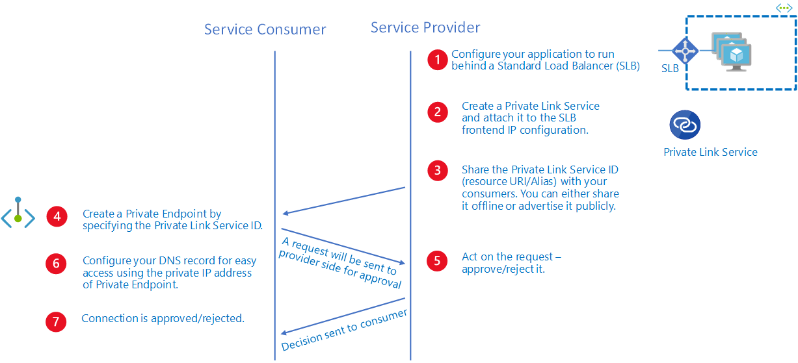

# What is Azure Private Link service?

Azure Private Link service is the reference to your own service that is powered by Azure Private Link. Your service that is running behind [Azure Standard Load Balancer](../load-balancer/load-balancer-standard-overview.md) can be enabled for Private Link access so that consumers to your service can access it privately from their own VNets. Your customers can create a private endpoint inside their VNet and map it to this service. This article explains concepts related to the service provider side. 

## Workflow

### Create your Private Link Service

- Configure your application to run behind a standard load balancer in your virtual network. If you already have your application configured behind a standard load balancer, you can skip this step.   
- Create a Private Link Service referencing the load balancer above. In the load balancer selection process, choose the frontend IP configuration where you want to receive the traffic. Choose a subnet for NAT IP addresses for the Private Link Service. It is recommended to have at least eight NAT IP addresses available in the subnet. All consumer traffic will appear to originate from this pool of private IP addresses to the service provider. Choose the appropriate properties/settings for the Private Link Service.    

    > [!NOTE]
    > Azure Private Link Service is only supported on Standard Load Balancer. 
    
### Share your service

After you create a Private Link service, Azure will generate a globally unique named moniker called "alias" based on the name you provide for your service. You can share either the alias or resource URI of your service with your customers offline. Consumers can start a Private Link connection using the alias or the resource URI.
 
### Manage your connection requests

After a consumer initiates a connection, the service provider can accept or reject the connection request. All connection requests will be listed under the **privateendpointconnections** property on the Private Link service.
 
### Delete your service

If the Private Link service is no longer in use, you can delete it. However, before your delete the service, ensure that there are no private endpoint connections associated with it. You can reject all connections and delete the service.

## Properties

A Private Link service specifies the following properties: 

|Property |Explanation  |
|---------|---------|
|Provisioning State (provisioningState)  |A read-only property that lists the current provisioning state for Private Link service. Applicable provisioning states are: "Deleting; Failed; Succeeded; Updating". When the provisioning state is "Succeeded", you have successfully provisioned your Private Link service.        |
|Alias (alias)     | Alias is a globally unique read-only string for your service. It helps you mask the customer data for your service and at the same time creates an easy-to-share name for your service. When you create a Private Link service, Azure generates the alias for your service that you can share with your customers. Your customers can use this alias to request a connection to your service.          |
|Visibility (visibility)     | Visibility is the property that controls the exposure settings for your Private Link service. Service providers can choose to limit the exposure to their service to subscriptions with role-based access control (RBAC) permissions, a restricted set of subscriptions, or all Azure subscriptions.          |
|Auto Approval (autoApproval)    |   Auto-approval controls the automated access to the Private Link service. The subscriptions specified in the auto-approval list are approved automatically when a connection is requested from private endpoints in those subscriptions.          |
|Load Balancer Frontend IP Configuration (loadBalancerFrontendIpConfigurations)    |    Private Link service is tied to the frontend IP address of a Standard Load Balancer. All traffic destined for the service will reach the frontend of the SLB. You can configure SLB rules to direct this traffic to appropriate backend pools where your applications are running. Load balancer frontend IP configurations are different than NAT IP configurations.      |
|NAT IP Configuration (ipConfigurations)    |    This property refers to the NAT (Network Address Translation) IP configuration for the Private Link service. The NAT IP can be chosen from any subnet in a service provider's virtual network. Private Link service performs destination side NAT-ing on the Private Link traffic. This ensures that there is no IP conflict between source (consumer side) and destination (service provider) address space. On the destination side (service provider side), the NAT IP address will show up as Source IP for all packets received by your service and destination IP for all packets sent by your service.       |
|Private endpoint connections (privateEndpointConnections)     |  This property lists the private endpoints connecting to Private Link service. Multiple private endpoints can connect to the same Private Link service and the service provider can control the state for individual private endpoints.        |
|TCP Proxy V2 (EnableProxyProtocol)     |  This property lets the service provider use tcp proxy v2 to retrieve connection information about the service consumer. Service Provider is responsible for setting up receiver configs to be able to parse the proxy protocol v2 header.        |
|||

### Details

- Private Link service can be accessed from approved private endpoints in any public region. The private endpoint can be reached from the same virtual network, regionally peered VNets, globally peered VNets and on premises using private VPN or ExpressRoute connections. 
 
- When creating a Private Link Service, a network interface is created for the lifecycle of the resource. This interface is not manageable by the customer.
 
- The Private Link Service must be deployed in the same region as the virtual network and the Standard Load Balancer.  
 
- A single Private Link Service can be accessed from multiple Private Endpoints belonging to different VNets, subscriptions and/or Active Directory tenants. The connection is established through a connection workflow. 
 
- Multiple Private Link services can be created on the same Standard Load Balancer using different front-end IP configurations. There are limits to the number of Private Link services you can create per Standard Load Balancer and per subscription. For details, see [Azure limits](https://docs.microsoft.com/azure/azure-resource-manager/management/azure-subscription-service-limits#networking-limits).
 
- Private Link service can have more than one NAT IP configurations linked to it. Choosing more than one NAT IP configurations can help service providers to scale. Today, service providers can assign up to eight NAT IP addresses per Private Link service. With each NAT IP address, you can assign more ports for your TCP connections and thus scale out. After you add multiple NAT IP addresses to a Private Link service, you can't delete the NAT IP addresses. This is done to ensure that active connections are not impacted while deleting the NAT IP addresses.

## Alias

**Alias** is a globally unique name for your service. It helps you mask the customer data for your service and at the same time creates an easy-to-share name for your service. When you create a Private Link service, Azure generates an alias for your service that you can share with your customers. Your customers can use this alias to request a connection to your service.

The alias is composed of three parts: *Prefix*.*GUID*.*Suffix*

- Prefix is the service name. You can pick you own prefix. After "Alias" is created, you can't change it, so select your prefix appropriately.  
- GUID will be provided by platform. This helps make the name globally unique. 
- Suffix is appended by Azure: *region*.azure.privatelinkservice 

Complete alias:  *Prefix*. {GUID}.*region*.azure.privatelinkservice  

## Control service exposure

Private Link service provides you options to control the exposure of your service through "Visibility" setting. You can make the service private for consumption from different VNets you own (RBAC permissions only), restrict the exposure to a limited set of subscriptions that you trust, or make it public so that all Azure subscriptions can request connections on the Private Link service. Your visibility settings decide whether a consumer can connect to your service or not. 

## Control service access

Consumers having exposure (controlled by visibility setting) to your Private Link service can create a private endpoint in their VNets and request a connection to your Private Link service. The private endpoint connection will be created in a "Pending" state on the Private Link service object. The service provider is responsible for acting on the connection request. You can either approve the connection, reject the connection, or delete the connection. Only connections that are approved can send traffic to the Private Link service.

The action of approving the connections can be automated by using the auto-approval property on the Private Link service. Auto-Approval is an ability for service providers to preapprove a set of subscriptions for automated access to their service. Customers will need to share their subscriptions offline for service providers to add to the auto-approval list. Auto-approval is a subset of the visibility array. Visibility controls the exposure settings whereas auto-approval controls the approval settings for your service. If a customer requests a connection from a subscription in the auto-approval list, the connection is automatically approved and the connection is established. Service providers don’t need to manually approve the request anymore. On the other hand, if a customer requests a connection from a subscription in the visibility array and not in the auto-approval array, the request will reach the service provider but the service provider has to manually approve the connections.

## Getting connection Information using TCP Proxy v2

When using private link service, the source IP address of the packets coming from private endpoint is network address translated (NAT) on the service provider side using the NAT IP allocated from provider's virtual network. Hence the applications receive the allocated NAT IP address instead of actual source IP address of the service consumers. If your application needs actual source IP address from consumer side,  you can enable Proxy protocol on your service and retrieve the information from the proxy protocol header. In addition to source IP address, proxy protocol header also carries the LinkID of the private endpoint. Combination of source IP address and LinkID can help service providers uniquely identify their consumers. For more information on Proxy Protocol, visit [here](https://www.haproxy.org/download/1.8/doc/proxy-protocol.txt). 

This information is encoded using a custom Type-Length-Value (TLV) vector as follows:

Custom TLV details:

|Field |Length (Octets)  |Description  |
|---------|---------|----------|
|Type  |1        |PP2_TYPE_AZURE (0xEE)|
|Length  |2      |Length of value|
|Value  |1     |PP2_SUBTYPE_AZURE_PRIVATEENDPOINT_LINKID (0x01)|
|  |4        |UINT32 (4 bytes) representing the LINKID of the private endpoint. Encoded in little endian format.|

 > [!NOTE]
 > Service provider is responsible for making sure that the service behind the standard load balancer is configured to parse the proxy protocol header as per the [specification](https://www.haproxy.org/download/1.8/doc/proxy-protocol.txt) when proxy protocol is enabled on private link service. The request will fail if proxy protocol setting is enabled on private link service but service provider's service is not configured to parse the header. Similarly, the request will fail if the service provider's service is expecting a proxy protocol header while the setting is not enabled on the private link service. Once proxy protocol setting is enabled, proxy protocol header will also be included in HTTP/TCP health probes from host to the backend virtual machines, even though there will be no client information in the header. 

## Limitations

The following are the known limitations when using the Private Link service:
- Supported only on Standard Load Balancer 
- Supports IPv4 traffic only
- Supports TCP traffic only

## Next steps
- [Create a private link service using Azure PowerShell](create-private-link-service-powershell.md)
- [Create a private link service using Azure CLI](create-private-link-service-cli.md)
