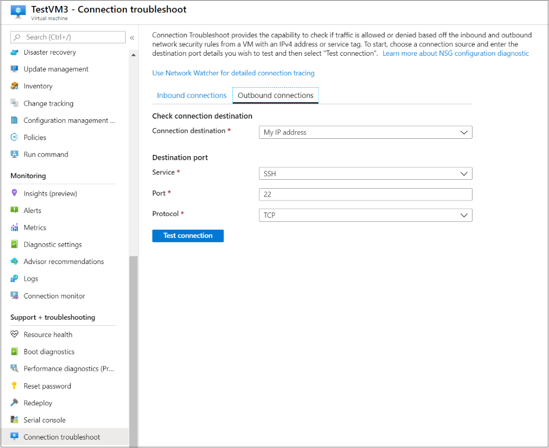
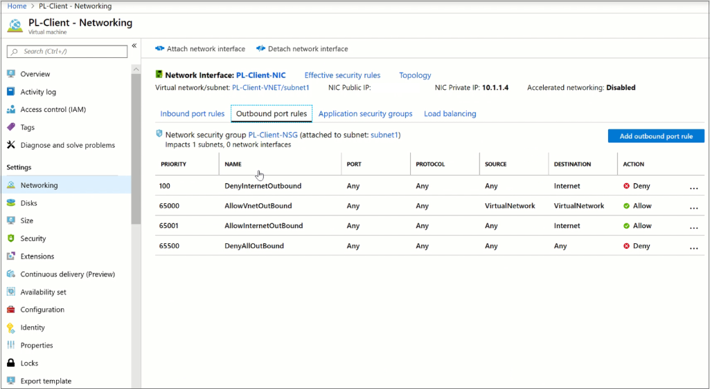

# Troubleshoot Azure Private Endpoint connectivity problems

This article provides step-by-step guidance to validate and diagnose your Azure Private Endpoint connectivity setup.

Azure Private Endpoint is a network interface that connects you privately and securely to a private link service. This solution helps you secure your workloads in Azure by providing private connectivity to your Azure service resources from your virtual network. This solution effectively brings those services to your virtual network.

Here are the connectivity scenarios that are available with Private Endpoint:

- Virtual network from the same region
- Regionally peered virtual networks
- Globally peered virtual networks
- Customer on-premises over VPN or Azure ExpressRoute circuits

## Diagnose connectivity problems 

Review these steps to make sure all the usual configurations are as expected to resolve connectivity problems with your private endpoint setup.

1. Review Private Endpoint configuration by browsing the resource.

    a. Go to **Private Link Center**.

      

    b. On the left pane, select **Private endpoints**.
    
      

    c. Filter and select the private endpoint that you want to diagnose.

    d. Review the virtual network and DNS information.
     - Validate that the connection state is **Approved**.
     - Make sure the VM has connectivity to the virtual network that hosts the private endpoints.
     - Check that the FQDN information (copy) and Private IP address are assigned.
    
       
    
1. Use [Azure Monitor](../azure-monitor/overview.md) to see if data is flowing.

    a. On the private endpoint resource, select **Monitor**.
     - Select **Bytes In** or **Bytes Out**. 
     - See if data is flowing when you attempt to connect to the private endpoint. Expect a delay of approximately 10 minutes.
    
       

1.  Use **VM Connection troubleshoot** from Azure Network Watcher.

    a. Select the client VM.

    b. Select **Connection troubleshoot**, and then select the **Outbound connections** tab.
    
      
    
    c. Select **Use Network Watcher for detailed connection tracing**.
    
      

    d. Select **Test by FQDN**.
     - Paste the FQDN from the private endpoint resource.
     - Provide a port. Typically, use 443 for Azure Storage or Azure Cosmos DB and 1336 for SQL.

    e. Select **Test**, and validate the test results.
    
      
    
        
1. DNS resolution from the test results must have the same private IP address assigned to the private endpoint.

    a. If the DNS settings are incorrect, follow these steps:
     - If you use a private zone: 
       - Make sure that the client VM virtual network is associated with the private zone.
       - Check to see that the private DNS zone record exists. If it doesn't exist, create it.
     - If you use custom DNS:
       - Review your custom DNS settings, and validate that the DNS configuration is correct.
       For guidance, see [Private endpoint overview: DNS configuration](./private-endpoint-overview.md#dns-configuration).

    b. If connectivity is failing because of network security groups (NSGs) or user-defined routes:
     - Review the NSG outbound rules, and create the appropriate outbound rules to allow traffic.
    
       

1. Source Virtual Machine should have the route to Private Endpoint IP next hop as InterfaceEndpoints in the NIC Effective Routes. 

    a. If you are not able to see the Private Endpoint Route in the Source VM, check if 
     - The Source VM and the Private Endpoint belongs to the same VNET. If yes, then you need to engage support. 
     - The Source VM and the Private Endpoint are part of different VNETs, then check for the IP connectivity between the VNETS. If there are IP connectivity and still you are not able to see the route, engage support. 

1. If the connection has validated results, the connectivity problem might be related to other aspects like secrets, tokens, and passwords at the application layer.
   - In this case, review the configuration of the private link resource associated with the private endpoint. For more information, see the [Azure Private Link troubleshooting guide](troubleshoot-private-link-connectivity.md)
   
1. It is always good to narrow down before raising the support ticket. 

    a. If the Source is On-Premises connecting to Private Endpoint in Azure having issues, then try to connect 
      - To another Virtual Machine from On-Premises and check if you have IP connectivity to the Virtual Network from On-Premises. 
      - From a Virtual Machine in the Virtual Network to the Private Endpoint.
      
    b. If the Source is Azure and Private Endpoint is in different Virtual Network, then try to connect 
      - To the Private Endpoint from a different Source. By doing this you can isolate any Virtual Machine specific issues. 
      - To any Virtual Machine which is part of the same Virtual Network of that of Private Endpoint.  

1. Contact the [Azure Support](https://ms.portal.azure.com/#blade/Microsoft_Azure_Support/HelpAndSupportBlade/overview) team if your problem is still unresolved and a connectivity problem still exists.

## Next steps

 * [Create a private endpoint on the updated subnet (Azure portal)](./create-private-endpoint-portal.md)
 * [Azure Private Link troubleshooting guide](troubleshoot-private-link-connectivity.md)
