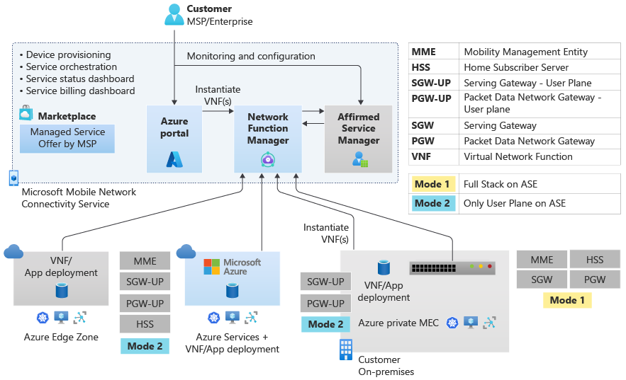

# Deploy Affirmed Private Network Service on Azure

This article provides a high-level overview of the process of deploying Affirmed Private Network Service (APNS) solution on an Azure Stack Edge device via the Microsoft Azure Marketplace.

The following diagram shows the system architecture of the Affirmed Private Network Service, including the resources required to deploy.

## Collect required information

To deploy APNS, you must have the following resources:

- A configured Azure Network Function Manager - Device object which serves as the digital twin of the Azure Stack Edge device. 

- A fully deployed Azure Stack Edge with NetFoundry VM. 

- Subscription approval for the Affirmed Management Systems VM Offer and APNS Managed Application. 

- An Azure account with an active subscription and access to the following:  

    - The built-in **Owner** Role for your resource group. 

    - The built-in **Managed Application Contributor** role for your subscription. 

    - A virtual network and subnet to join (open ports tcp/443 and tcp/8443). 

    - 5 IP addresses on the virtual subnet. 

    - A valid SAS Token provided by Affirmed Release Engineering.  

    - An administrative username/password to program during the deployment. 
    
## Deploy APNS

To automatically deploy the APNS Managed application with all required resources and relevant information necessary, select the APNS Managed Application from the Microsoft Azure Marketplace. When you deploy APNS, all the required resources are automatically created for you and are contained in a Managed Resource Group.

Complete the following procedure to deploy APNS:
1.	Open the Azure portal and select **Create a resource**.
2.	Enter *APNS* in the search bar and press Enter.
3.	Select **View Private Offers**. 
    > [!NOTE]
    > The APNS Managed application will not appear until **View Private Offers** is selected.
4.	Select **Create** from the dropdown menu of the **Private Offer**, then select the option to deploy.
5.	Complete the application setup, network settings, and review and create.
6.	Select **Deploy**.

## Next steps

- For information about Affirmed Private Network Service, see [What is Affirmed Private Network Service on Azure?](affirmed-private-network-service-overview.md).
