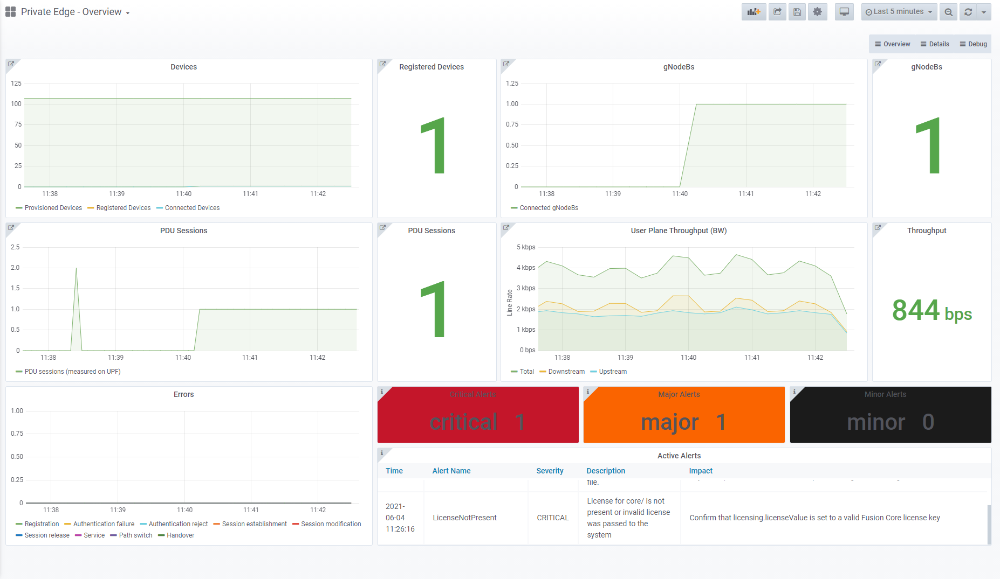

# What is Fusion Core?

Fusion Core is a cloud native implementation of the 3GPP standards-defined 5G Next Generation Core (5G NGC or 5GC) that allows 5G network operators to aggregate data traffic from all end devices over multiple wireless and fixed access technologies. It comprises a high performance and highly programmable 5G user plane function (UPF), core control plane functions, a portfolio of service-based architecture elements and management components for network monitoring.

Fusion Core can be deployed in pure 5G scenarios or it can interoperate with 4G networks.

Fusion Core implements the following 5G Network Functions.

|Network Function  |Description  |
|---------|---------|
|**AMF**  Access and Mobility Management Function     |This supports the following. <ul> <li>Termination of NAS signaling from the gNB</li><li>NAS ciphering and integrity protection</li><li>Registration Management</li><li>Connection Management</li><li>Mobility Management</li><li>Access Authentication and Authorization</li><li>Security Context Management</li></ul>         |
|**SMF**  Session Management Function     |The SMF supports session setup, modification, and release.  As part of this, it provides UE IP address allocation and management, including DHCP, and termination of NAS signaling related to session management.  It also provides support for paging devices on downlink data traffic and providing traffic steering configuration as part of session management.         |
|**UPF**  User Plane Function     |The UPF is responsible for handling packet data traffic. This includes handling routing, forwarding, inspection, and QoS for packet data traffic.  It acts as the anchor point for traffic both to the Data Network (DN) and for handover between different radio networks.         |
|**PCF**  Policy Control Function     |The PCF provides a central policy framework for traffic, providing policy rules for control plane function and acting as a source of subscription information.         |
|**AUSF**  Authentication Server Function     |The AUSF is the authentication server for 5G subscribers.         |
|**UDM**  Unified Data Management     |The UDM supports generation of the AKA credentials, user identification, access authorization and subscriber management.         |
|**UDR**  Unified Data Repository     |The UDR is a converged repository of all subscriber information.         |
|**NRF**  Network Repository Function     |The NRF provides service discovery for NFs.         |

It also implements the following Network Functions when interworking with a 4G network.

|Network Function  |Description  |
|---------|---------|
|**MME**  Mobility Management Entity     |The MME is the key control-node for the LTE-access network, and is responsible for controlling all aspects of UE access to the network.         |
|**S11-IWF**  S11 Interworking Function |The S11-IWF exposes an S11 interface to 4G Mobility Management Entities (MMEs) and provides protocol translations for supporting functions.         |
|**UDR**  Unified Data Repository     |The UDR is a converged repository of all subscriber information. Fusion Core's UDR performs the role that would usually be performed by a Home Subscriber Store (HSS) in a 4G scenario. It interacts with the MME using the S6a interface.         |

The following diagram shows each of these Network Functions and the interfaces they use to interoperate with third-party components.

:::image type="content" source="./media/metaswitch-overview/fusion-core-architecture.png" alt-text="Fusion Core architecture":::

Fusion Core is delivered on a Virtual Machine (VM) known as the Fusion Core Base VM. The Fusion Core Base VM is designed to be deployed as an Azure-managed application on an Azure Stack Edge (ASE). The Network Functions and infrastructure components required to deliver Fusion Core function are deployed as containers on the Fusion Core Base VM and orchestrated by Kubernetes.

:::image type="content" source="./media/metaswitch-overview/fusion-core-base-vm-azure-stack-edge-with-networking.png" alt-text="Fusion Core Base VM on Azure Stack Edge":::

## Why use Fusion Core?

### Deployment in private networks

Fusion Core uses the capabilities of the Azure private multi-access edge compute to provide a 5G solution for enterprises that combines the performance and low latency from Edge compute resources required to support Industry 4.0 use cases, with consistent, centralized management through Azure. For detailed information on Private multi-access edge compute, see [What is Azure private multi-access edge compute?](overview.md).

Deploying Fusion Core at the enterprise edge ensures that it is as close as possible to the devices it serves, allowing it to deliver low latency levels and reduced backhaul through local data processing when combined with application logic in the same location. This provides a number of valuable benefits to enterprises, including the following.

- **Automation** - command and control messages from automated systems (like robots) can be processed in real time to prevent stalling, ensuring higher productivity.
- **Telemetry** - telemetry data for health assessment and the operation of automated systems can be processed in real time to prevent accidents and ensure on-site safety.
- **Analytics** - huge amounts of operational and diagnostics data can be transported at minimal expense, ensuring that vital actions are not delayed.

:::image type="content" source="./media/metaswitch-overview/enterprise-edge-latency.png" alt-text="Fusion Core at the Private 5G Edge":::

Fusion Core is able to leverage this low latency along with the security and high bandwidth offered by private 5G networks, putting it in the optimal position to support Industry 4.0 use cases such as the following.

- **Manufacturing** - Production-line analytics and warehouse automation with robots.
- **Public Safety** - Mobility and connectivity for emergency workers and disaster recovery operatives.
- **Energy and Utilities** - Backhaul networks for Smart Meters and network slicing/control.
- **Defense** - Connected command posts and battlefield with real-time analytics.
- **Smart farms** - Connected equipment for farm operation.

### Pure 5G and 4G Interworking support

Fusion Core can be deployed in purely 5G scenarios. In this case, Fusion Core runs in **5G Standalone mode**.

Fusion Core also supports 4G Interworking, providing service to 4G UEs over a cloud-native core. This is known as **4G mode**. For greenfield and incumbent network operators, 4G mode provides an immediate path to 5G without continuing investments in maintaining a 4G core.

### Service assurance and KPI metrics

Fusion Core is integrated with **Metaswitch's Service Assurance Server (SAS)**, providing proactive, real-time analysis of all message traffic, including NGAP/NAS messages and HTTP requests and responses.

The Service Assurance Server offers a Web GUI you can use to collect detailed traces for signaling flows involving Fusion Core. These can be used to diagnose many common configuration, network, and interoperability problems affecting user service.

:::image type="content" source="./media/metaswitch-overview/service-assurance-server-detailed-timeline.png" alt-text="Detailed Timeline view in the Service Assurance Server Web GUI":::

Fusion Core is also integrated with **Metaswitch ServiceIQ Monitoring**, which provides industry standard cloud native monitoring tools, such as Prometheus and Grafana, allowing for real-time analysis of system performance, fault identification and troubleshooting.

ServiceIQ Monitoring runs on the Fusion Core VM and allows you to access a number of Fusion Core dashboards, which provide a flexible way to monitor key metrics relating to your Fusion Core deployment. They also allow you to view information on firing alerts, ensuring you can react quickly to emerging issues.

### Other features

|Feature  |Description  |
|---------|---------|
|**Network slicing**     |Fusion Core deployments can be configured to provide multiple network slices to multiplex independent logical networks. All network functions within a single Fusion Core deployment serve all of the configured slices.  You can choose to provision subscribers with their allowed and default slices and define slice-specific policy (QoS), providing an easy and ubiquitous mechanism to maintain administrative separation of groups of subscribers.         |
|**Supported 5G procedures**     |Fusion Core complies with 3GPP TS 23.502 for the following procedures when operating as part of a wider Private 5G solution.<ul><li>UE registration / deregistration</li><li>Mobility Registration Update / Periodic Registration Update</li><li>UE Initiated Service Request (Signaling / Data)</li><li>AN / Network Initiated UE Context Release</li><li>PDU Session Establishment</li><li>PDU Session Release</li><li>Inter NG-RAN node N2 based handover</li><li>Xn based inter NG-RAN handover</li><li>Network Initiated Downlink Data Notification / Paging</li>        |
|**UE authentication**     |<ul><li>Security Anchor Function (SEAF) support to provide authentication functionality in the serving network.</li><li>Authentication using Subscription Permanent Identifiers (SUPI), Subscription Concealed Identifiers (SUCI) and Globally Unique Temporary Identities (5G-GUTI).</li><li>Assignment or reallocation of a 5G-GUTI to a UE.</li><li>3rd Generation Authentication and Key Agreement (EAP-AKA') and 5G Authentication and Key Agreement (5G-AKA) for mutual authentication between UEs and the network.</li><li>Evolved Packet System based Authentication and Key Agreement (EPS-AKA) for deployments running in 4G mode.</li>         |
|**UE Security Context Management**     |Fusion Core's AMF performs ciphering and integrity protection of 5G NAS. During UE registration, the UE includes its security capabilities for 5G NAS with 128-bit keys.  The algorithms supported by Fusion Core for ciphering and integrity protection include the following.<ul><li>5GS null encryption algorithm</li><li>128-bit Snow3G</li><li>128-bit AES</li><li>128-bit ZUC</li>        |
|**UE MTU configuration**     |Fusion Core's SMF signals the MTU for a Data Network to UEs on request as part of PDU Session Establishment procedures to avoid fragmentation.         |
|**Policy control**     |Fusion Core applies end to end policy control decisions and enforcement on a per PDU session and per flow basis. This provides the flexibility you need to apply different QoS levels to particular flows or UEs, and allowing you to selectively expose services or data networks to groups of UEs and controlling the types of traffic flowing over the network.         |
|**UPF Access Control Lists (ACLs)**     |ACLs can be used to either allow or block traffic addressed from or to specific IPv4 address ranges. You can configure ACLs in Fusion Core's access (N3) and core (N6) interfaces.         |
|**Index to RAT/Frequency Selection Priority (RFSP)**     |Fusion Core's AMF can provide a RAN with an RFSP Index, which the RAN can match to its local configuration to apply specific Radio Resource Management policies, such as cell reselection or frequency layer redirection.         |

## Next steps

- Learn how to [deploy Fusion Core](deploy-metaswitch-fusion-core-solution.md)

