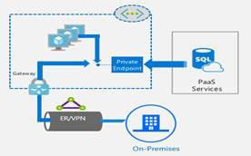
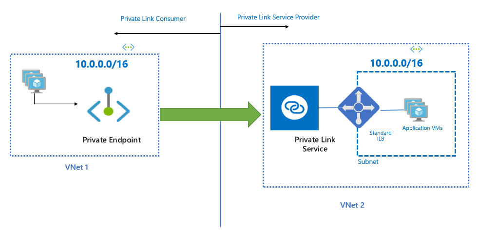

# What is Azure Private Link? (Preview)

Azure Private Link provides private connectivity between applications running in different Virtual Networks and to Azure PaaS services (such as Azure Storage, Azure SQL, Azure CosmosDB etc.) using the Microsoft network. Azure Private Link simplifies the network architecture and secures the connection between endpoints in Azure by eliminating the data exposure to public internet. Azure Private Link extends this ability to customer owned services as well as shared market place services run by the partners. The setup and consumption experience using Private Link is consistent across Azure PaaS, customer owned services, and shared partner services. Moreover Private Link works across AD tenants and across Azure regions. Private Link brings in true private connectivity experience between Services and VNets.  The technology works on a provider and consumer model where the provider renders the service and consumer consumes the service. Both provider and consumer need to be on Azure to use Private Link. Connection is established between provider and consumer based on an approval call flow and once established all data that flows between the service provider and service consumer is isolated from internet and stays on the Microsoft backend. There is no need for any sort of gateways, NAT devices, ExpressRoute or VPN connections, public IP addresses to communicate with the service.  

> [!IMPORTANT]
> This public preview is provided without a service level agreement and should not be used for production workloads. Certain features may not be supported, may have constrained capabilities, or may not be available in all Azure locations. See the [Supplemental Terms of Use for Microsoft Azure Previews](https://azure.microsoft.com/support/legal/preview-supplemental-terms/) for details.
>

## Key features

## Why use Private Link?

### Private Link for Azure PaaS services
Azure consumers can connect to Azure PaaS services privately from within their Virtual Networks. A PaaS resource will be mapped within the Customer VNet that will allow direct connectivity from within VNet and connectivity over ER private peering or VPN tunnels from on-premises thus eliminating exposure to public internet. Moreover, since the service resource is mapped a private IP from customer's VNET IP space, NSGs configuration is clean and need not open to public IPs.

### Private Link for customer owned services  
 Private Link private connectivity experience is extended to shared Market Place services and customer owned services too. 

### Private Link for management plane traffic
Any Azure customer with a Resource Manager deployment-based virtual network is able to create a service using a Standard Load Balancer that other Azure consumers can connect to. This capability is desirable in two scenarios:
1. Azure customers connecting their VNets without VNet peering the VNet. This will not require non-overlapping address space as mandated by VNet Peering.  
2. Market Place Service Providers rendering their services to other Azure customers privately in their VNets.

## Next steps
- [Create a Private Link service using Azure PowerShell](create-privatelink-powershell.md)
 
