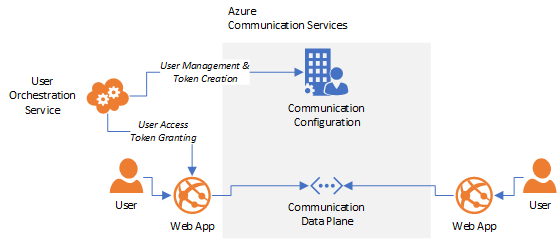

# User access tokens (UAT)

User access tokens enable you to build client applications that directly authenticate to Azure Communication Services. You generate these tokens on your server, pass them back to a client device, and then use them to initialize the Communication Services SDKs.



## Creating user access tokens

The Azure Communication Services Configuration SDK provides the functionality to create user access tokens. You should expose this functionality via a trusted web service that your users can authenticate against. Once your endpoint validates that a user should be authorized to access Azure Communication Services, you should use the configuration SDK to create a user access token for that user's unique identity, serialize it and return it to the user's client application so it can initialize an instance of an Azure Communication Services client SDK.

#### [C#](#tab/c-sharp)

```csharp
using Azure.Communication.Configuration; // Import NuGet package Azure.Communication.Configuration

[HttpPost]
[Authorize]
public async Task<ActionResult> CreateAccessToken(string userId)
{
    // validate the user that sent this request is authorized to
    // access Azure Communication Services
    
    // initialize the configuration client with a connection string
    // retrieved from the Azure Portal
    var userClient = new UserTokenClient(CONNECTION_STRING);
    
    // create a user access token and implicitly create a new ACS identity
    Azure.Communication.Configuration.Models.TokenResponse tokenResult = userClient.Issue(null, new[] { "voip" });

    
    // return the access token to the
    var response = new CreateAccessTokenResponse()
    {
      token: tokenResult.token
    }
    return Ok(response);
}
```
#### [Javascript](#tab/javascript)
```js
app.post('/token', (req, res) => {
    // validate the user that sent this request is authorized to
    // access Azure Communication Services
    
    // initialize the configuration client with a connection string
    // retrieved from the Azure Portal
    const configurationClient = new ConfigurationClient(CONNECTION_STRING);
    

    // create a user access token for the provided identity and implicitly create a new ACS identity
    // Scopes: chat, vpoid, pstn, joinroom
    // createToken method also accepts an identiy, but that should only be passed after
    // the user has already been assigned one to recreate their token.
    const tokenResponse = configurationClient.userToken().createToken(USER_SCOPES[]);
    
    // return the access token to the client
    res.json({ 
        token: tokenResponse,
     })
});
```
--- 

ACS maintains a lightweight identity directory. The very first time you create a user access token for a particular user, you should not specify an ACS identity because it is implicitly created by the token creation. Your trusted web service should maintain a mapping between your application entities (e.g. chris@contoso.com) to ACS generated identities. Subsequent token issuance should use the same identity generated by ACS in the initial token creation. 

Read the [Identity Model concept page to learn more](identity-model.md).

#### [C#](#tab/c-sharp)

```csharp

    // create a user access token and implicitly create a new ACS identity
    Azure.Communication.Configuration.Models.TokenResponse tokenResult = userClient.Issue(null, new[] { "voip" });
    
    // create a user access token for the same ACS identity
    string identity = tokenResult.Identity;
    Azure.Communication.Configuration.Models.TokenResponse tokenResult = userClient.Issue(identity, new[] { "voip" });
    
```
#### [Javascript](#tab/javascript)
```js

    // create a user access token and implicitly create a new ACS identity
    const tokenResponse = configurationClient.userToken().createToken([ "chat", "pstn" ], null)
    
    const identity = tokenResponse.identity;
    tokenResponse = configurationClient.userToken().createToken([ "chat", "pstn" ], identity)

```
--- 

By default, user access tokens expire after 24 hours but it is a good security practice to limit the lifetime to the minimum duration required by your application. You can use the optional `ttl` parameter of the `CreateUserAccessTokenAsync` method to limit the duration of user access tokens.

## User access token scopes

Scopes allow you to specify the exact Azure Communications Services functionality that a user access token will be able to authorize. By default, user access tokens enable clients to participate in chat threads they have been invited to and to receive incoming VOIP calls. Additional scopes must be specified when creating user access tokens.

#### [C#](#tab/c-sharp)
```csharp
// create a user access token that enables outbound voip calling
// and expires after five minutes
var tokenResult = await userClient.IssueAsync(
    userID,
    ["voip"],
    (60 * 5)
);
```

#### [JS](#tab/javascript)
```javascript
// create a user access token that enables  voip calling
// Only pass username if you have already generated an id,
// if not omit, to generate a user id for the specific user

var tokenResult = await configurationClient.userToken().createToken(
    username,
    ['chat']
);

```

Scopes are applied to individual user access tokens. If you wish to remove a user's ability to access to some specific functionality, you should first [revoke any existing access tokens](#revoking-user-access-tokens) that may include undesired scopes before issuing a new token with a more limited set of scopes.

### Supported Scopes

Azure Communication Services supports the following scopes for user access tokens:

| Name                  | Description                                                  |
| --------------------- | ------------------------------------------------------------ |
| `chat`                | Grants the ability to participate in a chat                  |
| `voip`                | Grants the ability to make and receive VOIP calls using the calling SDK |
| `pstn`                | Grants the ability to make a PSTN calls using the calling SDK |
| `joinRoom`            | Grants the ability to create or join a group call     |


## Reissuing user access tokens

User access tokens are short-lived credentials that need to be reissued in order to prevent your users from experiencing service disruptions. The client SDKs provide an proactive-refresh callback to let you update the user access token before it is about to expire. You should provide a refresh callback and use it to fetch a new user access token from your trusted service.

#### [C#](#tab/csharp-user-token-refresh)

```C#
using Azure.Communication.Chat;     // Import NuGet package Azure.Communication.Chat
using Azure.Communication.Identity; // package Azure.Communication.Common will be automatically imported because importing the Chat package

// Your unique Azure Communication service endpoint
const string endpoint = 'https://<RESOURCE_NAME>.communcationservices.azure.com';

// Create a CommunicationUserCredential and pass a refresh function. The refresh function is called on first usage of the credential and again when the token is about to expire.
var userCredential = new CommunicationUserCredential(() => fetchNewToken(userId));

// Initialize the chat client
var chatClient = new ChatClient(endpoint, userCredential);
```

#### [Javascript](#tab/javascript-user-token-refresh)

```javascript
import { CommunicationUserCredential } from '@azure/communicationservices-common';
import { ChatClient } from '@azure/communicationservices-chat';
import { fetchNewToken } from 'myTokenHelper'; 

// Your unique Azure Communication service endpoint
const endpoint = 'https://<RESOURCE_NAME>.communcationservices.azure.com';

// Create a CommunicationUserCredential and pass a refresh function. The refresh function is called on 
// first usage of the credential and again when the token is about to expire.
const userCredential = new CommunicationUserCredential({
        tokenRefresher : async () => fetchNewToken(userID)}
        //Additional parameters include an initial Token and refresh proactively flag (false by default)
    );

// Initialize the chat client
const client = new ChatClient(endpoint, userCredential);
```

#### [Android (Java)](#tab/java-user-token-refresh)

```java
import com.azure.communication.ChatClient;
import com.azure.communication.CommunicationCredential;

// Your unique Azure Communication service endpoint
String endpoint = 'https://<RESOURCE_NAME>.communcationservices.azure.com';

CommunicationUserCredential credential = new CommunicationUserCredential(new ICommunicationUserCredentialProvider() {
     @Override
     public Future<String> getToken(String userID) {
          // fetch and return a new token from your trusted service
     }
});

// Initialize the chat client
ChatClient client = new ChatClient(endpoint, credential);
```

#### [iOS (Swift)](#tab/swift-user-token-refresh)

```swift
import AzureCommunicationServicesChat
import AzureCommunicationServicesCommon

// Your unique Azure Communication service endpoint
let endpoint = URL(string: "https://<RESOURCE_NAME>.communcationservices.azure.com")!

// create a user credential and provide a delegate to manage the token lifecycle
let userCredential = new CommunicationUserCredential(delegate: self);

// Initialize the chat client
let client = CommunicationChatClient(endpoint: endpointUrl, credential: userCredential)

...

extension MyViewController: CommunicationUserCredentialDelegate {
    // implement the credentialWillExpire method in your delegate to manage the 
    // user access token lifecycle
    public func credentialWillExpire(_ credential: CommunicationUserCredential) {
        // fetch a new token from your trusted service
        credential.updateToken(string: newUsertoken);
    }
}
```
--- 

User access tokens are valid for 24 hours by default. If your application does not require long-running sessions, you can decide to not use the built-in refresh callback and just pass the token string to the client that you want to instantiate. You won't get notified before the token expires.

#### [C#](#tab/csharp-simple-token-init)

```C#
using Azure.Communication.Chat;     // Import NuGet package Azure.Communication.Chat
using Azure.Communication.Identity; // package Azure.Communication.Common will be automatically imported because importing the Chat package

// Your unique Azure Communication service endpoint
const string endpoint = 'https://<RESOURCE_NAME>.communcationservices.azure.com';

// User access token fetched from your trusted service
const userAccessToken = 'SECRET';

// Create a CommunicationUserCredential with the given access token, which is only valid till the token is valid
var userCredential = new CommunicationUserCredential(userAccessToken);

// Initialize the chat client
var chatClient = new ChatClient(endpoint, userCredential);
```

#### [Javascript](#tab/javascript-simple-token-init)

```javascript
import { CommunicationUserCredential } from '@azure/communicationservices-common';
import { ChatClient } from '@azure/communicationservices-chat';

// Your unique Azure Communication service endpoint
const endpoint = 'https://<RESOURCE_NAME>.communcationservices.azure.com';

// User access token fetched from your trusted service
const userAccessToken = 'SECRET';

// Create a CommunicationUserCredential with the given access token, which is only valid till the token is valid
const userCredential = new CommunicationUserCredential(userAccessToken);

// Initialize the chat client
const client = new ChatClient(endpoint, userCredential);
```

#### [Android (Java)](#tab/java-simple-token-init)

```java
import com.azure.communication.ChatClient;

// Your unique Azure Communication service endpoint
String endpoint = 'https://<RESOURCE_NAME>.communcationservices.azure.com';

// User access token fetched from your trusted service
String userAccessToken = 'SECRET';

// Create a CommunicationUserCredential with the given access token, which is only valid till the token is valid
CommunicationUserCredential userCredential = new CommunicationUserCredential(userAccessToken);

// Initialize the chat client
ChatClient client = new ChatClient(endpoint, userCredential); 
```

#### [iOS (Swift)](#tab/swift-simple-token-init)

```swift
import AzureCommunicationServicesChat

// Your unique Azure Communication service endpoint
let endpoint = URL(string: "https://<RESOURCE_NAME>.communcationservices.azure.com")!

// User access token fetched from your trusted service
let userAccessToken = 'SECRET';

// Create a CommunicationUserCredential with the given access token, which is only valid till the token is valid
let userCredential = new CommunicationUserCredential(userAccessToken);

// Initialize the chat client
let client = ChatClient(endpoint: endpointUrl, token: userCredential)
```
--- 

If your client application is using several of the Azure Communication Services client SDKs, you should instantiate each SDK with a shared instance of the `CommunicationUserCredential` class and use that instance to manage the user access token reissuing process. Make sure to give appropriate scope permissions
for each service

#### [C#](#tab/csharp-shared-credential)

```C#
using Azure.Communication.Chat;     // Import NuGet package Azure.Communication.Chat
using Azure.Communication.Calling;  // Import NuGet package Azure.Communication.Calling
using Azure.Communication.Identity; // package Azure.Communication.Common will be automatically imported because the ones above

// Your unique Azure Communication service endpoint
const string endpoint = 'https://<RESOURCE_NAME>.communcationservices.azure.com';

var userCredential = new CommunicationUserCredential(() => fetchNewToken(userId));

// Create a CommunicationUserCredential with the given access token, which is only valid till the token is valid
var userCredential = new CommunicationUserCredential(userAccessToken);

// Initialize the chat client
var chatClient = new ChatClient(endpoint, userCredential);

// Initialize the calling client
var callingClient = await CallingFactory.create(userCredential);
```

#### [Javascript](#tab/javascript-shared-credential)

```javascript
import { CommunicationUserCredential } from '@azure/communicationservices-common';
import { ChatClient } from '@azure/communicationservices-chat';
import { CallingFactory } from '@azure/communicationservices-calling';
import { fetchNewToken } from 'myTokenHelper';

const userCredential = new CommunicationUserCredential(async() => fetchNewToken(userId));

// Initialize the chat SDK with the token provider
const chatClient = new ChatClient(resourceUrl, userCredential);

// Initialize the calling SDK with the token provider
const callingClient = await CallingFactory.create(userCredential);
```

#### [Android (Java)](#tab/java-shared-credential)

```java
import com.azuer.communication.CallingClient;
import com.azure.communication.ChatClient;
import com.azure.communication.CommunicationCredential;

// Your unique Azure Communication service endpoint
String endpoint = 'https://<RESOURCE_NAME>.communcationservices.azure.com';

CommunicationUserCredential credential = new CommunicationUserCredential(new ICommunicationUserCredentialProvider() {
     @Override
     public Future<String> getToken(String userId) {
          // fetch and return a new token from your trusted service
     }
});

// Initialize the chat client
ChatClient client = new ChatClient(endpoint, credential);

// Intialize the calling client
CallingClient client = new CallingClient(endpoing, credential);
```

#### [iOS (Swift)](#tab/swift-shared-credential)

```swift
import AzureCommunicationServicesCalling
import AzureCommunicationServicesChat
import AzureCommunicationServicesCommon

// Your unique Azure Communication service endpoint
let endpoint = URL(string: "https://<RESOURCE_NAME>.communcationservices.azure.com")!

// User access token fetched from your trusted service
let accessToken = 'SECRET';

// Create a user credential
let userCredential = new CommunicationUserCredential(accessToken: accessToken, delegate: self);

// Initialize the chat SDK with the token credential
let client = ChatClient(endpoint: endpointUrl, credential: userCredential)

// Initialize the calling client with the token credential
let client = CallingClient(endpoint: endpointUrl, credential: userCredential)
```
---

## Caching user access tokens

By default, the Azure Communication Services SDKs cache user access tokens in memory. This works well for long-running client applications but is not optimized for implementing communication functionality in a stateless web service (e.g. a chatbot).

Instead, you should initialize the `CommunicationUserCredential` with the aforementioned refresh callback which enables you to fetch user access tokens on demand. With the refresh callback you can then use a caching strategy that suites your application architecture. The following snippet assumes that you have implemented your own functions to fetch from and write to a cache.

#### [C#](#tab/csharp-shared-credential)
```csharp
var userCredential = new CommunicationUserCredential(async () => {
    // try to fetch the access token from the application cache
    var token = await FetchTokenFromCache(userID);
    if (!string.IsNullOrEmpty(token))
    {
        return token;
    }
    
    // create a new token using the configuration SDK 
    var tokenResult = await configurationClient.CreateUserAccessTokenAsync(userID);

    // set the token in the cache for the next request
    await CacheAccessToken(
        key: userID, 
        value: tokenResult.token, 
        ttl: tokenResult.ttl
    );

    return tokenResult.token;
});
```

#### [JS](#tab/javascript-shared-credential)
```javascript

TODO

```

> [!CAUTION] 
> Tokens are sensitive data, because they grant access to a user's resources. Therefore, it's critical to protect tokens from being compromised. If your custom caching logic involves writing user access tokens to a backing store, it is strongly reccomended that you use encryption.

## Revoking user access tokens

In some cases, you may need to explicitly revoke user access tokens, for example, when a user changes the password they use to authenticate to your service. This functionality is available via the Azure Communication Services Configuration SDK.

#### [C#](#tab/csharp-shared-credential)
```csharp
// revoke all access tokens issued for a given user
var result = await configurationClient.RevokeUserAccessTokenAsync(userID);
```
#### [JS](#tab/javascript-shared-credential)
```javascript
//revoke all access tokens issued for a given user

TODO

```

## Troubleshooting

> TODO: common issues and how to deal with them
