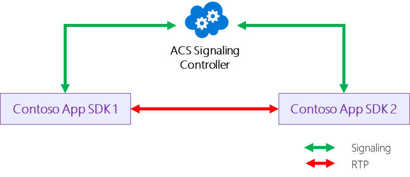
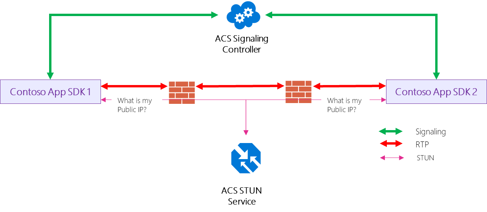
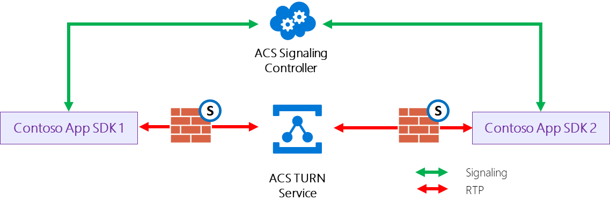
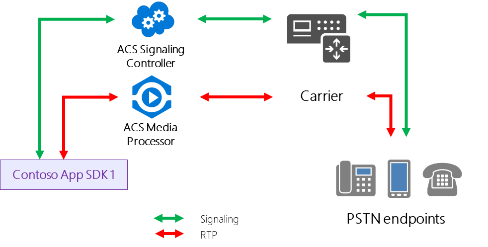
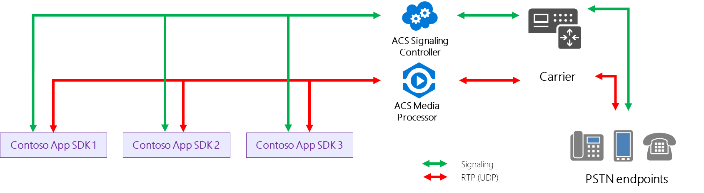
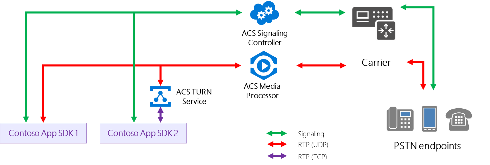

> [!WARNING]
> This is an **in-progress draft**.

 
 

## Call Flows

The section below gives an overview of the call flows in Azure Communication Services. Signaling and media flows depend on the types of calls your users are making. Examples of call types include one-to-one VoIP, one-to-one PSTN, and group calls containing a combination of VoIP and PSTN-connected participants. Call types can be reviewed [here](./voice.md).

### About Signaling and Media protocols

Signaling is used to...

For example...

Here's the bare-minimum you need to know about TLS / HTTP REST / UDP / TCP.

Signaling between the Client SDKs or Client SDKs and ACS Signaling Controller is handled with HTTP REST (TLS). For Real Time Media Traffic (RTP), the Used Datagram Protocol (UDP) is preferred. If the use of UDP is prevented by your firewall, the Client SDK will use the Transmission Control Protocol (TCP) for media. 

### Call Flow Cases

#### Case 1: VoIP where a direct connection between two devices is possible

In one-to-one VoIP or Video calls, traffic prefers the most direct path. "Direct path" means that if two client SDKs can reach each other directly, they'll establish a direct connection. This is usually possible when two SDKs are in the same subnet (for example, in a subnet 192.168.1.0/24) or two when the devices each live in subnets that can see each other (SDKs in subnet 10.10.0.0/16 and 192.168.1.0/24 can reach out each other).

#### Case 2: VoIP where a direct connection between devices is not possible, but where connection between NAT devices is possible

If two devices are located in subnets that cannot reach each other (for example, Alice works from a coffee shop and Bob works from his home office) but the connection between the NAT devices is possible, the clientside SDKs will establish connectivity via NAT devices. 

For Alice it will be the NAT of the coffee shop and for Bob it will be the NAT of the home office. Alice's device will send the external address of her NAT and Bob's will do the same. The SDKs learn the external addresses from a STUN (Session Traversal Utilities for NAT) service that Azure Communication Services provides free of charge. If you use the client SDKs provided by Azure Communication Services you don’t need to configure anything. The logic that handles the handshake between Alice and Bob is embedded within the Client SDKs.

#### Case 3: VoIP where neither a direct nor NAT connection is possible

If one or both client devices are behind a symmetric NAT, a separate cloud service to relay the media between two client SDKs is required. This service is called TURN (Traversal Using Relays around NAT) and is also provided by the ACS. Approximately 20% of calls require use of TURN across all our clients. If you use the ACS Client SDKs, the request of the keys to use the TURN service happens automatically. Use of Microsoft's TURN service is charged separately. You can disable the use of TURN, but if your SDKs are behind a symmetric NAT, your calls are likely to fail.

 
#### Case 4: Group calls with PSTN

Both signaling and media for PSTN Calls use the Azure Communication Services telephony resource. This resource is interconnected with other carriers (to elaborate).

PSTN media traffic flows through a component called Media Processor.

> [!NOTE]
> For those familiar with media processing, our Media Processor is also a Back to Back User Agent, as defined in [RFC 3261 SIP: Session Initiation Protocol](https://tools.ietf.org/html/rfc3261), meaning it can translate codecs when handling calls between Microsoft and Carrier networks. The Azure Communication Services Signaling Controller is Microsoft's implementation of an SIP Proxy per the same RFC.

For group calls, media and signaling always flow via the Azure Communication Services backend. The audio and/or video from all participants need to be mixed. The mixing happens in the Media Processor component. All members of a group call send their audio and/or video streams to the media processor, which returns mixed media streams.

The default real-time protocol (RTP) for group calls is User Datagram Protocol (UDP).

> [!NOTE]
> The Media Processor can act as a Multipoint Control Unit (MCU) or Selective Forwarding Unit (SFU)

If the client SDK can't use UDP for Media due to firewall restrictions, an attempt will be made to use the Transmission Control Protocol (TCP). Note that the Media Processor component requires UDP, so when this happens, the ACS TURN service will be added to the group call to translate TCP to UDP. TURN charges will be incurred in this case unless TURN capabilities are manually disabled (todo).

### IP addresses, ports, protocols and FQDNs (next section under “About Voice”)

In progress
