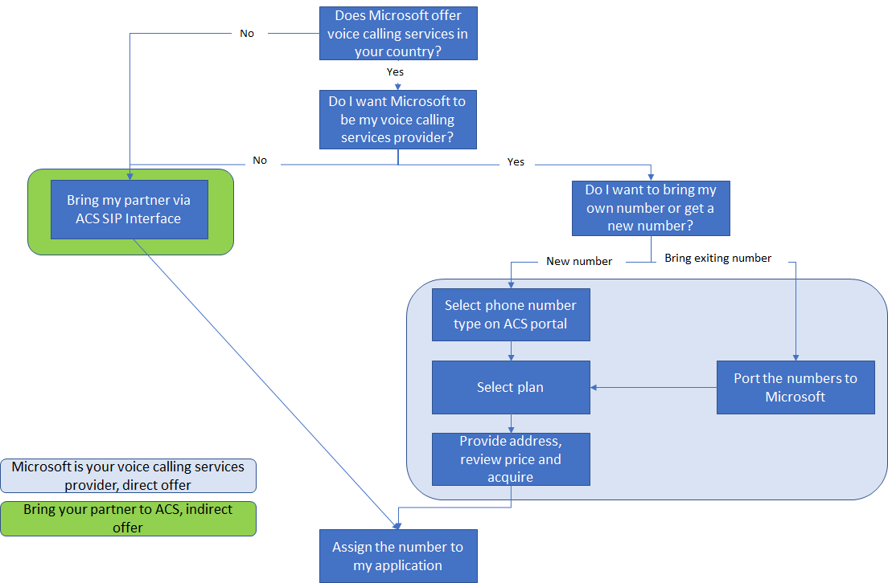

# Plan your Telephony and SMS solution

This document describes the telephony numbers and plans in Azure Communication Services and guides you to select the appropriate offer. Regardless of whether you are new to the telephony world or a seasoned professional, the information will help you make the right decision for your solution.
We will walk you through the decision flows on selecting a voice service provider, phone number types, plans (or capabilities) available from Microsoft, and review the Azure Communications Services phone number acquisition portal.

## About phone numbers in Azure Communications Services

Azure Communication Services allows you to use phone numbers to receive telephony calls and send or receive SMS messages. You also can use phone numbers in your caller ID on outbound calls.  Microsoft offers a variety of options depending on the country and your needs.
If you want just to try Azure Communications Services or build a new project with no requirements to bring the existing phone number, the simplest way would be to get a new phone number from Microsoft in a matter of minutes.

> [!NOTE]
> Microsoft does not provide voice telephony services in each country. We keep expanding the countries rapidly. If your country is not served by Microsoft directly, you can interconnect the telephony via the SIP interface on your own or with our partners' help. The SIP interface does not allow interconnection with your own carrier for sending and receiving the SMS

If your customer has an existing phone number and they want to keep using in your solution (for example, 1 800 – COMPANY), you have several choices.
If Microsoft provides voice calling services in your country, you can port the phone number from the existing partner to Microsoft.
If you do not want to port the number (keep it with the existing partner) or Microsoft does not yet provide the voice calling services in your country, you can interconnect your partner via the Azure Communication Services SIP Interface (available soon)
The following diagram helps you to navigate through the available options, based on your scenario

Now let look at the phone number types and plans (capabilities) available in the Microsoft direct offer. If you want to interconnect your carrier, the phone number types and plans might or might not match the Microsoft offers. Note you cannot interconnect your carrier for SMS, you can only interconnect for making or receiving voice calls. Please consult your carrier on the phone number types and offers.
For the guide on how to interconnect your carrier, please proceed here [LINK]

## Microsoft direct offer of phone numbers and capabilities

Azure Communication Services provides excellent flexibility for developers. On most phone numbers, we allow you to configure an "a la carte" set of plans. Some developers only need an inbound calling plan; some might opt for inbound calling and outbound SMS plans. When you purchase numbers from or port your number to Microsoft, you can select plans that best suit your project.
The available plans depend on the country and phone number type. The diagram below represents the decision flow.

