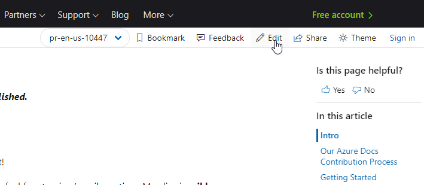
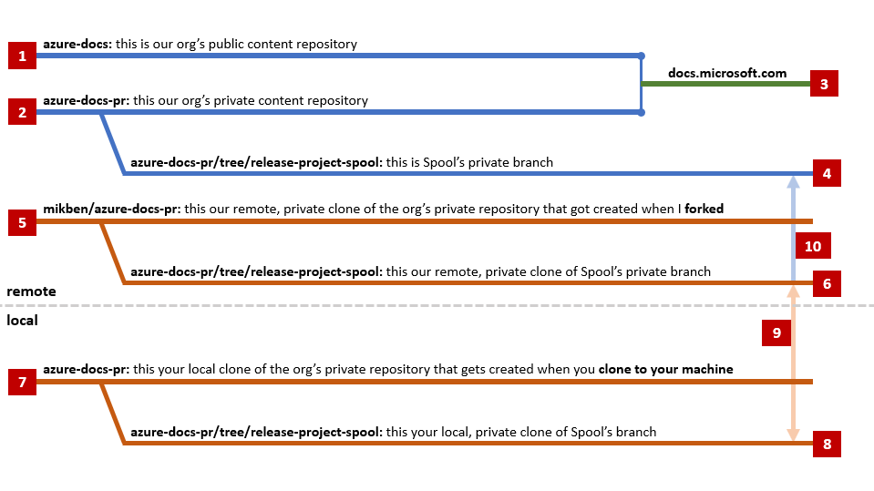
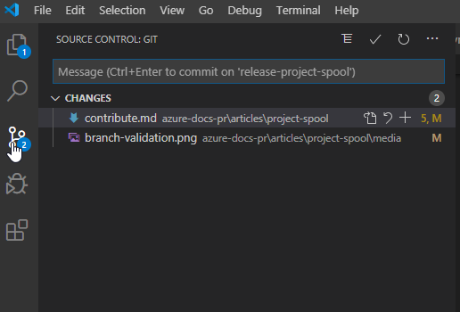

*Note: This is a temporary page.  **This will not be published**.  If you have any questions or feedback along the way, feel free to ping/email me any time.  My alias is **mikben**.*

## Intro

The status of Spool Docs is being tracked in [this spreadsheet](https://microsoft.sharepoint-df.com/:x:/t/IC3SDK/EasbZy5MyMBLq2S0NyTNBVABhKiR6r8bq8Ld8clQQkgOeA?e=AYC94P).

Open issues are being discussed in [this document](https://microsoft.sharepoint-df.com/:w:/t/IC3SDK/Eer2632Xk-hHgCtvPAj6kgkBPlV42XZmsZ8TG4GwsvZf0A?e=p3yxen).

--------------

## Contribute Content

Click "edit" on any page within our docs (like this page) to add content:

Once you're brought to the file on GitHub, click the edit icon:

 

Once you've made your changes, click Commit with the "direct" option selected:

I'll then be notified, and I'll merge your changes into the docs.

To preview your markdown, you can use Visual Studio Code.

For a list of available docs UI components and Markdown features, see [the Docs Markdown Reference](https://review.docs.microsoft.com/en-us/help/contribute/markdown-reference?branch=master).

For Microsoft Docs writing principles, see [this](https://review.docs.microsoft.com/en-us/help/contribute/writing-principles?branch=master) and [this](https://styleguides.azurewebsites.net/StyleGuide/Read?id=2700).

To add **new docs** or **images to existing docs**, feel free to ping Mick.

-----------------

## Technical Details

### Our Azure Docs Contribution Process

The numbers in the above diagram correspond to the following numbered annotations:

1. This is the public repository that public contributors use to submit changes.  The purpose of this repository is to facilitate public contributions.
2. This is the private repository that internal contributors and partners use to submit changes.
3. **[1]** and **[2]** are synchronized and used to generate the Azure content you see on docs.microsoft.com.
4. This is the branch that has been created for our project.  We will rename this branch to reflect the branding of our product once it becomes official.  This branch can be viewed [here](https://github.com/MicrosoftDocs/azure-docs-pr/tree/release-project-spool).  Note that this repository is locked down as a matter of policy - only members of the PR review team have the ability to approve pull requests here.
5. I've forked from our org's private repository **[2]** to facilitate contributions from this team.  Since we're working with a small number of people, I've opted to minimize process complexity by using **a single fork** that we all own together.  This means you don't have to submit pull requests - you can just push your commits directly into our branch (**[6]**).
6. This is our branch.  This is where our changes will be pushed.  We won't ever directly contribute to the "root".  When we push to this branch, changes will automatically be built and staged [here](https://review.docs.microsoft.com/en-us/azure/project-spool/?branch=pr-en-us-104477).
7. When you clone **[5]**, you're pulling the entire Azure-docs-pr repository down onto your local machine.
8. This is your local Spool branch, where we'll be making our changes.
9. When we make changes in our local branch, we'll sync our changes.  This pulls others' changes down from **[6]** to **[8]**, and then pushes our changes from **[8]** to **[6]**.
10. I've [issued a pull request](https://github.com/MicrosoftDocs/azure-docs-pr/pull/104477) from **[6]** to **[4]**.  This is what enables continuous validation and staging as we commit our changes to **[6]**.  If you view that pull request after pushing to **[4]**, you'll be able to see the validations and staging status.

*Note: PRs from **[6]** to **[4]** will always be built and validated, but they won't be passed off to the Azure docs editorial team until we sign off on them with a comment that says "#sign-off".  This will tell our merge bot ("PR Merger") to pass the baton along.  We will only do this when our content is mature.*

### Power User Instructions

To begin contributing: 

1. Install Visual Studio Code along with the [content authoring tools](https://review.docs.microsoft.com/en-us/help/contribute/contribute-get-started-setup-tools?branch=master). 
2. [Set up a GitHub account](https://review.docs.microsoft.com/en-us/help/contribute/contribute-get-started-setup-github?branch=master) if you don't already have one.
3. [Link your Microsoft and GitHub accounts](https://review.docs.microsoft.com/en-us/help/contribute/contribute-get-started-setup-github?branch=master#link-your-github-and-microsoft-accounts).
4. [Join the Azure Docs GitHub organization](https://review.docs.microsoft.com/en-us/help/contribute/contribute-get-started-setup-github?branch=master#link-your-github-and-microsoft-accounts).
5. I'll have to provide you with write permissions to my fork (**[5]** above).  Feel free to ping your **GitHub username** to me.  My Microsoft alias is **mikben**.

Using Command Prompt, navigate to a directory on your local machine where you want the Azure documentation repository to live.  Then, clone our repository (`mikben/azure-docs-pr`) to that directory with the following command:

    git clone https://github.com/mikben/azure-docs-pr.git

This gives you **[7]** from the above diagram.

Next, move over to our branch:

    git checkout --track origin/release-project-spool

Now, you're working on **[8]** from the above diagram.

Next, open Visual Studio Code and **open the folder** (`File`> `Open Folder`) that you just cloned to begin contributing.  You'll know that you're working in the correct branch if you see `release-project-spool` in the branch indicator at the bottom left-hand corner of VS Code:

In the above image, there's a "refresh" icon below the cursor.  This is the "sync" function that performs the pull-push illustrated as item **[9]** in the above diagram.  We'll use this in a moment.

Next, navigate to our folder, which is located in `azure-docs-pr/articles/project-spool`:

Once you've made changes, you can navigate to the Source Control tab within VS Code to review them:

Finally, click the sync button to push your changes up and kick off the staging:

- **If you aren't familiar with Markdown**, [here's a great resource](https://review.docs.microsoft.com/en-us/help/contribute/markdown-reference?branch=master).
- **If you aren't familiar with git**, ping me directly!  I can help and then expand this doc accordingly.
- **If you are familiar with git** and have any feedback regarding this process, I'm completely open to suggestions, as I'm learning git as I go.

---------