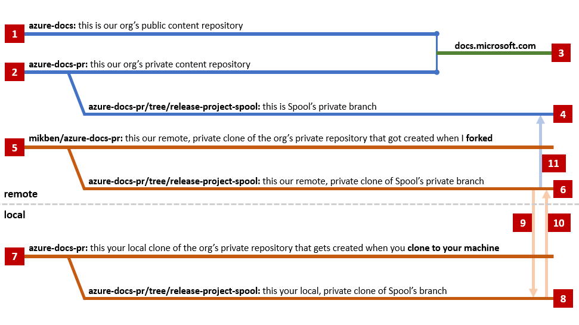

## Intro

I'm writing this to expose you to the bare minimum amount of information you need in order to contribute documentation. 

If you have any questions or feedback along the way, feel free to ping/email any time.  My alias is mikben.

I'm new to both content (and git), so we'll be learning the docs contribution process together.  I've copied the documentation structure of the Spatial Anchors service to get started; we'll use that as scaffolding for our content set.

## Process Overview

1. This is the public repository that public contributors use to submit changes.  The purpose of this branch is to facilitate public contributions.
2. This is the private repository that internal contributors and partners use to submit changes.
3. **[1]** and **[2]** are synchronized and used to generate the Azure content you see on docs.microsoft.com.
4. This is the branch that has been created for our project.  We will rename this branch to reflect the branding of our product once it becomes official.  This branch can be viewed here: https://github.com/MicrosoftDocs/azure-docs-pr/tree/release-project-spool.  This is what's used to generate the staging documentation here: https://review.docs.microsoft.com/en-us/azure/active-directory/?branch=release-project-spool.  Note that this repository is locked down as a policy decision - only members of the PR review team have the ability to approve pull requests here.
5. I've forked from our org's private repository to facilitate contributions from this team.  Since we're working with a small number of people, I've opted to minimize process complexity by using a single fork that we can all own together.  This means you don't have to submit pull requests - you can just push your commits directly into our branch (**[6]**).
6. This is our branch.  This is where our changes will be pushed.  We won't ever directly contribute to the "root".
7. When you clone **[5]**, you're pulling the entire Azure-docs-pr repository down onto your local machine.
8. Our local changes will be tracked against our local Spool branch.
9. We'll pull from the remote Spool branch before pushing to make sure that others' changes are incorporated into ours.
10. We'll then push our local changes to the remote Spool branch.
11. While we're developing our content, I'll periodically issue a pull requests from **[6]** to **[4]**.  This will validate that our content passes various validations, and it will provide us with a staging link.  I'll send this out to the team whenever I issue a PR.

*Note: PRs from **[6]** to **[4]** will always be built and validated, but they won't be passed off to the Azure docs editorial team until we sign off on them with a comment that says "#sign-off".  This will tell our merge bot ("PR Merger") to pass the baton along.  We will only do this when our content is mature.*

## Getting Started

To begin contributing: 

Once these are installed:

1. install Visual Studio Code along with the [content authoring tools](https://review.docs.microsoft.com/en-us/help/contribute/contribute-get-started-setup-tools?branch=master). 
2. [Set up a GitHub account](https://review.docs.microsoft.com/en-us/help/contribute/contribute-get-started-setup-github?branch=master) if you don't already have one.
3. [Link your Microsoft and GitHub accounts](https://review.docs.microsoft.com/en-us/help/contribute/contribute-get-started-setup-github?branch=master#link-your-github-and-microsoft-accounts).
4. [Join the Azure Docs GitHub organization](https://review.docs.microsoft.com/en-us/help/contribute/contribute-get-started-setup-github?branch=master#link-your-github-and-microsoft-accounts).

I'll have to provide you with write permissions to my fork (**[5]** above).  Feel free to ping your **GitHub username** to me.  My Microsoft alias is **mikben**).

Using Command Prompt, navigate to a directory on your local machine where you want the Azure documentation repository to live.  Then, clone our repository (mikben/azure-docs-pr) to that directory with the following command:

    git clone https://github.com/mikben/azure-docs-pr.git

This gives you **[7]** from the above diagram.

Next, move over to our branch:

    git checkout --track origin/release-project-spool

Now, you're working on **[8]** from the above diagram.

Next, open Visual Studio Code and **open the folder** that you just cloned to begin contributing.  You can see that you're working in the correct branch here:

You should be able to push your commits to our team's branch now!

- **If you aren't familiar with git**, let me know and I can expand accordingly.
- **If you are familiar with git** and have any feedback regarding this process, I'm completely open to suggestions, as I'm learning it as I go.  One concern that I have is that as of right now, we're all working from a single branch, and I don't know if that will get messy.
- **If you ever want to stage the latest version of our branch to preview your changes**, let me know and I can process a PR from **[6]** to **[4]**.
